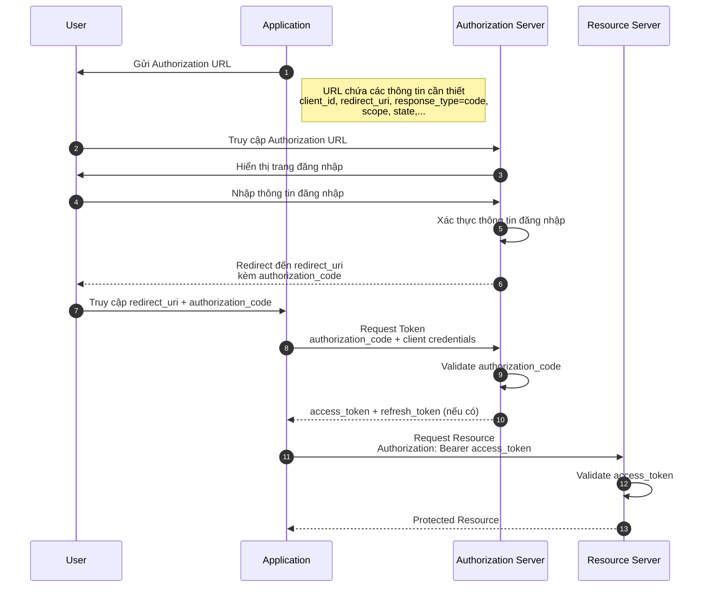
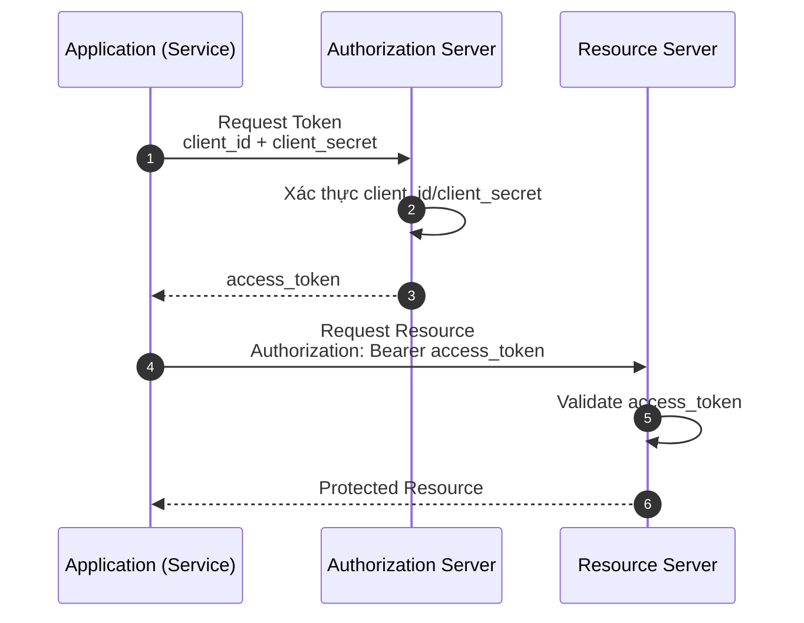
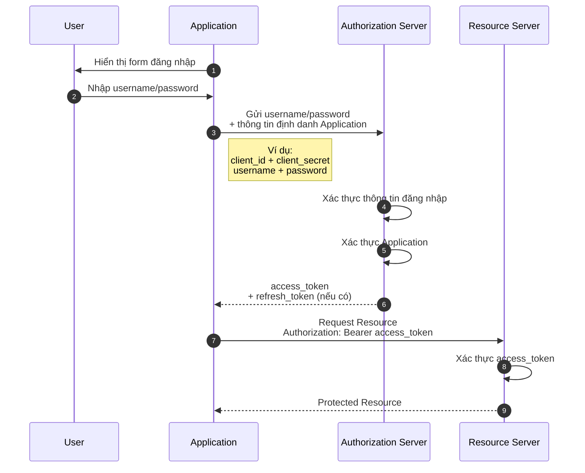

## OAuth 2.0 Là Gì?

**OAuth 2.0** là một giao thức **ủy quyền (authorization)** phổ biến, cho phép một ứng dụng truy cập vào tài nguyên của người dùng trên một dịch vụ khác, **mà không cần biết thông tin đăng nhập (username/password)** của người dùng đó. Giao thức này được triển khai rộng rãi để xử lý việc ủy quyền cho ứng dụng web, ứng dụng di động, ứng dụng desktop, và các dịch vụ web nói chung.

**OAuth** là viết tắt của **"Open Authorization"** (ủy quyền mở).

> **OAuth 2.0 về bản chất là một giao thức Authorization, không phải Authentication**. Nó chỉ trả lời câu hỏi "ứng dụng này có được phép truy cập tài nguyên X của người dùng hay không", chứ **không** tự nó xác minh "người dùng đang thao tác thực sự là ai". Việc xác thực danh tính người dùng dựa trên nền OAuth 2.0 thuộc về một giao thức riêng, xây dựng thêm một lớp trên OAuth 2.0, gọi là **OpenID Connect (OIDC)**.

OAuth ra đời để giải quyết một vấn đề cụ thể: làm sao để các ứng dụng có thể chia sẻ tài nguyên với nhau một cách an toàn, **mà không cần chia sẻ mật khẩu**. Về vai trò cơ bản, OAuth 2.0 giúp kiểm soát quyền truy cập và bảo vệ thông tin người dùng, bằng cách cung cấp một phương pháp ủy quyền an toàn giữa các ứng dụng và dịch vụ.

**Ví dụ dễ hình dung nhất**: khi bạn thấy một website cho phép "Đăng nhập bằng Google" hoặc "Đăng nhập bằng Facebook" mà không cần tạo tài khoản mới — đó chính là một ứng dụng thực tế của OAuth (kết hợp thêm OpenID Connect để xác thực danh tính bạn là ai).

### Lợi ích chính của OAuth 2.0

- **Ủy quyền an toàn, không lộ mật khẩu**: Ứng dụng bên thứ ba có thể truy cập tài nguyên được cho phép mà không cần biết mật khẩu của người dùng.
- **Dùng được trên nhiều nền tảng**: Web, di động, desktop, dịch vụ backend — cùng một mô hình ủy quyền, chỉ khác ở grant type phù hợp (xem phần dưới).
- **Người dùng kiểm soát được quyền truy cập**: Có thể xem ứng dụng nào đang được cấp quyền, và thu hồi quyền truy cập bất kỳ lúc nào (ví dụ trong phần cài đặt tài khoản Google/Facebook).
- **Giảm rủi ro bảo mật khi tích hợp bên thứ ba**: Vì mật khẩu không bao giờ được chia sẻ cho ứng dụng thứ ba, rủi ro lộ mật khẩu qua các bên tích hợp được giảm đáng kể.

---

## OAuth 2.0 Có 4 Loại Grant Type

**Grant type** là cách một ứng dụng (client) thực hiện để lấy được **access token** — "tấm vé" dùng để truy cập tài nguyên được bảo vệ. OAuth 2.0 định nghĩa 4 grant type chính, mỗi loại phù hợp với một hoàn cảnh khác nhau. Dưới đây trình bày theo thứ tự: các grant type **được khuyến nghị dùng hiện nay**, rồi tới các grant type **cũ, đã bị coi là không an toàn** và không nên dùng cho hệ thống mới.

### 1. Authorization Code

**Khi nào dùng?** Đây là grant type **được khuyến nghị sử dụng phổ biến nhất hiện nay**, phù hợp với các ứng dụng có độ tin cậy không cao (ví dụ ứng dụng bên thứ ba cần truy cập vào hệ thống của bạn), vì nó không bao giờ để lộ access token trực tiếp ở phía trình duyệt/URL.

Quy trình gồm các bước:

- Ứng dụng gửi một link tới authorization server để bắt đầu quá trình lấy `authorization_code`. Link này chứa các thông tin để authorization server định danh ứng dụng và biết cách phản hồi lại.
- Người dùng nhập thông tin đăng nhập trên trang của authorization server (không phải trên ứng dụng) — đây là điểm quan trọng: ứng dụng bên thứ ba **không bao giờ nhìn thấy** mật khẩu người dùng.
- Authorization server xác thực thông tin đăng nhập, rồi redirect người dùng về `redirect_uri` của ứng dụng, kèm theo một `authorization_code`.
- Ứng dụng dùng `authorization_code` này, gửi request tới authorization server để đổi lấy `access_token` (và `refresh_token`, nếu có).
- Ứng dụng dùng `access_token` để truy cập tài nguyên trên resource server.

> **Cập nhật quan trọng**: Với các ứng dụng không thể lưu trữ bí mật client an toàn — như ứng dụng mobile hoặc Single Page Application (SPA) chạy hoàn toàn trên trình duyệt — nên dùng thêm phần mở rộng **PKCE (Proof Key for Code Exchange)** kèm Authorization Code. Trong đặc tả OAuth 2.1 (bản hợp nhất các thực hành bảo mật tốt nhất, đang được hoàn thiện), PKCE trở thành **bắt buộc cho mọi loại client**, không chỉ ứng dụng public như trước.

### 2. Client Credentials

**Khi nào dùng?** Grant type này dùng cho giao tiếp **service-to-service (máy với máy)**, khi **không có người dùng nào tham gia** vào quá trình xin quyền — ví dụ một backend service cần gọi API của một service khác để lấy dữ liệu nội bộ, không đại diện cho bất kỳ người dùng cụ thể nào.

Quy trình rất đơn giản, không cần redirect qua trình duyệt:

- Ứng dụng (đóng vai trò client) gửi trực tiếp `client_id` và `client_secret` của chính nó tới authorization server.
- Authorization server xác thực thông tin định danh của ứng dụng, rồi trả về `access_token` (thường không có `refresh_token`, vì ứng dụng có thể xin token mới bất cứ lúc nào bằng chính `client_id`/`client_secret` của mình).
- Ứng dụng dùng `access_token` để gọi tới resource server.

**Ví dụ**: `order-service` cần gọi tới `inventory-service` để kiểm tra tồn kho, không đại diện cho một người dùng cụ thể nào — `order-service` dùng Client Credentials Grant để tự lấy access token cho chính nó, rồi gọi API bằng token đó.

### 3. Implicit _(đã lỗi thời — không khuyến nghị dùng cho hệ thống mới)_

**Trước đây dùng khi nào?** Grant type này từng được thiết kế cho các ứng dụng chạy hoàn toàn trên trình duyệt (SPA) hoặc ứng dụng mobile, ở giai đoạn trước khi PKCE ra đời — khi đó, các ứng dụng này không thể lưu trữ `client_secret` một cách an toàn.

Flow của Implicit khá giống Authorization Code, ngoại trừ việc **bỏ qua bước `authorization_code`**: sau khi người dùng đăng nhập và đồng ý, authorization server trả **trực tiếp** `access_token` về cho ứng dụng (thường gắn kèm trong URL fragment sau dấu `#`), thay vì trả `authorization_code` rồi mới đổi lấy token ở bước sau. Loại grant này **không hỗ trợ `refresh_token`**.

> **Cảnh báo bảo mật**: Vì access token bị lộ trực tiếp trong URL (dễ bị ghi lại trong lịch sử trình duyệt, log của server trung gian, hay rò rỉ qua HTTP Referer header), Implicit Grant **đã bị loại bỏ hoàn toàn khỏi đặc tả OAuth 2.1**. Khuyến nghị hiện tại là các SPA/ứng dụng mobile nên chuyển sang dùng **Authorization Code + PKCE** (mục 1 ở trên) thay vì Implicit.

### 4. Resource Owner Password Credentials (ROPC) _(đã lỗi thời — không khuyến nghị dùng cho hệ thống mới)_

**Trước đây dùng khi nào?** Chỉ nên dùng cho những ứng dụng **thực sự được tin tưởng tuyệt đối** (ví dụ chính ứng dụng chính thức của cùng công ty sở hữu dịch vụ), vì nó yêu cầu ứng dụng **trực tiếp xử lý** thông tin đăng nhập (username/password) của người dùng.

Quy trình gồm các bước:

- Ứng dụng hiển thị một form, cho phép người dùng nhập trực tiếp username/password vào chính ứng dụng đó (không phải trang của authorization server).
- Ứng dụng gửi thông tin đăng nhập này, kèm thông tin định danh của chính mình, lên authorization server. Authorization server xác thực, rồi trả lại `access_token` và `refresh_token` (nếu có).
- Ứng dụng dùng `access_token` để truy cập tài nguyên trên resource server.

> **Cảnh báo bảo mật**: Vì ứng dụng phải trực tiếp cầm mật khẩu người dùng — đi ngược lại chính triết lý cốt lõi của OAuth là "không chia sẻ mật khẩu" — grant type này **cũng đã bị loại bỏ khỏi đặc tả OAuth 2.1**, và không nên dùng cho bất kỳ hệ thống mới nào.

---

## Mở Rộng

Sau khi nắm được tổng quan OAuth 2.0 và các grant type, bạn có thể tìm hiểu thêm:

- **OpenID Connect (OIDC)**: Lớp authentication xây dựng trên nền OAuth 2.0 — dùng khi bạn thực sự cần xác thực danh tính người dùng (ví dụ "Đăng nhập với Google"), không chỉ ủy quyền truy cập tài nguyên.
- **PKCE (Proof Key for Code Exchange)**: Cơ chế bảo mật bổ sung cho Authorization Code Grant, hiện là bắt buộc theo OAuth 2.1.
- **Device Authorization Grant**: Grant type dành cho thiết bị không có (hoặc khó dùng) trình duyệt/bàn phím, ví dụ Smart TV — thay thế hợp lý cho các trường hợp trước đây có thể bị nhầm dùng ROPC.
- **Scope**: Cách giới hạn phạm vi quyền truy cập mà access token được cấp (ví dụ chỉ đọc email, không được chỉnh sửa hồ sơ).
- **JWT (JSON Web Token)**: Định dạng phổ biến thường được dùng để biểu diễn access token/ID token trong các hệ thống OAuth2/OIDC hiện đại.

## Nguồn Trích Dẫn

- IETF — [RFC 6749: The OAuth 2.0 Authorization Framework](https://datatracker.ietf.org/doc/html/rfc6749)
- OAuth.net — [OAuth 2.1 Draft](https://oauth.net/2.1/)
- OAuth.net — [PKCE](https://oauth.net/2/pkce/)

---

Phần tiếp theo [ở đây](https://claude.ai/chat/87dfe022-a3fc-4f6e-8d79-792e8630af80)