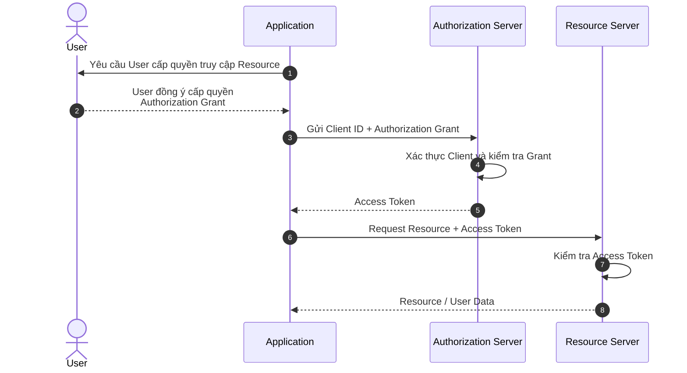

## Các Tác Nhân (Đối Tượng) Trong OAuth2

**OAuth 2.0** hoạt động dựa trên 4 đối tượng, mỗi đối tượng đảm nhiệm một vai trò riêng:

- **Resource Owner (User)**: Người dùng sở hữu tài khoản/dữ liệu, có quyền ủy quyền cho ứng dụng truy cập vào một phần dữ liệu của mình. Ứng dụng chỉ được truy cập trong phạm vi (**scope**) đã được cấp phép — ví dụ chỉ được đọc, hoặc được cả đọc lẫn ghi dữ liệu. **=> Chính là bạn.**
- **Client (Application)**: Ứng dụng muốn truy cập vào dữ liệu của người dùng. Trước khi được phép tương tác với dữ liệu, ứng dụng phải được User ủy quyền, và phải xác thực định danh của chính mình (thường bằng `client_id`/`client_secret`) khi gọi tới Authorization Server. **=> Ví dụ: các ứng dụng bên thứ ba tích hợp với Facebook, Twitter, Google API.**
- **Resource Server (API)**: Nơi lưu trữ dữ liệu/tài nguyên của User, được bảo vệ và chỉ cho phép truy cập khi có access token hợp lệ.
- **Authorization Server (API)**: Nơi xác thực thông tin của User (và của Client), sau đó cấp quyền truy cập cho ứng dụng thông qua việc phát hành `access_token`.

`Resource Server` và `Authorization Server` là **một trong những khác biệt đáng chú ý** giữa OAuth 2.0 và OAuth 1.0: OAuth 2.0 tách rõ hai vai trò — nơi xử lý việc xác thực/ủy quyền (Authorization) và nơi lưu trữ, cung cấp dữ liệu (Resource) — thành hai server độc lập, có thể triển khai tách biệt. Một khác biệt lớn khác giữa hai phiên bản: OAuth 1.0 yêu cầu ký (sign) từng request bằng thuật toán mã hóa phức tạp (HMAC-SHA1...), còn OAuth 2.0 đơn giản hóa bằng cách dựa vào **HTTPS** để bảo mật đường truyền, và dùng **bearer token** (access token) thay cho chữ ký request — đây cũng là lý do OAuth 2.0 dễ triển khai hơn hẳn OAuth 1.0.

---

## OAuth2 Hoạt Động Như Thế Nào?

Khi bạn đăng nhập vào một website bằng tài khoản Facebook hay Google, website sẽ chuyển bạn đến trang của Facebook/Google, liệt kê những quyền (scope) mà nó cần để hoạt động — ví dụ quyền xem email, quyền xem ảnh đại diện.

Nếu bạn đồng ý, Facebook/Google sẽ cấp cho website một **access token**. Token này mang một số quyền hạn nhất định (theo đúng scope bạn đã đồng ý), cho phép website gọi tới API của Facebook/Google (ví dụ lấy email, tên hiển thị) để nhận diện bạn và vận hành các tính năng liên quan tới tài khoản của bạn — đây chính là cách hầu hết các nút "Đăng nhập bằng..." hoạt động trong thực tế (kết hợp OAuth2 để lấy quyền truy cập, và một lệnh gọi API riêng để lấy thông tin định danh).

Vì website không bao giờ nắm giữ mật khẩu Facebook/Google của bạn, nếu website đó chẳng may bị hacker tấn công, kẻ tấn công cũng chỉ lấy được đúng phạm vi dữ liệu/quyền mà access token đó cho phép trên website này — **không** ảnh hưởng tới tài khoản Facebook/Google gốc của bạn, hay tới các website khác bạn từng đăng nhập bằng OAuth. Đây chính là lý do cách đăng nhập qua OAuth an toàn hơn nhiều so với việc chia sẻ mật khẩu trực tiếp cho từng website.

---

## Sơ Đồ Luồng Hoạt Động Của OAuth2

**Người dùng (User) → Ứng dụng (Client) → Authorization Server & Resource Server**

1. **Ứng dụng** (website hoặc mobile app) yêu cầu User ủy quyền để truy cập vào tài nguyên trên **Resource Server** (ví dụ Gmail, Facebook, GitHub...).
2. Nếu **User** đồng ý ủy quyền, **Ứng dụng** nhận được một **authorization grant** từ phía User (hình thức cụ thể tùy grant type — ví dụ một `authorization_code`, xem lại phần "4 loại grant type" ở bài trước).
3. **Ứng dụng** gửi thông tin định danh của mình (`client_id`, `client_secret`) kèm theo authorization grant vừa nhận, tới **Authorization Server**.
4. Nếu thông tin định danh và grant hợp lệ, **Authorization Server** trả về `access_token` cho **Ứng dụng**. Quá trình ủy quyền hoàn tất.
5. Để lấy dữ liệu từ **Resource Server**, **Ứng dụng** đính kèm `access_token` trong request.
6. Nếu `access_token` hợp lệ, **Resource Server** trả về dữ liệu tài nguyên đã yêu cầu cho **Ứng dụng**.

Luồng hoạt động thực tế có thể khác nhau đôi chút tùy loại authorization grant mà ứng dụng sử dụng — sơ đồ trên chỉ minh họa ý tưởng chung.

---

## Đánh Giá Ưu Và Nhược Điểm Của OAuth2

### Ưu điểm

- **An toàn**: OAuth2 loại bỏ việc chia sẻ thông tin đăng nhập/mật khẩu giữa ứng dụng, người dùng, và dịch vụ bên thứ ba — tạo ra cách ủy quyền và truy cập dữ liệu an toàn hơn nhiều so với chia sẻ mật khẩu trực tiếp.
- **Linh hoạt**: Hỗ trợ nhiều loại ứng dụng khác nhau (web, mobile, service backend...), khiến OAuth2 trở thành giao thức ủy quyền phổ biến, áp dụng được cho nhiều tình huống.
- **Người dùng kiểm soát quyền truy cập**: Có thể xem và thu hồi quyền truy cập của bất kỳ ứng dụng nào, bất kỳ lúc nào — tăng tính bảo mật và quyền riêng tư.
- **Tích hợp bên thứ ba dễ dàng, an toàn**: Cho phép các dịch vụ tích hợp với nhau một cách an toàn, mang lại trải nghiệm liền mạch hơn cho người dùng (ví dụ đăng nhập một lần, dùng chung nhiều dịch vụ).

### Nhược điểm

- **Phức tạp khi triển khai**: Việc triển khai và vận hành đúng OAuth2 đòi hỏi hiểu biết kỹ thuật khá sâu (chọn đúng grant type, xử lý refresh token, bảo mật `client_secret`...). Triển khai sai dễ dẫn tới lỗ hổng bảo mật, đặc biệt với đội ngũ ít kinh nghiệm.
- **Không có cơ chế quản lý phiên (session) tích hợp sẵn**: OAuth2 tập trung vào việc cấp quyền truy cập tài nguyên, không định nghĩa sẵn cách quản lý phiên đăng nhập của người dùng — đây là một phần lý do OpenID Connect (OIDC) ra đời để bổ sung, chuẩn hóa phần này.
- **Rủi ro nếu access token bị lộ**: Vì OAuth2 dùng bearer token (ai cầm token đó, coi như có quyền truy cập tương ứng — không cần chứng minh gì thêm), nếu access token bị đánh cắp (qua log, network sniffing khi không dùng HTTPS...), kẻ tấn công có thể dùng ngay để truy cập tài nguyên cho tới khi token hết hạn hoặc bị thu hồi.
- **Phụ thuộc vào tính sẵn sàng của Authorization Server**: Nếu Authorization Server gặp sự cố, mọi ứng dụng cần xin cấp hoặc làm mới access token đều bị ảnh hưởng — đây là một điểm cần tính tới khi thiết kế hệ thống ở quy mô lớn.

---

## Mở Rộng

Sau khi nắm được các tác nhân và luồng hoạt động của OAuth2, bạn có thể tìm hiểu thêm:

- **OpenID Connect (OIDC)**: Lớp xác thực (authentication) và quản lý phiên xây dựng trên nền OAuth2 — giải quyết đúng nhược điểm "không có cơ chế quản lý phiên" đã nêu ở trên.
- **JWT (JSON Web Token)**: Định dạng phổ biến để biểu diễn access token/ID token, cho phép Resource Server xác thực token mà không cần gọi ngược lại Authorization Server mỗi lần.
- **Token Introspection & Revocation**: Cơ chế cho phép Resource Server kiểm tra tính hợp lệ của token theo thời gian thực, và cách thu hồi token khi cần (ví dụ khi người dùng đăng xuất, hoặc phát hiện token bị lộ).
- **Refresh Token Rotation**: Kỹ thuật bảo mật giúp giảm rủi ro nếu refresh token bị đánh cắp, bằng cách cấp refresh token mới sau mỗi lần sử dụng.

## Tài Liệu Tham Khảo

- [Cách hoạt động của OAuth2 và sơ đồ ứng dụng công nghệ hiệu quả](https://fptshop.com.vn/tin-tuc/danh-gia/oauth2-173582) — FPT Shop
- [OAuth2 là gì?](https://topdev.vn/blog/oauth2-la-gi/) — TopDev
- IETF — [RFC 6749: The OAuth 2.0 Authorization Framework](https://datatracker.ietf.org/doc/html/rfc6749)