### 1. **Đồ thị có hướng:**

**G** bao gồm 1 cặp **(X, U)**, ký hiệu **G(X, U)** trong đó:

- **X** là một tập hợp mà các phần tử của nó ==được gọi là các đỉnh== của đồ thị. Khi đồ thị có **n** đỉnh (Tức là số phần tử của **X** là **n**), thì người ta nói đồ thị **G** có bậc là n. Khi số phần tử **X** là hữu hạn thì người ta gọi ==**G** là đồ thị hữu hạn.==
- **U** là một tập hợp mà các phần tử của nó là các cặp đỉnh có thứ tự **U = (i, j)**, gọi là cung nối đỉnh i với đỉnh j của đồ thị. Đỉnh **i** được gọi là đỉnh gốc, đỉnh **j** được gọi là ngọn, Cung **U = (i, j)** ==là đi ra từ i và đi vào từ j==.
- Cung **U = (i, i)** là đi ra từ **i** và đi vào từ **i**, có gốc và ngọn trùng nhau, được gọi là ==khuyên==.
- ==1 đỉnh chỉ có một cung duy nhất đi tới nó== được gọi là **đỉnh treo**. ==Cung duy nhất đi đến đỉnh treo== sẽ được gọi là **cung treo.**
- **Đỉnh nào mà không có cung nào đi ra từ nó và không có cung nào đi vào** nó thì được gọi là **đỉnh cô lập**.

Xét đồ thị có hướng như sau:
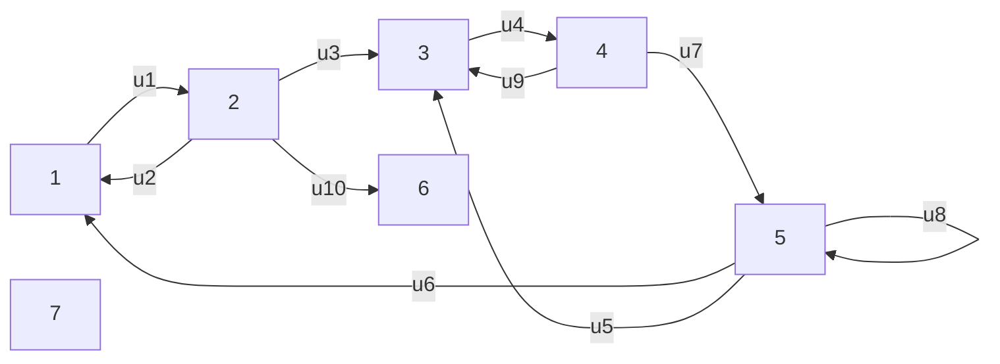

- Tập hợp các đỉnh: X = { 1, 2, 3, 4, 5, 6, 7 }.
- Cung `U8` là khuyên.
- Đỉnh `6` là đỉnh treo, cung `U10` là cung treo.
- Đỉnh `7` là đỉnh cô lập.

----
### 2. **Đồ thị có hướng và ánh xạ:**

- Đỉnh **j** được gọi là ==ảnh== của đỉnh **i**. 1 đỉnh có thể có nhiểu ảnh. Người ta ký hiệu **𝛤i**  Là tập hợp tất cả các ảnh của i.
- Đỉnh i được goi là ==tạo ảnh== của j. 1 đỉnh có thể có nhiều tạo ảnh. Người ta ký hiệu **𝛤i^-1** là tập hợp tất cả các tạo ảnh của i.
- Khi đồ thị có hướng **G** là đồ thị là đồ thị đơn thì G có thể được biểu diễn bằng 1 trong 2 ánh xạ sau:
	$$ \Gamma:X \to \varphi(X) \qquad   i \mapsto \Gamma i $$
	$$ \Gamma:X \to \varphi(X) \qquad   i \mapsto \Gamma^{-1}_{i} $$

***Ví dụ:** Xét đồ thị có hướng như sau:*
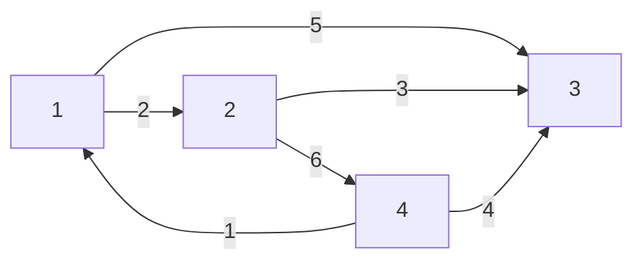
Đồ thị này được biểu diễn bằng ánh xạ

| $$ \Gamma \; xác \; định \; bởi $$ | $$ \Gamma^{-1} \; xác \; định \; bởi $$ |
| ---------------------------------- | --------------------------------------- |
| 1 **↦** **𝜞1** = {2, 3}           | 1 **↦** **𝜞1^-1** = {4}                |
| 2 **↦** **𝜞2** = {3, 4}           | 2 **↦** **𝜞2^-1** = {1}                |
| 3 **↦** **𝜞3** = **🛇**           | 3 **↦** **𝜞3^-1** = {1, 2, 4}          |
| 4 **↦** **𝜞4** = {1, 3}           | 4 **↦** **𝜞4^-1** = {2}                |
 
---
### 3. **Đồ thị vô hướng:**

Đồ thị vô hướng là ==chiều của một cung không còn giữ vai trò quan trọng== nữa, chiều nào cũng được, trường hợp này người ta chỉ quan tâm đến tự tồn tại hay không tồn tại cạnh của các đỉnh.

Đồ thị vô hướng **G** bao gồm một cặp **(X, U)**. Ký hiệu **G = (X, U)**, trong đó:
- **X** là tập hợp các phần tử của nó được gọi là các đỉnh của đồ thị.
- **U** là một tập hợp các phần tử của nó là cặp đỉnh không tính đến thứ tự. ==**U = (i, j) = (j, i)**==. Gọi là cạnh nối đến đỉnh i và đỉnh j trong đồ thị.

Trình bày bằng đoạn thẳng nối 2 đỉnh. Khi tồn tại 1 cạnh nối giữa 2 đỉnh thì có thể xem như tồn tại 2 cung trái chiều nhau giữa 2 đỉnh đó.
- ==Đa đồ thị vô hướng là đồ thị vô hướng== mà trên đó có thể có ==nhiều cạnh nối 2 đỉnh phân biệt bất kỳ==.
- ==Đồ thị đơn vô hướng không có khuyên== và ==không có 1 cạnh nối 2 đỉnh phân biệt bất kỳ==.
- Các khái nhiệm khác về đồ thị vô hướng được hiểu tương tự như đồ thị có hướng.

Xét đồ thị vô hướng sau:

- Danh sách các cung
	- 1 - 2
	- 1 - 3
	- 2 - 3
	- 2 - 4
	- 3 - 5
	- 4 - 5
	- 4 - 6
	- 5 - 6

- Ma trận:

|       | 1   | 2   | 3   | 4   | 5   | 6   |
| ----- | --- | --- | --- | --- | --- | --- |
| **1** | 0   | 1   | 1   | 0   | 0   | 0   |
| **2** | 1   | 0   | 1   | 1   | 0   | 0   |
| **3** | 1   | 1   | 0   | 0   | 1   | 0   |
| **4** | 0   | 1   | 0   | 0   | 1   | 1   |
| **5** | 0   | 0   | 1   | 1   | 0   | 1   |
| **6** | 0   | 0   | 0   | 1   | 1   | 0   |

- Đồ thị:
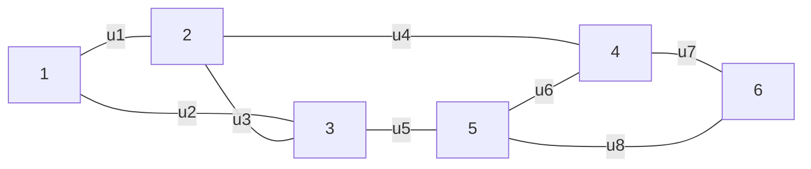
---
### 4.**Các khái niệm thường gặp:**

	G = (X, U) là đồ thị

Tùy theo thuật ngữ sử dụng, người ta thường gặp các khái niệm sau đây:
- **Đỉnh kề:** hai đỉnh được goi là kề nhau nếu chúng có chung cạnh/cung.
- **Cung kề - Cạnh kề:** hai cung (cạnh) được gọi là kề nhau nếu chúng có chung đỉnh.

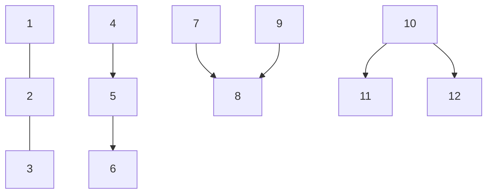

- **Bậc và nửa bậc:**
	- **Nửa bậc trong**: đỉnh x, ký hiệu $d^-(X)$,  là số cung có ==ngọn là X== (Số cung đi vào X).
	- **Nửa bậc ngoài:** của đỉnh X, ký hiệu $d^+(X)$, là số cung ==có gốc là X== (Số cung đi ra từ X).
	- **Bậc** của đỉnh X ký hiệu **d(x)** là số cung/cạnh chứa x. Với hình vẽ ta có:

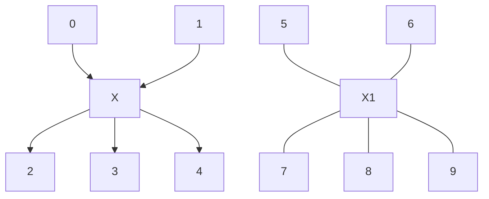

- Ký hiệu $\theta(A)$:
	- **G = (X, U)** là đồ thị có hướng. A là tập hợp con của X.
	- người ta ký hiệu
		- $\omega^+(A)$ là tập hợp các cung có ==gốc thuộc A và ngọn không thuộc A.==
		- $\omega^-(A)$ là tập hợp các cung có ==ngọn thuộc A và góc không thuộc A.==
		- $\theta(A) = \omega^-(A) + \omega^+(A)$ là tập hopwn các cung có chung 1 đỉnh là A.

**Ví dụ xét đồ thị có hướng G = (X, U) như sau:**

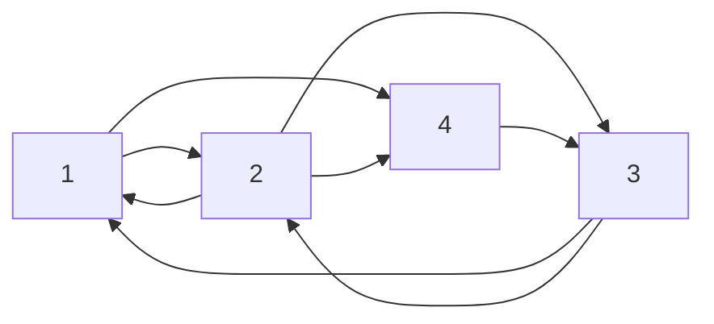
Ta có: X = {1, 2, 3, 4}., A **$\epsilon$ X, A = {1, 2} 
- $\omega^+(A)$ = { (1,4) ; (2,4); (2,3) }
- $\omega^-(A)$ = { (3,1) ; (3,2) }
- $\theta(A)$ = { (1,4) ; (2,4); (2,3); (3,1) ; (3,2) }

**Đồ thị đối xứng - Đồ thị bất đối xứng:**
- ==Đồ thị đối xứng== là đồ thị có hướng với mọi cặp đỉnh (i, j) bất kỳ. Số cung từ i đến j bằng số cung từ j đến i.
- ==Đồ thị bất đối xứng== là đồ thị có hướng mà tồn tại 2 đỉnh i và j nào đó mà có số cung từ $i \to j$ khác số cung từ $j \to i$.

Đồ thị đối xứng:
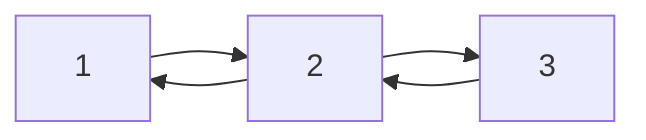

Đồ thị bất đối xứng:
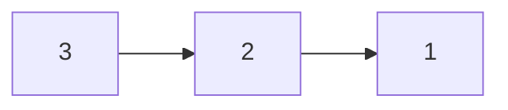

**Đồ thị đầy đủ:** là đồ thị luôn tồn tại cung/cạnh nối giữa 2 đỉnh bất kỳ của nó.
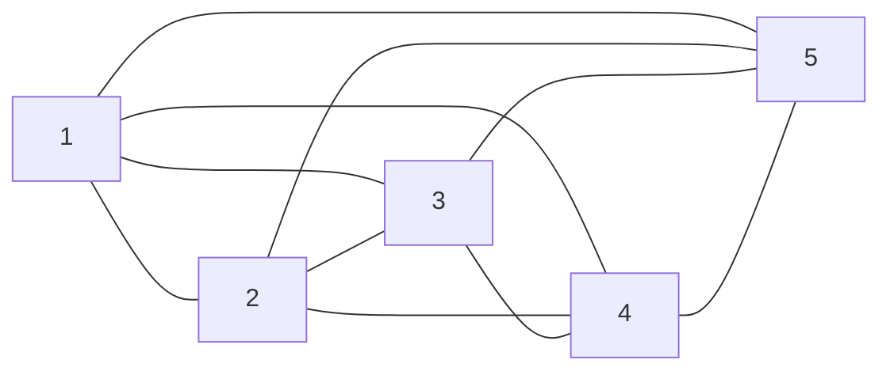

**Đồ thị con:** *A là tập hợp con của X.* 
	Đồ thị  con $G_A$ của đồ thị **G** sinh ra bởi **A** có đỉnh là A có cung/cạnh là cung/cạnh của G mà đỉnh của chúng thuộc A.
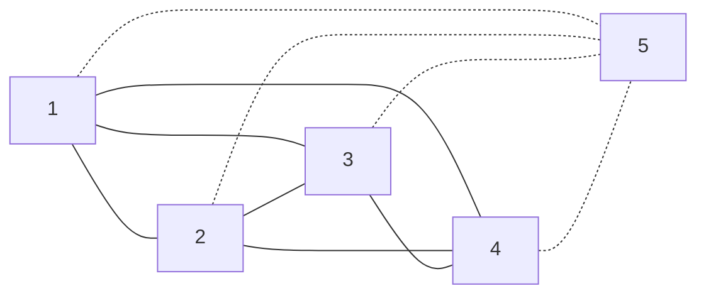

**Đồ thị bộ phận:** *V là tập hợp con của U*
	Đồ thị bộ phận sinh ra bởi V là đồ thị có đỉnh X các cạnh/cung là của V
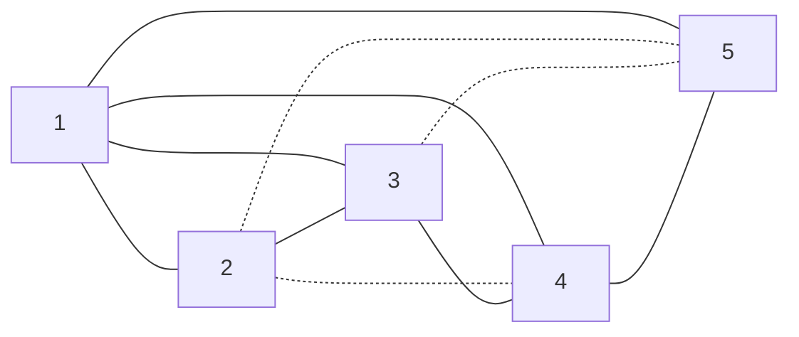

**Đồ thị bộ phận con:** là đồ thị cừa là đồ thị con vừa là đồ thị bộ phận