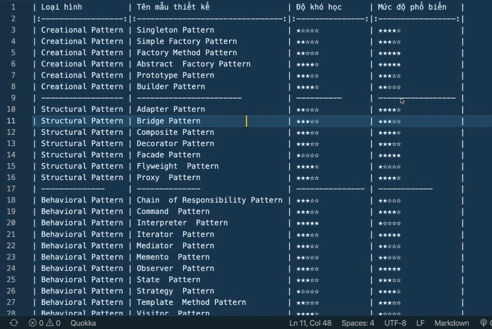

## **1. Định nghĩa:**

- **Design patten (Mẫu thiết kế)** là các giải pháp đã được kiểm chứng và tổng hợp để giải quyết vấn đề phổ biến trong phần mềm. Các mẫu này là hướng dẫn không mẫu mà lập trình viên có thể áp dụng để tạo ra phần mềm có cấu trúc, dễ bảo trì và mở rộng. 
- Theo định nghĩa từ cuốn sách nổi tiếng **"Design Patterns: Elements of Reusabla Object-Oriented Software"** của nhóm tác giải: Authors: [Erich Gamma](https://www.google.com/search?newwindow=1&sca_esv=dd4f2f9b345362f6&sxsrf=ADLYWILV64U98jC-MsBz2_3TAbWVBCXWDg:1735629634396&q=Erich+Gamma&si=ACC90nzx_D3_zUKRnpAjmO0UBLNxnt7EyN4YYdru6U3bxLI-L4VgYBnoQdryCjwPsANNnINji53J8Wv1qTo0E9Rnu44NirTYoNRLI5mHRhkXoWnWYb8YF91gVVZkGhuZvGL9jsB-HAMSXJJzjvIVJTRPZlKbOE2SZzB1IjxfjhJsJ9RnBRBshMpryc5UQOIeMSeAe1HqcJxDArYZd4lS-WjmTXXMwz__e-PMhBe3ktzdzma6i4KKkQA%3D&sa=X&ved=2ahUKEwiwg8eevNGKAxUMyzgGHURTCkQQmxMoAHoECC0QAg), [Richard Helm](https://www.google.com/search?newwindow=1&sca_esv=dd4f2f9b345362f6&sxsrf=ADLYWILV64U98jC-MsBz2_3TAbWVBCXWDg:1735629634396&q=Richard+Helm&si=ACC90nzx_D3_zUKRnpAjmO0UBLNxnt7EyN4YYdru6U3bxLI-L3AcS9xIPG9LOIG5_1uxb3V_2BlkgnBpUBPvKrPyrfgsRElMU_iwf2RGAPIkzlzzaemgNp-SEsalqcE2OtJtDOBeQyRuWICaW16cXV0PZM6m8MhU3xfU9IC6FpGTQUA4fjqyPinJ7CIujWlTHEM5tZhJwCf2YLBV-XjjHx-qh_vGd3M5_uhZOVZ9xrgk8CrSU_4wYc9EHJDNacO97G_r16utfjJa&sa=X&ved=2ahUKEwiwg8eevNGKAxUMyzgGHURTCkQQmxMoAXoECC0QAw), [John Vlissides](https://www.google.com/search?newwindow=1&sca_esv=dd4f2f9b345362f6&sxsrf=ADLYWILV64U98jC-MsBz2_3TAbWVBCXWDg:1735629634396&q=John+Vlissides&si=ACC90nzx_D3_zUKRnpAjmO0UBLNxnt7EyN4YYdru6U3bxLI-Ly4ELhEOZm0PyAg94J_kw82NZdUH56wehgAk3QrVNVQSKZCXe33clfWzDAFHEkepqrw31WhzJdwp2vQ_cCC5KVqcG2De2-yFGbFhGVKFcaFp-8BdY3zNP4I_LRaxW82IPV9GjvR2wtdwM5wZ5heNOqdt1HAyvwaJ69nj-ZnN2LYq9fvnpFHqiYVOLMu9OkRAww93iiKv8CxptT2jW6IrbkNDId9R&sa=X&ved=2ahUKEwiwg8eevNGKAxUMyzgGHURTCkQQmxMoAnoECC0QBA), [Ralph Johnson](https://www.google.com/search?newwindow=1&sca_esv=dd4f2f9b345362f6&sxsrf=ADLYWILV64U98jC-MsBz2_3TAbWVBCXWDg:1735629634396&q=Ralph+Johnson+(computer+scientist)&si=ACC90nzx_D3_zUKRnpAjmO0UBLNxnt7EyN4YYdru6U3bxLI-L20K9hpEvb_53EeAcwjEi7kdkBZkEYu_ftgsVNWEO0rdBv9U5Wwg1YKqI5vTl0Zc-dl_h6aIbisSbjX3kediKctX8mwdhodw53_d8HxkOMtTBrHJbPxgTTc8eEGMArcsGbyqHFRipgRDkBRqFhvNcPgu-mb9ZpNx0O5kuJUG64LlCan62gbzv3pwvl7n60RrkFY2ZqteX1yIfqFmqZIBhKT_Rd7ctm388JZDOCNgXtV6s_tm0Q%3D%3D&sa=X&ved=2ahUKEwiwg8eevNGKAxUMyzgGHURTCkQQmxMoA3oECC0QBQ)

>**Design Patterns là các mô tả chuẩn hóa các giải pháp chung cho những vấn đề thường gặp trong thiết kế phần mềm.**

- Design patterns là một trong những kỹ thuật lập trình hướng đối tượng (OOP), không phụ thuộc vào ngôn ngữ lập trình cụ thể nào. Nó cung cấp các mẫu thiết kế, giải pháp đển giải quyết vấn đề chung, thường gặp trong lập trình. Các vấn đề mà mình gặp phải và tự nghĩ ra cách để giải quyết thường thì chưa tối ưu.
- Design pattern giúp giải quyết vấn đề một cách tối ưu, cung cấp các giải pháp trong lập trình OOP.

---
## **2. Lợi ích của Design Patterns mang lại :**

**Tăng tốc độ phát triển phần mềm:**
- Trong quá trình phát triển và xây dựng ứng dụng, việc áp dụng design patterns cho phép các developer có một công cụ để giải quyết các vấn đề thông dụng trong thiết kế phần mềm. Kể cả khi không gặp phải những vấn đề đó, việc nắm vũng design patterns cũng rất quan trọng vì nó giúp cho những lập trình viên có thể giải quyết vấn đề thông qua ứng dụng các nguyên tắt thiết kế hướng đối tượng.

**Cải thiện khả năng đọc mã, dễ dàng teamwork :**
- Design patterns định nghĩa ra một ngôn ngữ chung giúp các lập trình viên có thể hiểu và hỗ trợ trao đổi với nhau một cách hiệu quả hơn. Ví dụ như khi nêu tên một Design pattern cụ thể thì mọi người trong nhóm điều hiểu hình dung ra cấu trúc và ý tưởng đằng sau ứng dụng đó. Chính vì vậy sẽ tối ưu thời gian phát triển ý tưởng hơn vì hạn chế được thời gian giải thích.

**Tái sử dụng Code:**
- Về phía dự án phần mềm, design patterns giúp developers có thể dễ dàng tái sử dụng và mở rộng code với các giải pháp tối ưu đã được kiểm chúng để giải quyết vấn đề thông thường. Do đó khi gặp vấn đề trong lập trình thì có thể xem **Design Patterns như là tiêu chí** để giúp giải quyết những vấn đề thay vì phải tự đi tìm giải pháp.

**Giảm lỗi thiết kế:**
- Các giải pháp đã được kiểm chứng sẽ giúp tránh gặp phải lỗi cơ bản.

**Tăng tính linh hoạt:**
- Mẫu thiết kế thường giúp giảm sự phụ thuộc giữa các module trong hệ thống,

**Hạn chế lỗi tiềm ẩn, dễ dàng nâng cấp:**
- Ngoài ra, việc sử dụng lại các design patterns còn giúp developers tránh các vấn đề tiềm ẩn trong tương lai, cùng với đó cũng giúp cho dự án có thể dễ dàng bảo trì và mở rộng trong tương lai.

---
## **3. Phân loại Design Patterns:**

- Theo cuốn **"Design Patterns: Elements of Reusabla Object-Oriented Software"** thì các Design Patterns được chia làm 3 nhóm chính, mỗi loại giải quyết các khía cạnh khác nhau trong phần mềm:

**Creational Pattern (Nhóm khởi tạo)** gồm 5 mẫu:
- **Abstract Factory:** _Cung cấp một giao diện để tạo các nhóm đối tượng liên quan hoặc phụ thuộc mà không cần chỉ định lớp cụ thể_
- **Builder:** _Tách biệt việc xây dựng một đối tượng phức tạp khỏi cấu trúc_
- **Factory Method:** _Cung cấp một phương thức để tạo đối tượng mà không cần chỉ định lớp cụ thể_
- **Prototype:** _Sao chép các đối tượng hiện có thay vì khởi tạo từ đầu_
- **Singleton:** _Đảm bảo chỉ định có một thể hiện duy nhất của một lớp trong suốt vòng đời của ứng dụng._
> Các loại Patterns này cung cấp giải pháp để tạo ra các đối tượng và che giấu được logic của việc tạo ra nó thay vì tạo ra đối tượng theo các trực tiếp (bằng từ khóa `new`). Điều này giúp chương trình trở nên linh hoạt hơn và tạo ra những đối tượng nào cần thiết

**Structural Pattern (Nhóm cấu trúc)** gồm 7 mẫu:
- **Adapter:** _Chuyển đổi giao diện của một lớp thành giao diện khác theo yêu cầu từ khách hàng._
- **Bridge:** _Tách biệt phần Abstraction và phần triển khai (implementation)._
- **Composite:** _Tạo cấu trúc phân cấp để nhóm các đối tượng theo cách cây._
- **Decorator:** _Thêm hành vi hoặc trách nhiệm cho đối tượng mà không thay đổi mã nguồn ban đầu._
- **Facade:** _Cung cấp một giao diện đơn giản để truy cập một hệ thống phức tạp._
- **Flyweight:** _Giảm chi phí bộ nhớ bằng cách chia sẻ dữ liệu cho các đối tượng tương tự_
- **Proxy:** _Cung cấp một đối tượng cụ thể để kiểm soát truy cập đối tượng thực sự._
>Những patterns loại này liên quan tới class và các thành phần của đối tượng. Nó dùng để thiết lập, định nghĩa quan hệ giữa các đối tượng. Hệ thống càng lớn thì mẫu này càng đóng vai trò quan trọng. Có thể dựa vào class diagram để theo dõi các Patterns này.

**Behavioral Pattern (Nhóm hành vi)** gồm 11 mẫu:
- **Chain of Reponsibility:** _truyền yêu cầu dọc theo một chuỗi các đối tượng để xử lý/_
- **Command:** _Biến một yêu cầu thành một đối tượng, qua đó cho phép xử lý linh hoạt các yêu cầu._
- **Interpreter:** _Xây dựng ngôn ngữ chuyên biệt và giải thích cho ngôn ngữ đó_
- **Iterator:** *Cung cấp cách tuần tự truy cập vào các phần tử trong tập hợp mà không để lộ cấu trúc bên trong*
- **Mediator:** _Định nghĩa một đối tượng trung gian để kiểm soát giao tiếp giữa các đối tượng._
- **Mementor:** _Lưu trữ trạng thái bên trong của một đối tượng để có thể khôi phục sau._
- **Observer:** _Định nghĩa mối quan hệ một-nhiều giữa các đối tượng_
- **State:** _Thay đổi hành vi của một đối tượng khi trạng thái nó bị thay đổi._
- **Strategy:** _Định nghĩa một họ các thuật toán, đóng gói chúng và làm chúng có thể dễ dàng thay đổi_
- **Template Method:** _Định nghĩa khung của một thuật toán, cho phép các bước cụ thể được tùy chỉnh bởi lớp con._
- **Visitor:** _Thêm hành vi mới cho các lớp mà không cần thay đổi chúng._
> Nhóm này liên quan đến các hành vi để xử lí các chức năng giữa các đối tượng trong hệ thống. ĐỐi với các Patterns thuộc nhóm này có thể dựa vào collaboration và sequence diagram để có thể theo dõi.

---
## _**Tài liệu tham khảo:**_
1. https://viblo.asia/p/design-patterns-la-gi-tai-sao-no-lai-la-tro-thu-dac-luc-cua-developers-tong-hop-23-mau-design-pattern-GrLZDBQV5k0
2. https://tuhocict.com/huong-dan-tu-hoc-design-pattern-trong-c/#google_vignette