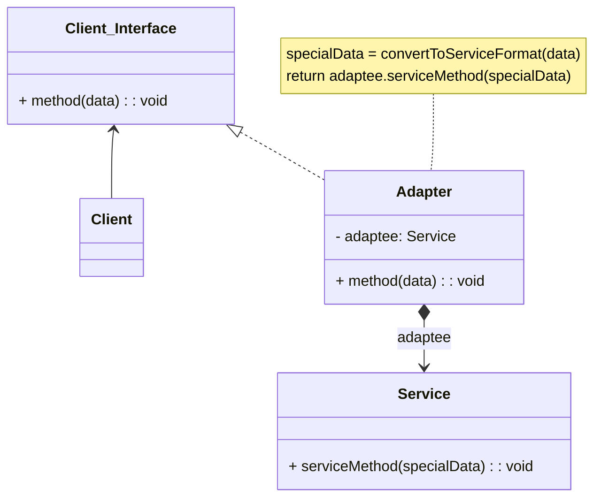
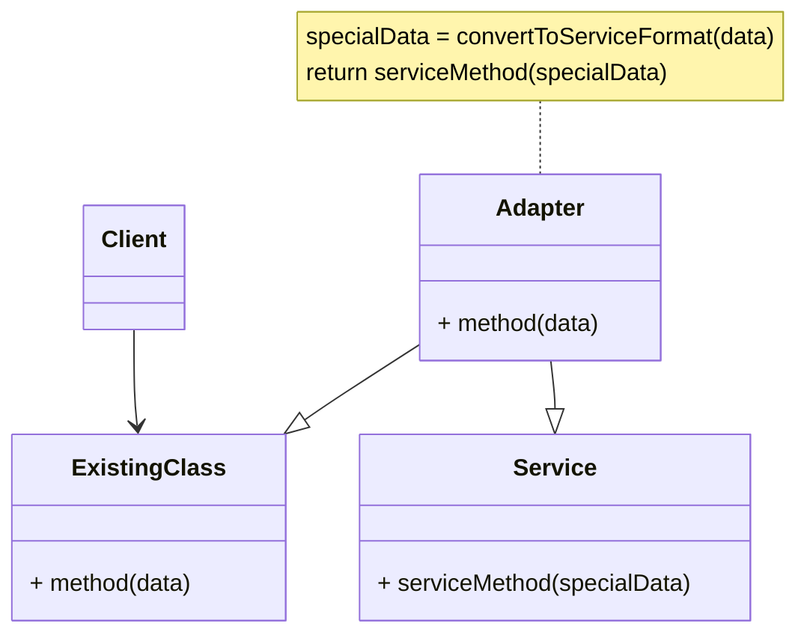

## **Giới thiệu:** 


- **Adapter (wrapper)** là một mẫu thiết kế thuộc nhóm **Structural Pattern**, giúp kết nối các giao diện (**Interfaces**) không tương thích lại với nhau. Nó cho phép các lớp giao diện khác nhau làm việc cùng nhau mà không cần thay đổi mã nguồn của chúng.
- **Mô tả:** Adapter hoạt động như một "cầu nối" giữa hai giao diện không tương thích. Nó chuyển đổi giao diện của một lớp thành một giao diện mà client mong đợi.
- **Mục tiêu:** giúp các lớp có giao diện khác nhau làm việc cùng nhau mà không cần thay đổi mã nguồn của chúng.
- **Adapter Pattern** còn được gọi là **Wrapper Pattern** do cung cấp một **interface** "bọc ngoài" tương thích cho một hệ thống có sẵn, có dữ liệu và hành vi phù hớp nhưng có interface không tương ứng với lớp đang viết.


---
## **Các thức hoạt động:**

- **Adapter** có một interface ==tương thích== với một trong các object hiện có.
- Với việc sử dụng **interface** này, object hiện có, có thể gọi các phương thức của Adapter **một cách an toàn**
- Khi được gọi, Adapter sẽ ==chuyển yêu cầu đến object thứ hai==, như theo một định dạng và thứ tự mà object thứ hai mong đợi.

---
## **Các thành phần chính:**

###### **Target (mục tiêu):**
- **Mô tả:** Giao diện mà client mong đợi
- **Ví dụ:** Một interface hoặc lớp trừu trường mà client sử dụng
###### **Adaptee (Đối tượng cần điều chỉnh):**
- **Mô tả:** Lớp có giao diện không tương thích với Target.
- **Ví dụ:** Một lớp hoặc thư viện bên ngoài mà bạn mong muốn sử dụng.
###### **Adapter (Bộ điều hợp):**
- **Mô tả:** Lớp chuyển đổi giao diện của Adaptee thành giao diện của Target.
- **Ví dụ:** Một lớp triển khai Target và sử dụng Adaptee để thực hiện các yêu cầu.

---
## **Kiến trúc:**

Có hai cách để thực hiện **Adapter Pattern** dựa theo cách cài đặt **(Implement)** của chúng:
###### **Object Adapter - Composition:**

Trong mô hình này, một lớp mới (Adapter) sẽ tham chiếu đến một (hoặc nhiều)
đối tượng của lớp có sãn với interface không tương thích (**Adaptee/Service**), đồng thời cài đặt interface mà người dùng mong muốn (**Target**). Trong lớp mới này, khi cài đặt các phương thúc của interface người dùng mong muốn, sẽ gọi phương thức cần thiết thông qua đối tượng thuộc lớp interface không tương thích.



Các thành phần chính trong mô hình:
- **Client** là một class chứa business logic của chương trình.
- **Client interface** mô tả giao thức mà các lớp khác phải tuân theo để có thể collab với client code.
- **Service**: là một class hữu ích (thường là bên thứ 3 hoặc kế thừa). Client không thể sử dụng trực tiếp với lớp này vì nó có interface không tương thích.
- **Adapter**: Là một class có thể hoạt động với cả client và service, nó implements client interface, trong khi đóng gói service object. Adapter khi được gọi từ Client thông qua Adapter Interface sẽ chuyển chings thành các cuộc gọi service object được bao bọc ở định dạng mà nó có thể hiểu được.

###### **Class Adapter - Inheritance:**

Trong mô hình này, một lớp mới (Adapter) sẽ kế thừa lớp có sẵn interface không tương thích (Adaptee/Service), đồng thời cài đặt Interface mà người dùng mong muốn (Target). 
Trong lớp mới. Khi cài đặt các phương thức interface mà người dùng mong muốn, phương thức này sẽ gọi các phương thức cần thiết mà nó thừa kế được từ lớp có interface không tương thích.



Các thành phần:
- **Class Adapter**: không cần phải bọc bất kỳ object nào vì nó kế thừa các hành vi từ client và service. Adaptation xảy ra trong các phương thức bị ghi đề. Kết quả của Adapter có thể được sử dụng thay cho một client class hiện có.

###### **So sánh Oject Adapter và Class Adapter:**

- Sự khác biệt chính là Class Adapter sử dụng Inheritance (kế thừa) để kết nối Adapter và Adaptee trong khi Object Adapter sử dụng Composition (chứa trong) để kết nối Adapter và Adaptee
- Trong cách tiếp cận Class Adapter, nếu một Adaptee là một class và không phải là một interface thì Adapter sẽ là một lớp con của Adaptee. Do đó, nó sẽ không phục vụ tất cả các lớp con khác theo cùng một cách vì Adapter là một lớp phụ cụ thể của Adaptee.
-  Object Adapter sẽ tốt hơn vì nó sử dụng Composition để giữ một thể hiện của Adaptee, cho phép một Adapter hoạt động với nhiều Adaptee nếu cần thiết.

---
## **Ví dụ minh họa:**

Hệ thống thanh toán:
```csharp
using System;

// Giao diện Target mà client mong muốn
interface IPaymentProcessor {
    void ProcessPayment(decimal amount);
}

// Adaptee: Hệ thống thanh toán cũ
class LegacyCashPayment {
    public void PayWithCash(double amount) {
        Console.WriteLine($"Paid {amount} using cash (legacy system).");
    }
}

// Adapter: Chuyển đổi từ giao diện mới sang hệ thống cũ
class PaymentAdapter : IPaymentProcessor {
    private readonly LegacyCashPayment _legacyPayment;

    public PaymentAdapter(LegacyCashPayment legacyPayment) {
        _legacyPayment = legacyPayment;
    }

    public void ProcessPayment(decimal amount) {
        // Chuyển đổi yêu cầu từ decimal sang double và gọi hệ thống cũ
        _legacyPayment.PayWithCash((double)amount);
    }
}

// Client code
class Program {
    static void Main(string[] args) {
        
        // Sử dụng hệ thống cũ thông qua Adapter
        LegacyCashPayment legacySystem = new LegacyCashPayment();
        IPaymentProcessor processor = new PaymentAdapter(legacySystem);
        processor.ProcessPayment(100.50m); // Client gọi giao diện mới
    }
}
```

**Vẽ hình chữ nhật:**
```csharp
internal class LegacyRectangle
{
	internal void Draw(int x, int y, int w, int h)
	{
		Console.WriteLine($"Drawing rectangle {x} {y} {w} {h}");
	}
}

internal class LegacyLine
{
	internal void Draw(int x1, int y1, int x2, int y2)
	{
		Console.WriteLine($"Drawing line {x1} {y1} {x2} {y2}");
	}
}

internal interface IShape
{
	void Draw(int x1, int y1, int x2, int y2);
}

internal class RectangleAdapter : IShape
{
	private readonly LegacyRectangle _legacyRectangle;

	public RectangleAdapter(LegacyRectangle legacyRectangle)
	{
		_legacyRectangle = legacyRectangle;
	}

	public void Draw(int x1, int y1, int x2, int y2)
	{
		int x = Math.Min(x1, x2);
		int y = Math.Min(y1, y2);
		int w = Math.Abs(x2 - x1);
		int h = Math.Abs(y2 - y1);
		_legacyRectangle.Draw(x, y, w, h);
	}
}

internal class LineAdapter : IShape
{
	private readonly LegacyLine _legacyLine;

	public LineAdapter(LegacyLine legacyLine)
	{
		_legacyLine = legacyLine;
	}

	public void Draw(int x1, int y1, int x2, int y2)
	{
		_legacyLine.Draw(x1, y1, x2, y2);
	}
}

class Program
{
	static void Main(string[] args)
	{
		List<IShape> shapes = new List<IShape>() { new LineAdapter(new LegacyLine()), new RectangleAdapter(new LegacyRectangle()) };

		int x1 = 5, y1 = 10, x2 = -3, y2 = 2;

		shapes.ForEach(shape => shape.Draw(x1, y1, x2, y2));
	}
}
```

---
## **Ưu/Nhược điểm:**

**Ưu điểm:** 
-  Cho phép các lớp có giao diện khác nhau làm việc cùng nhau.
- Tăng tính tái sử dụng mã nguồn.
- Linh hoạt và dễ dàng mở rộng.

**Nhược điểm:**
- Có thể làm tăng độ phức tạp của mã nguồn nếu sử dụng quá nhiều Adapter.
- Cần thêm lớp trung gian (Adapter), có thể ảnh hưởng đến hiệu suất.

---
## **Ứng dụng của Adapter Design Pattern**

- **Tích hợp thư viện bên ngoài:** Khi sử dụng các thư viện hoặc API có giao diện không tương thích với hệ thống hiện tại.
- **Tái sử dụng mã nguồn:** Khi muốn sử dụng lại các lớp cũ mà không cần thay đổi mã nguồn.
- **Hỗ trợ đa nền tảng:** Khi cần làm việc với các hệ thống hoặc nền tảng khác nhau.

---
## **Tóm tắt:**

- **Adapter Design Pattern** giúp kết nối các giao diện không tương thích với nhau.
- Có hai loại Adapter: **Class Adapter** và **Object Adapter**.
- Adapter tăng tính linh hoạt và tái sử dụng mã nguồn, nhưng có thể làm tăng độ phức tạp

---
## **Tài liệu:**

[1] Design Patterns for Dummies, Steve Holzner, PhD
[2] Head First, Eric Freeman
[3] Gang of Four Design Patterns 4.0