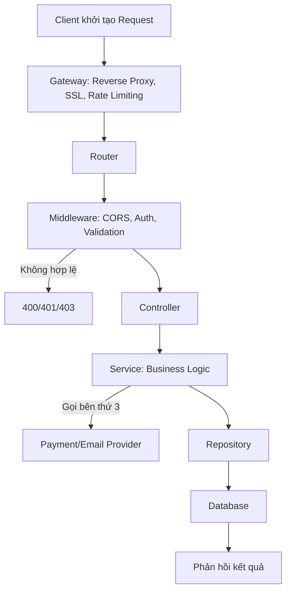

# Luồng Xử lý API Request (API Request Flow)

Luồng của một API request là quá trình giao tiếp giữa client và server: client khởi tạo và gửi request qua mạng, server tiếp nhận, xác thực, xử lý logic nghiệp vụ, truy vấn cơ sở dữ liệu, rồi trả kết quả về cho client.

## Bước 1: Client khởi tạo Request

Ứng dụng (web/mobile) chuẩn bị dữ liệu gồm:

- **Endpoint URL**: địa chỉ đích của API.
- **HTTP Method**: các hành động phổ biến như GET, POST, PUT, DELETE.
- **Headers**: chứa token xác thực (`Authorization`), định dạng dữ liệu (`Content-Type`), khóa idempotency (`Idempotency-Key` — bắt buộc với các request POST/PUT không mang tính idempotent, ví dụ giao dịch thanh toán), và mã định danh request (`X-Request-ID`) phục vụ tracing.
- **Parameters**: thông tin bổ sung để API xử lý, có thể nằm trong URL, query string, hoặc request body.
- **Body**: dữ liệu gửi đi (với POST hoặc PUT).

## Bước 2: Qua lớp Gateway (Network & Edge Layer)

Request được gửi qua mạng (DNS resolution, TLS handshake) đến địa chỉ IP của server, đi qua lớp Gateway trước khi vào ứng dụng Backend:

- **Reverse Proxy (Nginx/HAProxy)**: tiếp nhận request đầu tiên, phân tải (Load Balancing) nếu hệ thống có nhiều server Backend.
- **SSL Termination**: giải mã HTTPS thành HTTP nội bộ để tăng tốc cho Backend. Trong môi trường microservice, nên đảm bảo mạng nội bộ giữa các service là mạng riêng (private network) hoặc dùng mTLS để bù đắp việc traffic nội bộ không còn mã hóa TLS công khai.
- **Rate Limiting & DDoS Protection**: kiểm tra xem IP hoặc API key này có đang gửi quá nhiều request trong thời gian ngắn không. Nếu vượt ngưỡng → trả về `429 Too Many Requests`.
- **Authentication tập trung (tùy chọn, khuyến nghị cho microservice)**: xác thực token (JWT/Session) có thể thực hiện ngay tại tầng Gateway để tránh lặp lại logic này ở từng service phía sau.

## Bước 3: Đến tầng Router

Request tiến vào ứng dụng Backend (Node.js, Java Spring, Go, Python...). Framework đọc HTTP Method (GET, POST, PUT...) và URL Path (ví dụ `/api/v1/users/123`) để chuyển request đến đúng lớp xử lý.

## Bước 4: Được lọc bởi Middleware

- **CORS Middleware**: kiểm tra domain của client có được phép gọi API này không.
- **Authentication (Xác thực)**: giải mã Token (JWT/Session), nếu chưa được xử lý ở tầng Gateway. Nếu không hợp lệ → trả về `401 Unauthorized`.
- **Authorization (Phân quyền)**: kiểm tra User này có quyền thực hiện hành động này không (ví dụ Role Admin hay User). Nếu không đủ quyền → trả về `403 Forbidden`.
- **Input Validation (Kiểm tra dữ liệu)**: dùng các thư viện (Joi, class-validator, Zod) để đảm bảo dữ liệu gửi lên đúng định dạng. Dữ liệu sai → trả về `400 Bad Request` với cấu trúc lỗi thống nhất `{ "error_code", "field", "message" }`.

## Bước 5: Đến Controller

Sau khi đi qua các lớp Middleware, request chạm tới Controller.

Controller đóng vai trò tiếp nhận: bóc tách dữ liệu từ `req.params`, `req.query`, `req.body`, và thông tin User vừa được gán ở Middleware, sau đó gọi sang tầng Service để xử lý nghiệp vụ. Controller không nên chứa logic phức tạp hay câu lệnh SQL.

## Bước 6: Đến Service (Business Logic)

Đây là tầng chứa toàn bộ quy trình nghiệp vụ.

Ví dụ logic đặt hàng: tính toán tổng tiền → áp mã giảm giá → kiểm tra số lượng tồn kho → tạo đơn hàng.

- Nếu request có `Idempotency-Key`, Service kiểm tra key này đã được xử lý trước đó chưa (ví dụ tra trong Redis/DB); nếu đã xử lý, trả về kết quả của lần xử lý trước thay vì thực hiện lại — tránh trùng lặp giao dịch khi client retry.
- Nếu cần tương tác với bên thứ 3 (thanh toán VNPAY/Stripe, gửi email SendGrid), Service đứng ra thực hiện giao tiếp này, kèm cơ chế **Circuit Breaker** và **Timeout** để tránh cascading failure nếu bên thứ 3 gián đoạn.

## Bước 7: Đến Repository và Database

Để lưu trữ hoặc truy vấn dữ liệu, Service gọi tầng Repository/DAO:

- Tầng này chuyển đổi yêu cầu từ code thành câu lệnh SQL (SELECT, INSERT, UPDATE) hoặc NoSQL query, sử dụng ORM/Query Builder (Prisma, TypeORM, Hibernate) để giao tiếp với Database (MySQL, PostgreSQL, MongoDB).
- Thực hiện **Database Transaction** nếu thao tác gồm nhiều bước liên quan đến nhau (ví dụ trừ tiền tài khoản A và cộng tiền tài khoản B phải cùng thành công hoặc cùng thất bại) — **chỉ áp dụng khi các thao tác nằm trong cùng một database/service**. Nếu tài khoản A và B thuộc hai service/database khác nhau (microservice), transaction cục bộ không đảm bảo tính nhất quán; cần dùng **Saga pattern** (kèm bước bù trừ/compensating transaction) hoặc **Outbox pattern** để đảm bảo tính nhất quán cuối cùng (eventual consistency).
- Có thể áp dụng **Cache-aside pattern** (Redis) cho các truy vấn đọc tần suất cao (GET request) để giảm tải Database.

## Bước 8: Phản hồi

Đóng gói kết quả (thường dạng JSON) kèm mã trạng thái HTTP phù hợp (ví dụ `200 OK`, `404 Not Found`, `500 Internal Server Error`) và gửi ngược lại cho client. Với các phản hồi lỗi, sử dụng cấu trúc thống nhất `{ "error_code", "field", "message" }` để client xử lý nhất quán trên toàn hệ thống.

## Sơ đồ luồng tổng quát

## Công nghệ và kiến trúc nên áp dụng

- **Idempotency Key**: bắt buộc với các API POST/PUT liên quan giao dịch tài chính hoặc thao tác không idempotent, lưu trạng thái xử lý trong Redis/DB với TTL hợp lý.
- **Saga Pattern (orchestration hoặc choreography)**: dùng khi một nghiệp vụ cần phối hợp nhiều service/database khác nhau, thay thế cho Database Transaction cục bộ.
- **Outbox Pattern**: đảm bảo sự kiện phát ra sau khi ghi Database là đáng tin cậy, không bị mất khi hệ thống downstream tạm thời lỗi.
- **Message Queue (Kafka/RabbitMQ)**: dùng cho các tác vụ bất đồng bộ (gửi email, đồng bộ dữ liệu sang service khác) để không chặn response chính.
- **Circuit Breaker + Retry with backoff**: áp dụng cho mọi lời gọi ra bên thứ 3 hoặc giữa các service nội bộ.
- **Distributed Tracing (OpenTelemetry, Jaeger, Zipkin)**: gắn Correlation ID/trace ID từ Gateway, truyền xuyên suốt các tầng để phục vụ debug trong hệ thống phân tán.
- **API Gateway tập trung xác thực**: xác thực token một lần tại Gateway thay vì lặp lại ở từng service.
- **Cache-aside (Redis)**: cho các API đọc dữ liệu tần suất cao.
- **Health Check endpoint + Monitoring (Prometheus/Grafana)**: theo dõi tình trạng từng service, độ trễ từng tầng, tỉ lệ lỗi.
- **Structured Logging**: log có cấu trúc (JSON), gắn kèm trace ID, phục vụ tổng hợp và tìm kiếm log tập trung (ELK/Loki).
- **Audit Log**: ghi nhận riêng cho các thao tác nhạy cảm (thanh toán, thay đổi quyền, xóa dữ liệu).