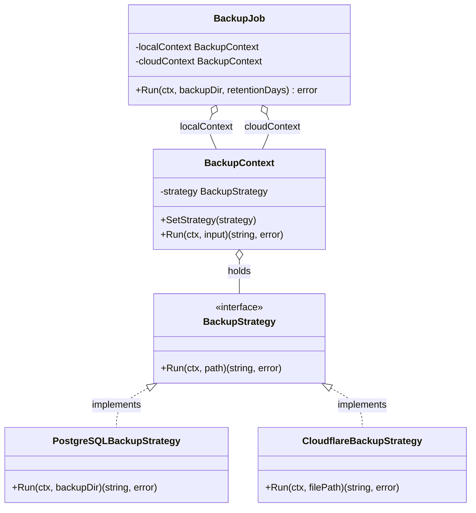
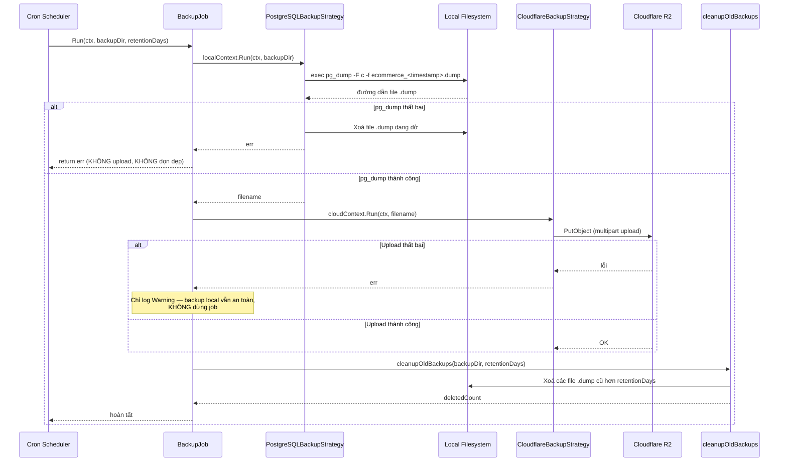

# Backup Database — Thiết lập & Workflow

Tài liệu mô tả cách thiết lập và vận hành quá trình sao lưu tự động cho PostgreSQL, lưu song song ở **local** (đĩa cục bộ) và **cloud** (Cloudflare R2), áp dụng **Strategy Pattern** để dễ mở rộng thêm các đích lưu trữ khác trong tương lai (AWS S3, Google Cloud Storage...).

---

## 1. Vì sao chọn định dạng `.dump` để sao lưu

Sao lưu cơ sở dữ liệu dưới dạng **dump** (qua công cụ `pg_dump` — tương đương `mysqldump` bên MySQL) [chuyển đổi dữ liệu thành tệp nhị phân/SQL gọn nhẹ, dễ di chuyển và phục hồi](https://erpsaigon.com/backup-database-dump-load-sage-300/).

- **Độc lập phiên bản và hệ thống:** dump lưu cấu trúc + dữ liệu dưới dạng độc lập với đường dẫn vật lý hay định dạng lưu trữ thô của hệ điều hành gốc — có thể phục hồi trên máy khác, hệ điều hành khác.
- **Tính nhất quán cao:** `pg_dump` mặc định chạy trong 1 transaction mức cô lập `REPEATABLE READ`, tận dụng cơ chế **MVCC** của PostgreSQL — đọc đúng 1 bản chụp (snapshot) nhất quán tại thời điểm bắt đầu, **không khoá (lock)** chặn ghi/đọc của các kết nối khác. Vì vậy backup không làm gián đoạn ứng dụng đang chạy.
- **Phục hồi chọn lọc:** dùng định dạng custom (`-F c`) cho phép `pg_restore` khôi phục từng bảng/schema riêng lẻ thay vì phải chạy lại toàn bộ file SQL.

## 2. Vì sao chọn Cloudflare R2 để lưu bản sao trên cloud

- **10GB miễn phí vĩnh viễn** — đủ cho quy mô dự án học tập/cá nhân.
- **Tương thích S3 API** — dùng lại nguyên `aws-sdk-go-v2`, không cần học SDK riêng.
- **Không tính phí egress (tải dữ liệu xuống)** — quan trọng cho backup, vì lúc **cần khôi phục khẩn cấp** (disaster recovery) là lúc cần tải hàng loạt file xuống nhiều nhất; nhiều dịch vụ lưu trữ khác tính phí egress, gây thêm chi phí/lo lắng đúng lúc cần backup nhất.

---

## 3. Kiến trúc: Strategy Pattern

### 3.1. Định nghĩa

**Strategy** là một Design Pattern thuộc nhóm **Behavioral**, cho phép định nghĩa một họ thuật toán (algorithm), đóng gói từng thuật toán vào 1 class riêng, và cho phép **hoán đổi qua lại giữa chúng tại runtime** mà không cần sửa code nơi sử dụng.

### 3.2. Đặc điểm

- Tách phần **"làm cái gì"** (interface `BackupStrategy`) khỏi phần **"làm như thế nào"** (từng struct triển khai cụ thể).
- Nơi gọi (`BackupContext`) chỉ biết làm việc qua interface, không quan tâm bên trong là PostgreSQL hay Cloudflare.

### 3.3. Ưu điểm / Nhược điểm trong bài toán backup này

|Ưu điểm|Nhược điểm|
|---|---|
|Thêm đích lưu trữ mới (VD: AWS S3) chỉ cần viết 1 struct mới implement `BackupStrategy`, không sửa `BackupJob`|Interface `Run(ctx, path string) (string, error)` phải dùng chung 1 chữ ký cho mọi strategy, dù ý nghĩa tham số hơi khác nhau: với `PostgreSQLBackupStrategy`, `path` là **thư mục** đích; với `CloudflareBackupStrategy`, `path` là **đường dẫn file** nguồn — đây là đánh đổi thường gặp của Strategy Pattern khi ép nhiều hành vi khác bản chất vào chung 1 interface|
|Test riêng từng strategy độc lập (mock `BackupStrategy` để test `BackupJob` mà không cần Postgres/R2 thật)|Thêm độ trừu tượng (1 interface + N struct) cho bài toán hiện tại chỉ có 2 chiến lược — cần cân nhắc nếu dự án nhỏ hơn|

### 3.4. Khi nào nên dùng

Khi có **nhiều cách khác nhau để thực hiện cùng 1 hành vi**, và số lượng cách đó **có khả năng tăng lên** theo thời gian. Ở đây: "nơi lưu trữ bản backup" hiện có 2 (local, Cloudflare), tương lai có thể thêm AWS S3, Google Cloud Storage — mỗi nơi chỉ cần 1 struct mới.

### 3.5. Cấu trúc file trong dự án

|File|Vai trò|
|---|---|
|`backups.strategy.go`|Định nghĩa interface `BackupStrategy` — hợp đồng chung|
|`backup.concrete.postgresql.go`|Concrete Strategy — chạy `pg_dump`, tạo file backup local|
|`backup.concrete.cloudflare.go`|Concrete Strategy — upload file backup lên Cloudflare R2|
|`backups.context.go`|`BackupContext` — nơi trung gian gọi tới strategy hiện tại|
|`backups.job.go`|`BackupJob` — điều phối toàn bộ luồng (local → cloud → dọn dẹp)|
|`backup.cleanup.go`|Hàm dọn các bản backup local đã quá hạn lưu trữ|

### 3.6. Sơ đồ lớp (Class Diagram)



---

## 4. Thiết lập

### 4.1. File `.env` (đặt ở thư mục gốc dự án, **không commit lên Git**)

```env
# Cloudflare R2
R2_ACCOUNT_ID=<r2_account_id>
R2_ACCESS_KEY_ID=<r2_access_key_id>
R2_SECRET_ACCESS_KEY=<r2_secret_access_key>
R2_BUCKET_NAME=ecommerce-backups

# Database
DB_HOST=postgresql
DB_USER=<db_user>
DB_PASSWORD=<db_password>
DB_NAME=e-commerce

# Chọn file cấu hình mà LoadConfig() sẽ đọc (xem mục 4.4)
ConfigPath=configs
ConfigName=local
ConfigType=yaml
```

`ConfigPath`/`ConfigName`/`ConfigType` quyết định `LoadConfig()` đọc file cấu hình nào trong thư mục `configs/` — cơ chế này cho phép **cùng 1 codebase** chạy đúng ở cả 2 môi trường: chạy trực tiếp (`go run`) dùng `local.yaml` (trỏ `localhost`), chạy trong Docker dùng `docker.yaml` (trỏ tên service nội bộ) — không cần sửa code khi đổi môi trường chạy.

### 4.2. Khai báo service trong `docker-compose.yaml`

```yaml
x-logging: &default-logging
  driver: "json-file"
  options:
    max-size: "10m"
    max-file: "3"

services:
  # ... các service khác (postgresql, redis...) ...

  backup-service:
    build:
      context: .
      dockerfile: docker/backup/Dockerfile
    container_name: backup.ecommerce
    restart: unless-stopped
    environment:
      # Ghi đè ConfigPath/ConfigName/ConfigType cho ĐÚNG môi trường Docker
      # (khác với giá trị trong .env dùng khi chạy "go run" trực tiếp)
      ConfigPath: /app/configs
      ConfigName: docker
      ConfigType: yaml

      DB_HOST: ${DB_HOST}
      DB_PORT: "5432"
      DB_USER: ${DB_USER}
      DB_PASSWORD: ${DB_PASSWORD}
      DB_NAME: e-commerce

      BACKUP_CRON: "0 2 * * *"        # 2h00 sáng mỗi ngày
      BACKUP_RETENTION_DAYS: "7"
      BACKUP_DIR: "/backups"

      R2_ACCOUNT_ID: ${R2_ACCOUNT_ID}
      R2_ACCESS_KEY_ID: ${R2_ACCESS_KEY_ID}
      R2_SECRET_ACCESS_KEY: ${R2_SECRET_ACCESS_KEY}
      R2_BUCKET_NAME: ${R2_BUCKET_NAME}

      TZ: "Asia/Ho_Chi_Minh"
    volumes:
      - backup_data:/backups
    networks:
      - ecommerce_net
    depends_on:
      postgresql:
        condition: service_healthy
    deploy:
      resources:
        limits:
          memory: 256M
          cpus: "0.5"
    logging: *default-logging

volumes:
  backup_data:
```

### 4.3. `docker/backup/Dockerfile`

```dockerfile
# ------ Giai đoạn 1: Build ứng dụng Go ------
FROM golang:1.26-alpine AS builder
WORKDIR /app
COPY go.mod go.sum ./
RUN go mod download
COPY . .
RUN CGO_ENABLED=0 go build -o /backup-service ./cmd/backup

# ------ Giai đoạn 2: Image chạy thật, nhẹ ------
FROM alpine:3.20

# Cài pg_dump/pg_restore — client tools của PostgreSQL.
# Nên chọn version client KHỚP với version server (postgres:15 trong compose)
RUN apk add --no-cache postgresql15-client tzdata

WORKDIR /app
COPY --from=builder /backup-service .
COPY --from=builder /app/configs ./configs

RUN mkdir -p /backups
ENTRYPOINT ["/app/backup-service"]
```

### 4.4. `configs/docker.yaml` (chỉ khác `local.yaml` ở phần `host`)

```yaml
server:
  port: 8080
  host: localhost
  mode: "dev"

postgres:
  host: postgresql        # Tên service Postgres trong docker-compose.yaml (khác "localhost" của local.yaml)
  port: 5432
  user: <db_user>
  password: <db_password>
  dbname: e-commerce
  maxIdleConns: 10          # Số kết nối nhàn rỗi giữ lại trong pool khi không có request
  maxOpenConns: 100         # Số kết nối mở tối đa cùng lúc — vượt ngưỡng, request mới phải chờ
  connMaxLifetime: 3600     # Vòng đời tối đa 1 kết nối (giây)

authentication:
  cloudflare:
    r2_token_name: "ecommerce-backups"
    r2_bucket_name: "ecommerce-backups"
    r2_token_value: "<r2_token_value>"
    r2_account_id: "<r2_account_id>"
    r2_access_key_id: "<r2_access_key_id>"
    r2_secret_access_key: "<r2_secret_access_key>"
    r2_endpoint: "https://<r2_account_id>.r2.cloudflarestorage.com"

cronjob:
  backup_cron: "@every 1h"     # Đổi sang "0 2 * * *" khi triển khai thật (2h sáng, ít traffic)
  backup_retention_days: 7
  backup_dir: "/backups"
```

---

## 5. Backup Workflow

Quy trình gồm **3 bước tuần tự**: **Backup local → Upload cloud → Dọn bản cũ**.

### 5.1. Bước 1 — Backup local (`PostgreSQLBackupStrategy`)

1. Xác định thư mục lưu trữ, đặt tên file theo timestamp, đuôi `.dump`.
2. Chuẩn bị tham số kết nối (host, port, user, database) từ `global.Config.PostgreSQL`.
3. Thực thi `pg_dump -F c` (định dạng custom, có nén sẵn) để tạo file `.dump`.
4. Nếu `pg_dump` thất bại giữa chừng, **xoá luôn file dở dang** — tránh `cleanupOldBackups` sau này nhầm tưởng đó là bản backup hợp lệ (vẫn có đuôi `.dump`), gây nhầm lẫn nghiêm trọng lúc cần khôi phục.
5. Trả về đường dẫn file vừa tạo.

### 5.2. Bước 2 — Upload cloud (`CloudflareBackupStrategy`)

1. Đọc cấu hình Cloudflare R2 (`endpoint`, `bucket`, `access key`, `secret key`) từ `global.Config.Authentication.Cloudflare`, kiểm tra đủ thông tin trước khi tiếp tục.
2. Tạo client AWS SDK trỏ `BaseEndpoint` về địa chỉ R2 (`region: "auto"`).
3. Mở file backup vừa tạo ở Bước 1.
4. Upload qua `manager.Uploader` (tự động chia nhiều phần nếu file lớn — multipart upload).

**Nếu bước này thất bại, `BackupJob` chỉ ghi log cảnh báo (Warning), không làm dừng toàn bộ job** — bản backup local vẫn còn nguyên, không bị mất chỉ vì 1 bước phụ gặp sự cố (mất mạng, sai credentials...).

### 5.3. Bước 3 — Dọn bản backup cũ (`cleanupOldBackups`)

1. Duyệt toàn bộ file `.dump` trong thư mục backup.
2. So sánh thời gian sửa đổi (mod time) với ngưỡng `retentionDays`.
3. Xoá các file cũ hơn ngưỡng, ghi log số lượng đã xoá.

> **Lưu ý quan trọng về thứ tự:** nếu Bước 1 (backup local) thất bại, `BackupJob` dừng lại ngay — **không** thực hiện Bước 2 và Bước 3. Điều này tránh việc dọn dẹp/xoá mất các bản backup cũ hợp lệ chỉ vì lần backup mới nhất bị lỗi.

### 5.4. Sơ đồ tuần tự (Sequence Diagram)



---

## 6. Kết quả sau khi triển khai

Sau khi chạy đúng lịch, các bản backup xuất hiện tại **Cloudflare Dashboard → Storage & Databases → R2 Object Storage → Buckets → `ecommerce-backups`**.

_(Đính kèm ảnh chụp màn hình minh hoạ khi có sẵn — ảnh gốc trong bản nháp bị lỗi cú pháp Markdown do dán từ Obsidian, cần export lại bằng cú pháp `` chuẩn hoặc upload trực tiếp lên GitHub.)_

---

## 7. Định hướng mở rộng

- Thêm `AWS S3BackupStrategy` hoặc `GoogleCloudStorageStrategy` khi cần đa dạng hoá nơi lưu trữ — chỉ cần implement `BackupStrategy`, không sửa `BackupJob`.
- Thử nghiệm khôi phục (`pg_restore`) định kỳ trên 1 DB thử nghiệm — một bản backup chưa từng được kiểm chứng khả năng khôi phục không nên được xem là đáng tin cậy.
- Cân nhắc **Transactional Outbox Pattern** hoặc cơ chế retry nếu bước upload cloud cần đảm bảo tin cậy cao hơn mức "log cảnh báo rồi bỏ qua" hiện tại.