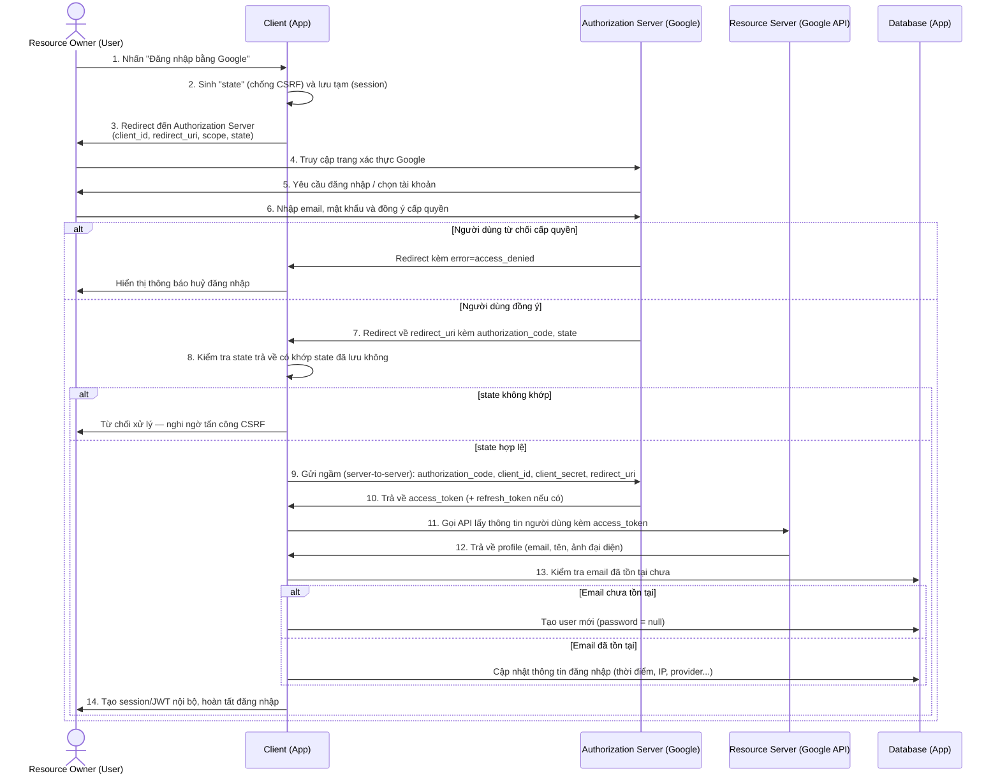

# Workflow Đăng nhập qua Bên thứ ba (OAuth 2.0) — Ví dụ với Google

> Tài liệu này không giới thiệu lại khái niệm OAuth 2.0. Phần giới thiệu tổng quan đã được trình bày [tại đây](https://github.com/GiaBao0510/ExperienceLearnedAndGathered/tree/main/Authentication/OAuth2). Tài liệu này tập trung mô tả **quy trình kỹ thuật** khi người dùng đăng nhập ứng dụng thông qua nhà cung cấp danh tính bên thứ ba (Google), bao gồm cả các trường hợp ngoại lệ cần xử lý.

---

## 1. Các thành phần tham gia (Actor)

| Thành phần               | Vai trò                                                                                                                  |
| ------------------------ | ------------------------------------------------------------------------------------------------------------------------ |
| **Resource Owner**       | Người dùng — chủ sở hữu tài khoản, người thực hiện cấp quyền                                                             |
| **Client**               | Ứng dụng bên thứ ba (web/mobile) muốn xin quyền truy cập thông tin người dùng                                            |
| **Authorization Server** | Máy chủ của nhà cung cấp (ví dụ: Google) — xác thực người dùng và cấp token                                              |
| **Resource Server**      | Máy chủ chứa dữ liệu thực tế (ví dụ: Google People API) — trả về thông tin hồ sơ người dùng khi có `access_token` hợp lệ |

Lưu ý: với Google, Authorization Server và Resource Server thường là hai endpoint khác nhau của cùng một hệ thống, nhưng về mặt logic vẫn cần phân biệt vì chúng đảm nhiệm hai trách nhiệm khác nhau (cấp token vs. trả dữ liệu).

---

## 2. Sơ đồ luồng xử lý

---

## 3. Mô tả chi tiết từng bước

**Bước 1 — Người dùng yêu cầu đăng nhập** Người dùng nhấn nút "Đăng nhập bằng Google" trên ứng dụng (Client).

**Bước 2 — Sinh tham số `state`** Trước khi redirect, Client sinh một chuỗi ngẫu nhiên gọi là `state` và lưu tạm ở phía server (hoặc session của trình duyệt). Đây là bước **quan trọng nhưng bị thiếu trong bản gốc** — nếu không có `state`, ứng dụng dễ bị tấn công CSRF (kẻ tấn công gửi một `authorization_code` giả để gán vào tài khoản nạn nhân).

**Bước 3 — Chuyển hướng đến trang xác thực** Client redirect trình duyệt người dùng đến Authorization Server kèm các tham số: `client_id`, `redirect_uri`, `scope` (quyền hạn yêu cầu, ví dụ `email`, `profile`) và `state`.

**Bước 4–6 — Xác thực và cấp quyền** Người dùng đăng nhập vào Google (nếu chưa có phiên đăng nhập) hoặc chọn tài khoản đã lưu, sau đó đồng ý cho phép ứng dụng truy cập thông tin.

_Trường hợp ngoại lệ:_ nếu người dùng **từ chối cấp quyền**, Authorization Server sẽ redirect về `redirect_uri` kèm tham số lỗi (`error=access_denied`) thay vì `authorization_code`. Ứng dụng cần xử lý case này bằng cách hiển thị thông báo phù hợp, không được coi đây là lỗi hệ thống.

**Bước 7 — Nhận Authorization Code** Nếu người dùng đồng ý, Authorization Server redirect trở lại ứng dụng kèm `authorization_code` và `state` đã gửi ở bước 3.

**Bước 8 — Xác thực `state`** Client so sánh `state` nhận được với `state` đã lưu ở bước 2. Nếu không khớp, yêu cầu bị từ chối ngay lập tức vì có khả năng là tấn công giả mạo.

**Bước 9 — Đổi mã lấy Access Token** Ứng dụng gửi request server-to-server (không qua trình duyệt người dùng) đến Authorization Server, gồm `authorization_code`, `client_id`, `client_secret` và `redirect_uri` để xác minh chính request này đến từ đúng ứng dụng đã đăng ký.

_Trường hợp ngoại lệ:_ `authorization_code` có thời gian sống rất ngắn (thường dưới 60 giây) và **chỉ dùng được một lần**. Nếu hết hạn hoặc bị dùng lại, Authorization Server trả về lỗi — Client cần yêu cầu người dùng đăng nhập lại từ đầu.

**Bước 10 — Nhận Access Token** Authorization Server xác minh thông tin hợp lệ và trả về `access_token` (và `refresh_token` nếu ứng dụng có yêu cầu quyền truy cập lâu dài).

**Bước 11–12 — Lấy thông tin người dùng** Ứng dụng dùng `access_token` gọi đến Resource Server (ví dụ Google People API / `userinfo` endpoint) để lấy dữ liệu hồ sơ: email, tên hiển thị, ảnh đại diện.

**Bước 13 — Đối chiếu với Database** Ứng dụng kiểm tra email vừa lấy được có tồn tại trong hệ thống hay chưa:

- **Chưa tồn tại**: tạo bản ghi user mới. Trường `password` trong bảng User nên để `nullable`, vì tài khoản này không có mật khẩu nội bộ.
- **Đã tồn tại**: cập nhật thông tin đăng nhập gần nhất (thời điểm, IP, thiết bị...).

_Trường hợp ngoại lệ cần cân nhắc:_ nếu email đã tồn tại nhưng được tạo bằng phương thức đăng ký truyền thống (email/password), hệ thống cần có chính sách rõ ràng — tự động liên kết (account linking) hay yêu cầu người dùng xác nhận trước khi gộp tài khoản, để tránh chiếm đoạt tài khoản qua email trùng.

**Bước 14 — Hoàn tất đăng nhập** Ứng dụng tạo phiên đăng nhập nội bộ (session hoặc JWT riêng của hệ thống — không phải `access_token` của Google) và điều hướng người dùng vào ứng dụng.

---

## 4. Kiến thức liên quan

- **Tham số `state`**: là cơ chế bắt buộc theo khuyến nghị của RFC 6749 để chống tấn công CSRF trong Authorization Code Flow. Ứng dụng production không nên bỏ qua tham số này.
- **PKCE (Proof Key for Code Exchange)**: mở rộng bảo mật cho OAuth 2.0, ban đầu dành cho ứng dụng mobile/SPA không thể giữ bí mật `client_secret` an toàn, nhưng hiện được khuyến nghị dùng cho cả ứng dụng web (OAuth 2.1 bắt buộc PKCE cho mọi loại client).
- **Account linking**: là bài toán thường gặp khi một người dùng có thể đăng nhập bằng nhiều phương thức (Google, Facebook, email/password) — cần thiết kế schema Database cho phép một user liên kết nhiều `provider` khác nhau, thay vì ràng buộc 1-1 giữa provider và tài khoản.
- **Refresh Token**: cho phép Client lấy `access_token` mới khi token cũ hết hạn mà không cần người dùng đăng nhập lại; cần được lưu trữ và mã hoá an toàn ở phía server, không lưu ở client-side storage như `localStorage`.
- **Access Token nên được xem là "opaque"** ở phía Client (trừ khi dùng chuẩn OpenID Connect với `id_token` dạng JWT) — không nên tự ý giải mã hay suy diễn nội dung của `access_token`.

---

## 5. Tài liệu tham khảo

1. [[P5] Giải ngố authentication: OAuth 2.0](https://duthanhduoc.com/blog/p5-giai-ngo-authentication-OAuth2)
2. [Tìm hiểu đôi chút về OAuth2](https://viblo.asia/p/tim-hieu-doi-chut-ve-oauth2-eW65GvMLlDO)
3. RFC 6749 — The OAuth 2.0 Authorization Framework (tham số `state`, luồng Authorization Code)