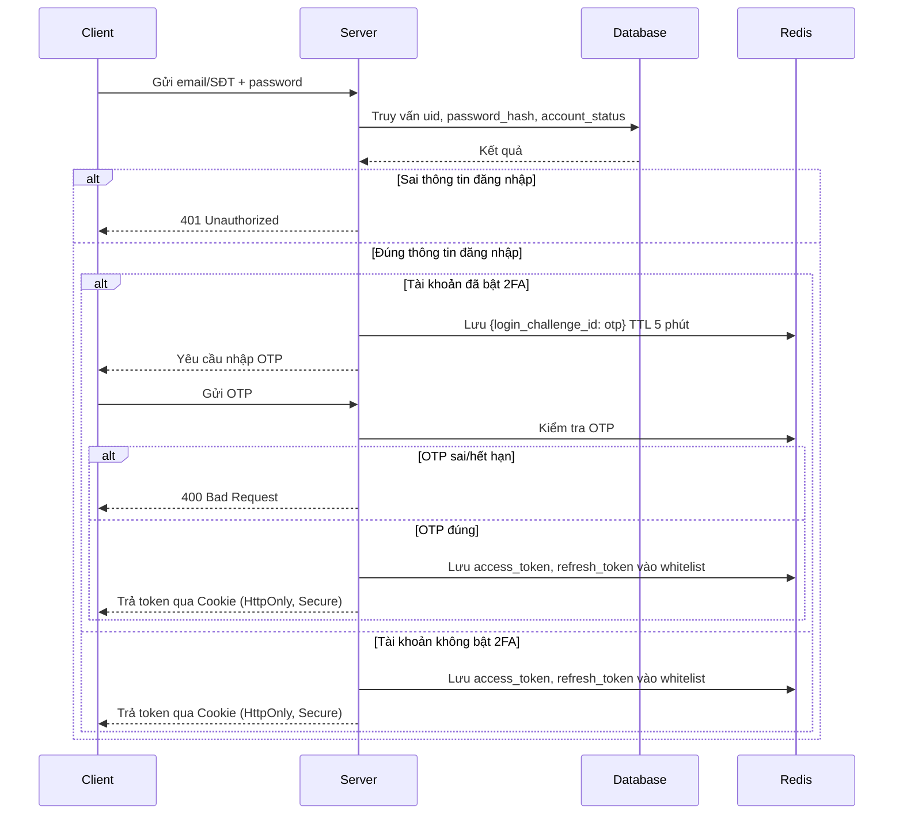

# Workflow Đăng nhập Người dùng (Login Workflow)

Quy trình đăng nhập là quá trình xác thực danh tính để truy cập hệ thống. Người dùng truy cập form đăng nhập, nhập thông tin (email hoặc số điện thoại và mật khẩu), hệ thống đối chiếu với cơ sở dữ liệu. Nếu thông tin chính xác, người dùng được cấp quyền truy cập; nếu sai, hệ thống báo lỗi. Nếu tài khoản đã bật xác thực hai yếu tố (2FA), hệ thống yêu cầu xác minh thêm bằng mã OTP trước khi cấp quyền.

## Bước 1: Nhập thông tin đăng nhập

Người dùng nhập Email hoặc Số điện thoại đã đăng ký, cùng Mật khẩu, trên form đăng nhập.

## Bước 2: Xác thực thông tin đăng nhập

Hệ thống truy vấn tài khoản theo email hoặc số điện thoại, sử dụng parameterized query để tránh SQL Injection:

```sql
SELECT uid, password_hash, account_status
FROM USER
WHERE email = ? OR phonenum = ?;
```

- Băm mật khẩu đầu vào (cùng thuật toán đã dùng khi lưu, ví dụ bcrypt/Argon2id) và so sánh với `password_hash`.
- Nếu tài khoản không tồn tại, hoặc mật khẩu không khớp, hoặc `account_status` khác `ACTIVE`: trả về lỗi chung `401 Unauthorized` với thông điệp thống nhất "Thông tin đăng nhập không chính xác" — không phân biệt nguyên nhân cụ thể ra ngoài, để tránh lộ thông tin tài khoản có tồn tại hay không.
- Mỗi lần xác thực sai được ghi nhận theo IP và theo tài khoản để áp dụng rate limiting (ví dụ khóa tạm 15 phút sau 5 lần sai liên tiếp).

## Bước 3: Xác thực hai lớp (2FA) — chỉ áp dụng nếu tài khoản đã bật 2FA

- Nếu tài khoản **chưa bật** 2FA: bỏ qua bước này, chuyển thẳng sang Bước 4.
- Nếu tài khoản **đã bật** 2FA:
  - Hệ thống sinh một `login_challenge_id` tạm thời gắn với phiên đăng nhập hiện tại, sinh mã OTP và lưu vào Redis theo cấu trúc key-value `{login_challenge_id: otp}`, TTL 5 phút.
  - Mã OTP được gửi qua SMS, Email, hoặc ứng dụng Authenticator.
  - Giới hạn gửi lại OTP: tối đa 3 lần / giờ.
  - Giới hạn nhập sai: khóa tạm sau 5 lần sai liên tiếp; mỗi lần sai được ghi nhận để rate limiting.
  - Nếu xác minh sai hoặc OTP hết hạn: trả về `400 Bad Request`.
  - Nếu xác minh đúng: chuyển sang Bước 4.

## Bước 4: Cấp quyền truy cập (Issue Token)

- Sau khi xác thực thành công (đã qua Bước 2, và Bước 3 nếu áp dụng), hệ thống cấp:
  - **Access Token** (JWT) — thời gian sống ngắn, ví dụ 15 phút.
  - **Refresh Token** (JWT) — thời gian sống dài hơn, ví dụ 7 ngày.
- Phía client lưu token trong cookie với thuộc tính bảo mật: `HttpOnly`, `Secure`, `SameSite=Strict` (hoặc `Lax` tùy yêu cầu CORS), nhằm giảm rủi ro bị đánh cắp qua XSS/CSRF.
- Phía server lưu whitelist token trong Redis theo cấu trúc `{white_list:<uid>: {access_token, refresh_token}}`, TTL của mỗi token trong Redis khớp với TTL thực tế của token đó (access và refresh có TTL khác nhau, không dùng chung một mốc thời gian).
- Ghi nhận audit log cho lần đăng nhập thành công (uid, thời gian, IP, thiết bị).

## Bước 5: Đăng xuất (Logout)

- Khi người dùng đăng xuất, server xóa access token và refresh token tương ứng khỏi whitelist trong Redis, đồng thời client xóa cookie.
- Đây là bước bắt buộc để đảm bảo token bị vô hiệu hóa ngay lập tức, thay vì chỉ chờ hết TTL tự nhiên.

## Sơ đồ luồng tổng quát



## Công nghệ và kiến trúc nên áp dụng

- **Rate Limiting** ở tầng API Gateway cho endpoint đăng nhập và endpoint gửi OTP, chống brute-force và spam OTP.
- **Refresh Token Rotation**: mỗi lần refresh access token, cấp luôn refresh token mới và vô hiệu hóa refresh token cũ — giảm rủi ro nếu refresh token bị đánh cắp.
- **Redis** làm session/token store dùng chung giữa các instance của Auth Service, đảm bảo nhất quán khi hệ thống chạy nhiều bản sao (horizontal scaling).
- **Message Queue (Kafka/RabbitMQ)**: gửi OTP qua Notification Service bất đồng bộ — dùng chung hạ tầng với luồng đăng ký để tránh trùng lặp component.
- **Circuit Breaker** cho lời gọi đến nhà cung cấp SMS/Email, kèm fallback provider nếu nhà cung cấp chính gián đoạn.
- **Audit Log**: ghi nhận mọi lần đăng nhập thành công/thất bại (uid, IP, thiết bị, thời gian) phục vụ điều tra bảo mật.
- **Anomaly Detection (tùy chọn)**: phát hiện đăng nhập bất thường (đổi vị trí địa lý đột ngột, thiết bị lạ) để yêu cầu xác minh bổ sung.
- **Structured Logging + Correlation ID**: gắn `trace_id` xuyên suốt các bước đăng nhập để dễ truy vết khi debug hoặc điều tra sự cố.
- **Chuẩn hóa cấu trúc lỗi trả về** (`error_code`, `field`, `message`) đồng bộ với tài liệu đăng ký, để client xử lý nhất quán trên toàn hệ thống.
- **Monitoring**: theo dõi tỉ lệ đăng nhập thành công/thất bại, tỉ lệ OTP gửi thành công, độ trễ từng bước — dùng Prometheus/Grafana hoặc tương đương.