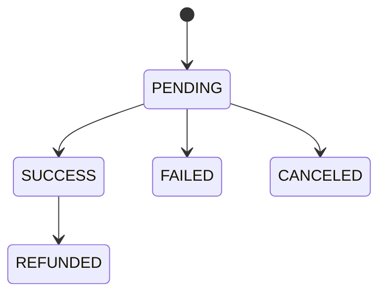

# Payment Workflow (Quy trình thanh toán)

Payment workflow là chuỗi các bước xử lý giao dịch tài chính, từ lúc người dùng bấm nút mua hàng cho đến khi tiền được chuyển thành công vào tài khoản, bao gồm: khởi tạo giao dịch, xử lý qua cổng thanh toán, và cập nhật trạng thái đơn hàng.

---

## Tại sao thiết kế Payment lại khó

Nhiều người mới nghĩ làm payment đơn giản là: User bấm mua → gọi API của cổng thanh toán → cổng trả về thành công → update database thành `SUCCESS` → xong.

Thực tế không như vậy. Hệ thống thanh toán là nơi mọi tình huống xấu nhất về network đều có thể xảy ra:

- Gateway đang xử lý thì sập.
- User đã bị trừ tiền nhưng client bị timeout, không nhận được response.
- User bực mình bấm nút "Thanh Toán" liên tục nhiều lần.
- Webhook từ Gateway gọi về server bị delay, hoặc gọi nhiều lần cho cùng một giao dịch.

Làm payment không khó ở việc "làm cho nó chạy", mà khó ở việc đảm bảo nó luôn chạy đúng trong mọi trường hợp lỗi.

---

## Flow chi tiết của hệ thống thanh toán

Một flow chuẩn (dạng Redirect hoặc Hosted Page) đi qua các bước sau:

### Bước 1: Khởi tạo (Init)

Client gửi yêu cầu thanh toán lên Backend, kèm header `Idempotency-Key` — một chuỗi UUID do client tự sinh cho mỗi lần bấm nút.

- Backend kiểm tra `Idempotency-Key` này đã tồn tại trong DB/Redis chưa. Nếu có rồi, trả về ngay kết quả của lần xử lý trước đó, **không** tạo giao dịch mới. Đây là cơ chế bắt buộc để chống trường hợp mạng lag khiến người dùng bấm "Thanh toán" nhiều lần, hoặc client tự động retry — nếu không có bước này, hệ thống có thể tạo nhiều transaction và gọi Gateway nhiều lần cho cùng một lần mua hàng.
- Nếu là request mới: Backend tạo bản ghi `Order` (`order_id`, `payment_method`, `created_at`,...) ở trạng thái `PENDING`, sau đó gọi sang Payment Gateway để lấy `payment_url`.
- Nếu lời gọi tới Gateway thất bại hoặc timeout (luôn set timeout cho mọi HTTP request gọi ra ngoài, ví dụ 5-10 giây): trả lỗi rõ ràng cho client. Order vẫn ở trạng thái `PENDING`, worker đối soát ở Bước 5 sẽ xử lý tiếp nếu cần.

### Bước 2: Thanh toán (Pay)

Backend trả `payment_url` về cho Client. Client redirect người dùng sang trang của Gateway (Momo, PayPal, VNPay, ZaloPay,...). Người dùng thực hiện thanh toán bằng cách nhập thông tin xác nhận hoặc quét mã QR.

- Gateway kết nối với ngân hàng để kiểm tra số dư và xác thực giao dịch.
- Nếu thanh toán thất bại (không đủ số dư, lỗi, nghẽn mạng): Gateway chuyển hướng người dùng về lại trang trước đó, kèm trạng thái `FAILED`.
- Nếu người dùng chủ động thoát hoặc hủy giữa chừng mà chưa hoàn tất bước xác nhận với ngân hàng: giao dịch được đánh dấu `CANCELED` (phân biệt với `FAILED` — `FAILED` là giao dịch đã được thử nhưng bị ngân hàng/Gateway từ chối; `CANCELED` là giao dịch chưa từng hoàn tất do người dùng bỏ ngang).

### Bước 3: Xác nhận (Confirm) — hai kênh song song

**Kênh 1 — Webhook/Callback (server-to-server):** Gateway báo kết quả giao dịch về Backend qua một URL webhook. Đây là kênh chính xác và đáng tin cậy **duy nhất** để cập nhật Database.

- **Security:** Gateway uy tín luôn gửi kèm chữ ký (signature) trong header. Backend bắt buộc dùng Secret Key để verify chữ ký này, tránh bị giả mạo request nạp tiền khống.
- **Fast Acknowledge:** khi webhook gọi đến, Backend nhanh chóng verify signature, đẩy event vào Message Queue (RabbitMQ, Kafka) hoặc lưu tạm vào DB, rồi lập tức trả `200 OK` cho Gateway. Không xử lý logic DB nặng nề ngay trong request này — nếu Gateway chờ lâu sẽ báo timeout và spam gọi lại webhook.
- **Orphan webhook:** nếu webhook gọi đến với `order_id`/`provider_transaction_id` không tồn tại trong hệ thống, cần ghi log và bắn alert thay vì bỏ qua âm thầm — đây có thể là dấu hiệu tấn công hoặc lỗi đồng bộ dữ liệu.

**Kênh 2 — Redirect (client-side):** Sau khi thanh toán, Gateway redirect người dùng về lại giao diện web/app, kèm theo vài tham số trạng thái. Kênh này **chỉ dùng để hiển thị UI cho người dùng**, tuyệt đối không dùng để cập nhật Database, vì tham số trên URL có thể bị người dùng giả mạo (ví dụ tự sửa `status=success` trên URL). Chỉ tin Webhook hoặc lời gọi trực tiếp server-to-server tới Gateway.

### Bước 4: Ghi nhận kết quả vào Database

Khi Webhook báo `SUCCESS`, Backend phải update cả `payment_transactions` và `orders`. Đôi khi Webhook gọi đúp hai lần gần như cùng lúc (race condition) — nếu không xử lý, hệ thống có thể cộng tiền hoặc gửi email xác nhận hai lần.

- **Giải pháp:** dùng lock ở Database (ví dụ `SELECT ... FOR UPDATE` trong SQL) kết hợp kiểm tra trạng thái hiện tại — chỉ update khi trạng thái đang là `PENDING`; nếu đã là `SUCCESS` rồi thì bỏ qua webhook gọi đúp.
- Với hệ thống throughput rất cao, có thể cân nhắc Optimistic Locking (thêm cột `version`, update kèm điều kiện `WHERE version = ?`) để giảm lock contention thay vì khóa bi quan.

### Bước 5: Đối soát (Reconciliation)

Không phải lúc nào Webhook cũng đến đích thành công (delay, mất gói tin, server down đúng lúc Gateway gọi về). Một worker chạy nền theo lịch (CRON job) định kỳ quét các giao dịch đang ở trạng thái `PENDING` quá lâu (ví dụ hơn 15-30 phút), sau đó dùng `provider_transaction_id` để gọi API "Check Transaction Status" của Gateway nhằm xác minh trạng thái thực tế:

- **Nếu Gateway xác nhận giao dịch thành công**: cập nhật `payment_transactions` và `orders` sang `SUCCESS` (áp dụng cùng cơ chế lock ở Bước 4 để tránh đụng độ với Webhook nếu nó đến muộn), gửi thông báo cho người dùng qua Email.
- **Nếu Gateway xác nhận giao dịch thất bại/không tồn tại**: cập nhật sang `FAILED`.
- **Nếu Gateway xác nhận tiền đã thực sự bị trừ nhưng hệ thống của mình lại ghi nhận thất bại** (lệch dữ liệu giữa hai bên): gọi **API Refund của chính Gateway** bằng `provider_transaction_id` để hoàn tiền tự động cho người dùng, đồng thời tạo audit log và bắn alert cho đội vận hành để theo dõi. Backend không tự ý thao tác với số tài khoản/số thẻ ngân hàng của người dùng — toàn bộ việc kiểm tra và hoàn tiền đều thực hiện gián tiếp qua API của Gateway bằng `provider_transaction_id`, backend không cần và không được phép chạm trực tiếp vào dữ liệu thẻ (PAN/CVV) — đây là dữ liệu do Gateway tokenize và quản lý, việc backend tự lưu/truy vết số thẻ sẽ vi phạm chuẩn PCI-DSS.

---

## Thiết kế API cho Payment

Thiết kế API theo chuẩn RESTful, rõ ràng và tách biệt logic:

- **POST /api/v1/payments**: khởi tạo transaction mới (Bước 1), trả về `payment_url` để client redirect.
- **GET /api/v1/payments/{id}**: cho phép client polling để tự cập nhật UI (đang pending, thành công, hay thất bại). Endpoint này chỉ **đọc** trạng thái đã được ghi nhận bởi Webhook (Bước 3-4) hoặc Reconciliation job (Bước 5) — bản thân polling không phải là nguồn xác nhận giao dịch.
- **POST /api/v1/webhooks/{provider}**: API hứng dữ liệu từ Gateway (ví dụ `/webhooks/stripe`, `/webhooks/momo`) — tương ứng Bước 3.

---

## Thiết kế Database cho Payment Transaction

Nguyên tắc cốt lõi: tách biệt `Order` và `Payment Transaction`. Một `Order` có thể có nhiều lần thử thanh toán (do người dùng chọn sai thẻ, hủy rồi thanh toán lại,...).

**Table `payment_transactions`** cơ bản cần có:

- `id`: Primary key (nên dùng UUID).
- `order_id`: Foreign key liên kết đến bảng `orders`.
- `amount`: Số tiền — lưu dưới dạng số nguyên (integer), đơn vị nhỏ nhất (ví dụ VNĐ hoặc cent). Tuyệt đối không dùng float/double để lưu tiền.
- `currency`: Mã tiền tệ (VND, USD).
- `provider`: Tên cổng thanh toán (STRIPE, VNPAY, MOMO).
- `provider_transaction_id`: Mã giao dịch do cổng thanh toán trả về — dùng ở Bước 5 để đối soát và xử lý refund.
- `status`: Trạng thái (`PENDING`, `SUCCESS`, `FAILED`, `REFUNDED`, `CANCELED`).
- `idempotency_key`: Khóa để chống duplicate — dùng ở Bước 1.

Trạng thái chỉ được chuyển theo một chiều: `PENDING` → `SUCCESS` / `FAILED` / `CANCELED`, và `SUCCESS` → `REFUNDED`. Không cho phép chuyển ngược, ví dụ từ `SUCCESS` về `PENDING`.

---

## Những cái bẫy Developer hay mắc phải

**Tin tưởng Client:** lấy trạng thái thành công từ URL redirect của người dùng để update DB — người dùng hoàn toàn có thể giả mạo URL này (đã nêu ở Bước 3, kênh Redirect).

**Không lưu lại Log:** khi cần đối chiếu với Gateway về một giao dịch lệch tiền, cần có bằng chứng. → Lưu toàn bộ Request/Response payload (kể cả Header) khi giao tiếp với Gateway vào log hoặc một bảng lưu trữ riêng biệt.

**Quên mất Timeout:** đang gọi sang Gateway lấy `payment_url` mà mạng lag treo 30 giây (đã nêu ở Bước 1). → Luôn set timeout (ví dụ 5-10 giây) cho mọi HTTP request gọi ra bên ngoài.

---

## Security

- **PCI-DSS**: backend không lưu trữ và không xử lý trực tiếp dữ liệu thẻ thô (số thẻ PAN, CVV). Toàn bộ thông tin thẻ do Gateway xử lý và tokenize; backend chỉ lưu `provider_transaction_id` và token do Gateway cấp.
- **Webhook signature verification**: bắt buộc với mọi webhook nhận từ Gateway.
- **HTTPS bắt buộc** cho toàn bộ endpoint liên quan thanh toán.
- **Tách biệt secret key** giữa môi trường sandbox và production, không hard-code trong source code.

---

## Best Practices khác

- **Alerting**: thiết lập alert bắn về Telegram/Slack ngay lập tức nếu webhook verify signature thất bại liên tục, hoặc tỉ lệ `FAILED` tăng vọt bất thường (dấu hiệu Gateway đang gặp sự cố).
- **Sandboxing**: luôn test kỹ ở môi trường Sandbox/Test của Gateway với đủ kịch bản: thẻ hết tiền, thẻ bị khóa, người dùng tắt trình duyệt giữa chừng.
- **Refund flow**: khi cần hoàn tiền (chủ động từ người dùng, hoặc tự động từ Reconciliation job ở Bước 5), luôn gọi API Refund của Gateway bằng `provider_transaction_id`, ghi nhận giao dịch refund như một bản ghi riêng, cập nhật `orders` sang `REFUNDED`.

---

## Công nghệ và kiến trúc nên áp dụng

- **Idempotency Key**: lưu trong Redis (TTL vài giờ) hoặc cột riêng trong DB với unique constraint.
- **Message Queue (Kafka/RabbitMQ)**: nhận event từ Webhook, xử lý bất đồng bộ, tách khỏi request-response chính để đáp ứng yêu cầu "Fast Acknowledge".
- **Saga Pattern**: nếu quy trình thanh toán còn kéo theo các service khác (ví dụ trừ kho, tạo hóa đơn ở service riêng), dùng Saga có bước bù trừ (compensating transaction) thay vì transaction cục bộ.
- **Optimistic/Pessimistic Locking**: `SELECT ... FOR UPDATE` cho hệ thống vừa và nhỏ; cột `version` cho hệ thống throughput cao.
- **Circuit Breaker + Timeout + Retry with backoff**: cho mọi lời gọi ra Payment Gateway.
- **Distributed Tracing**: gắn trace ID xuyên suốt từ lúc Client khởi tạo đến khi Webhook/Reconciliation cập nhật xong, hỗ trợ điều tra khi có tranh chấp giao dịch.
- **Audit Log riêng biệt** cho mọi thao tác liên quan tiền (khởi tạo, xác nhận, refund).
- **Monitoring & Alerting (Prometheus/Grafana + Telegram/Slack)**: theo dõi tỉ lệ `FAILED`, độ trễ Webhook, số lần verify signature thất bại.
- **Secrets Management (Vault, AWS Secrets Manager,...)**: quản lý API key/secret key của từng Gateway theo môi trường, tránh hard-code.

---

## Tham khảo

1. https://viblo.asia/p/tu-so-0-den-he-thong-thanh-toan-payment-system-chuan-chinh-kinh-nghiem-thuc-chien-cho-backend-dev-y0VGwGlyVPA
2. https://web.dev/articles/how-payment-request-api-works?hl=vi
3. https://zozo.vn/blog/quy-trinh-tich-hop-cong-thanh-toan-vao-website-928