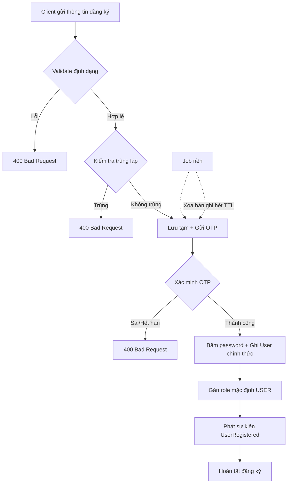

# Workflow Đăng ký Người dùng (Registration Workflow)
 
Workflow đăng ký là chuỗi bước xử lý nhằm xác minh tính hợp lệ của thông tin người dùng và khởi tạo tài khoản một cách an toàn, nhất quán.
 
## Cấu trúc dữ liệu người dùng
 
```
User(
    uid,         // Tự động sinh (UUID hoặc auto-increment)
    name,        // Bắt buộc
    birth_date,  // Bắt buộc
    email,       // Bắt buộc, duy nhất
    phonenum,    // Bắt buộc, duy nhất
    password_hash, // Bắt buộc, lưu dạng băm (hash), không lưu plaintext
    address,     // Tùy chọn
    fk_ID_role,  // Tự động gán, mặc định = USER
    created_at,  // Tự động gán
    updated_at   // Tự động cập nhật
)
```
 
## Bước 1: Client gửi thông tin đăng ký
 
Client gửi đầy đủ thông tin bắt buộc (`name`, `birth_date`, `email`, `phonenum`, `password`) cùng xác nhận đồng ý điều khoản sử dụng / chính sách dữ liệu cá nhân đến server qua API đăng ký.
 

## Bước 2: Xác thực đầu vào và dữ liệu trùng lặp
 
**2.1. Xác thực định dạng (input validation):** Hệ thống kiểm tra định dạng email, số điện thoại hợp lệ, ngày sinh không trống, và độ mạnh mật khẩu ngay khi nhận request.
→ Nếu lỗi: trả về `400 Bad Request` với cấu trúc `{ "error_code", "field", "message" }`.
 
**2.2. Xác thực trùng lặp:** Kiểm tra `email` và `phonenum` đã tồn tại trong hệ thống chưa (đảm bảo mỗi người dùng có thông tin liên hệ duy nhất).
→ Nếu trùng: trả về `400 Bad Request` với `error_code` tương ứng (ví dụ `EMAIL_ALREADY_EXISTS`).
→ Đây là lớp kiểm tra ở tầng ứng dụng; DB vẫn cần unique constraint làm lớp bảo vệ cuối (xem mục 5).
 
**2.3. Lưu tạm và gửi OTP:** Nếu 2.1 và 2.2 hợp lệ, hệ thống lưu thông tin vào bảng/kho tạm `pending_registrations` (có TTL, ví dụ 15 phút) — **chưa ghi vào bảng `User` chính thức**. Sau đó gửi mã OTP qua SMS/Email hoặc liên kết kích hoạt (Email Activation).
 
>Vì trong lúc chờ OTP xác minh — nếu ghi thẳng vào bảng `User` chính thức trước khi xác minh, hệ thống sẽ tích lũy tài khoản chưa xác minh vĩnh viễn, gây sai lệch dữ liệu nghiệp vụ (vấn đề C2, M2).
 
**2.4. Xác minh OTP:** Người dùng nhập mã OTP hoặc bấm liên kết kích hoạt.
- TTL của OTP: đề xuất 5 phút.
- Giới hạn gửi lại: tối đa 3 lần / giờ / số điện thoại hoặc email.
- Giới hạn nhập sai: khóa tạm sau 5 lần sai liên tiếp.
→ Nếu xác minh thành công: chuyển sang Bước 3.
→ Nếu thất bại hoặc hết hạn: trả về `400 Bad Request`, dữ liệu tạm tự động hết hạn theo TTL.
 
## Bước 3: Khởi tạo tài khoản chính thức
 
**3.1. Băm mật khẩu:** Mật khẩu được băm bằng thuật toán một chiều (bcrypt hoặc Argon2id) — không mã hóa hai chiều.
 
**3.2. Ghi dữ liệu chính thức:** Chuyển dữ liệu từ `pending_registrations` sang bảng `User` chính thức trong một transaction. Nếu hệ thống có tích hợp CRM, việc đồng bộ CRM được xử lý bất đồng bộ (xem mục 5 – Outbox Pattern) để không chặn response chính và không tạo phụ thuộc cứng giữa hai hệ thống.
 
**3.3. Phân quyền:** Gán `fk_ID_role = USER` (mặc định) cho mọi tài khoản mới. Việc gán các role khác (`STAFF`, `ADMIN`, ...) không thực hiện tự động trong luồng đăng ký công khai, mà qua quy trình cấp quyền riêng do quản trị viên thực hiện.
 
**3.4. Phát sự kiện `UserRegistered`:** Sau khi transaction ghi `User` thành công, hệ thống phát sự kiện để các service khác (email chào mừng, provisioning, analytics, đồng bộ CRM) xử lý độc lập.
 
→ Lỗi tại bước này chủ yếu là `500 Internal Server Error` (lỗi hệ thống, không phải lỗi do người dùng).
 
## Bước 4: Dọn dẹp dữ liệu chưa xác minh
 
Một tiến trình nền (scheduled job) định kỳ xóa các bản ghi trong `pending_registrations` đã hết TTL mà chưa xác minh thành công.
 
---
 
## 5. Công nghệ và kiến trúc nên áp dụng
 
Áp dụng khi hệ thống được triển khai theo hướng microservice hoặc cần chịu tải lớn:
 
- **Message Queue (Kafka/RabbitMQ):** dùng để gửi yêu cầu OTP đến Notification Service và phát sự kiện `UserRegistered` một cách bất đồng bộ, giảm độ trễ response chính và tăng khả năng chịu lỗi.
- **Outbox Pattern:** đảm bảo việc ghi `User` vào DB và phát sự kiện đồng bộ CRM là nhất quán — ghi sự kiện vào bảng outbox trong cùng transaction với việc tạo user, sau đó một tiến trình riêng đọc outbox và publish, tránh mất sự kiện khi CRM tạm thời lỗi.
- **Saga Pattern (orchestration):** nếu quy trình cấp tài khoản phải phối hợp nhiều service (User Service, Role Service, CRM Service) với khả năng cần rollback từng phần, nên dùng Saga có bước bù trừ (compensating transaction) thay vì transaction phân tán truyền thống.
- **Cache (Redis):** lưu trạng thái `pending_registrations` và OTP kèm TTL tự nhiên (Redis TTL), giảm tải cho DB chính và tự động dọn rác mà không cần job riêng.
- **CRM - Customer Relationship Management** — hệ thống quản lý thông tin khách hàng riêng biệt, dùng cho sales/marketing/CSKH
- **Idempotency Key:** client gửi kèm khóa idempotency ở Bước 1 để server phát hiện và bỏ qua các request trùng do retry.
- **Rate Limiting:** áp dụng ở tầng API Gateway cho endpoint gửi OTP và endpoint đăng ký để chống lạm dụng.
- **Circuit Breaker:** cho lời gọi đến nhà cung cấp SMS/Email, kèm fallback provider nếu nhà cung cấp chính gián đoạn.
- **Password Hashing:** bcrypt hoặc Argon2id, không dùng MD5/SHA thuần cho password.
- **Unique Constraint ở DB:** trên `email` và `phonenum` làm lớp bảo vệ cuối cùng chống race condition, độc lập với kiểm tra ở tầng ứng dụng.
- **Structured Logging + Correlation ID:** gắn một `trace_id` xuyên suốt từ Bước 1 đến Bước 4 để dễ truy vết khi debug hoặc điều tra sự cố.
- **Audit Log:** ghi lại các sự kiện nhạy cảm (đăng ký thành công, OTP thất bại nhiều lần, tài khoản bị khóa tạm) phục vụ điều tra bảo mật và tuân thủ.
- **Monitoring:** theo dõi tỉ lệ gửi OTP thành công/thất bại, tỉ lệ drop-off giữa các bước (funnel), độ trễ từng bước — dùng Prometheus/Grafana hoặc tương đương.
### Sơ đồ luồng tổng quát
 
