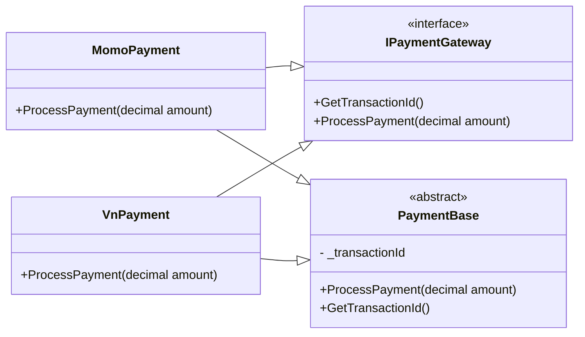

**Tính trừu tượng (Abstraction)** là cơ chế tập trung vào việc cung cấp giao diện chung (interface) hoặc hành vi cốt lõi của đối tượng, đồng thời ẩn đi các chi tiết triển khai phức tạp. **Abstraction** giúp người dùng tương tác với hệ thống thông qua các phương thức hoặc thuộc tính cần thiết mà không cần biết cách chúng được thực hiện bên trong. Nó được dựa trên sự chia tách của **interface** và các triển khai của **interface**.

Tính chất này được thể hiện thông qua việc sử dụng **Interface** hoặc **Abtraction class**.

> Ví dụ như bạn là một người khách hàng muốn sử dụng một chiếc xe, thì chúng ta không truy cập trực tiếp vào pít-tông, chúng ta sử dụng nút bấm START để khởi động pit-tông, Hãy tưởng tượng nếu một nhà máy sản xuất xe cho phép truy xuất trực tiếp vào pit-tông, thì nó sẽ rất khó để điều khiển các hành động trên pít-tông đó. Đó là lý do tại sao mà nhà máy sản xuất xe máy chia tách những chi tiết máy móc nội bộ ra khỏi giao diện người dùng.

***Ví dụ:***
```csharp
public abstract class Vehicle
{
    public abstract int GetMileage();
    public abstract string GetColor();
    protected string Formula { get; set; } // Dữ liệu được ẩn và chỉ lớp con truy cập

    public string DisplayFormula()
    {
        return Formula;
    }
}

public class Bike : Vehicle
{
    private int _mileage = 65;
    private string _color = "Blue";

    public Bike()
    {
        Formula = "a*b";
    }

    public override int GetMileage()
    {
        return _mileage;
    }

    public override string GetColor()
    {
        return _color;
    }
}

public class Program
{
    public static void Main()
    {
        Vehicle bike = new Bike();
        Console.WriteLine($"Bike mileage is {bike.GetMileage()}");
        Console.WriteLine($"Bike color is {bike.GetColor()}");
        Console.WriteLine($"Bike formula is {bike.DisplayFormula()}");
    }
}
```

Nhưng bạn đã thấy ví dụ trên, các ==phương thức và thuộc tính cần thiết== được đưa ra với từ khóa `public` và ==những phương thức và thuộc tính không cần thiết== sẽ được giấu đi bằng các sử dụng từ khóa `private`. Cách này có thể triển khai trừu tượng hóa hoặc chúng ta có thể hoàn thành việc trừu tượng hóa trong ứng dụng.

**❗Chú ý:** ==Tính trừu tượng và tính đóng gói== là hai tính chất liên quan đến nhau trong lập trình hướng đối tượng. Tính trừu tượng cho phép các thông tin liên quan hiển thị và tính đóng gói cho phép lập trình viên triển khai các mức độ mong muốn của trừu tượng hóa. Điều đó có nghĩa là ==các phần của class được ẩn đi như là Đóng gói== và ==hiển thi ra như là trừu tượng.== (*Ngắn ngọn*: **Abstraction - Ẩn đi chi tiết, thể hiện tổng quan)**
-  **Encapsulation** ẩn dữ liệu và cung cấp giao diện để truy cập an toàn (ví dụ: private fields với getter/setter).
- **Abstraction** ẩn chi tiết triển khai và chỉ cung cấp giao diện hoặc hành vi cần thiết (ví dụ: abstract methods hoặc interface).

---
### **Lớp trừu tượng (Abstract class):**

**Lớp trừu tượng** mà một lớp được khai báo với từ khóa `abstract` và ==có thể chứa phương thức trừu tượng bên trong== (phương thức trừu tượng là phương thức không có phần thân và kết thúc bằng dấu chấm phẩy).

**Lớp trừu tượng** thường được sử dụng khi định lớp có một hoặc một vài phương thức mà không thể cài đặt được xử lý cho chúng. Những phương thức này được khai báo là trừu tượng. Mục đích khác là tạo ra một lớp không cho phép tạo đối tượng của nó.

**Lớp trừu tượng** không thể tạo ra đối tượng bằng từ khóa `new`. Vì  nó chỉ là một ==bản **thiết** kế chung,== có thể chứa phương thức chưa có phần triển khai cụ thể (abstract methobs). Do đó, b==ạn phải kế thừa nó, và tạo ra đối tượng từ lớp con.==

```csharp
abstract class Car{
	public abstract void StartTheCar();
}

class motorcycle: Car{
	public override void StartTheCar(){
		Console.WriteLine("Kép dây 'e gió' kết hợp với việc đạp bàn đạp");
	}
}

class scooter: Car{
	public override void StartTheCar(){
		Console.WriteLine("Gác chân chống, cắm chìa khóa và vừa bóp phanh vừa vặn nhẹ tay lái.");
	}
}
```

`Abstraction` không chỉ ẩn chi tiết mà còn:
- Định nghĩa một giao diện chung cho các lớp không liên quan trực tiếp (ví dụ: **IPaymentGateway** cho **MomoPayment** và **VnPayment**).
- Giảm sự phụ thuộc (l**oose coupling**) giữa các thành phần trong hệ thống.
- Tăng tính mở rộng bằng cách cho phép thêm lớp mới mà không cần thay đổi mã hiện có.

>***"Tính trừu tượng giúp đơn giản hóa việc thiết kế hệ thống bằng cách tập trung vào "cái gì" (what) cần làm thay vì "làm như thế nào" (how). Nó được triển khai thông qua abstract class (cung cấp giao diện chung và một phần triển khai) hoặc interface (định nghĩa hợp đồng hành vi mà không có triển khai)."***

---
### **Giao diện (interface):**


**Interface** được sử dụng với 2 mục đích. ==Một là hỗ trợ đa kế thừa. Hai là tạo ra một hợp đồng trong viết code== giữa các thành viên trong một nhóm lập trình hoặc giữa các nhóm khác nhau. Nghĩa là tất cả thành viên phải tuân thủ những quy định khai báo trong **interface**.

Để khai báo interface thì sử dụng từ khóa `interface`. Sau đó là khai báo tên interface và phương thức bên trong nó. Và để triển khai interface trong `.net` thì dùng dấu `:` để triển khai lên lớp đã kế thừa và sau đó định nghĩa các phương thức trừu tượng từ interface.

***Ví dụ:*** Khi thực thực hiện hành động thanh toán sẽ có nhiều bước nghiệp vụ bên trong hành động này. Bằng cách chia tách nhỏ nghiệp vụ thành từng phương thức và sử dụng **interface** ta có thể dễ dàng hiểu được tổng quan những bước, những hành động khi thanh toán. Mà không cần đi vào chi tiết mỗi hành động làm gì
```csharp
public interface ICheckout{
	bool ValidateAccount(object BankAccount);
	Decimal CaculateTotalPrice(object BankAccount);
	int CheckOut(object BankAccount); 
}
```

#### **Các đặc điểm của `interface`**

- Chỉ khai báo **tên phương thức, không có phần thân**.
- Không có trường (field) hay constructor.
- Không thể chứa logic trạng thái (state), chỉ hành vi.
- Một lớp có thể **cài đặt nhiều interface** (đa kế thừa hành vi)
- Interface thường có chữ `I` đứng đầu (ví dụ `IAnimal`, `IDisposable`).

#### **Lợi ích của `interface`:**

- **Tăng tính mở rộng và linh hoạt:** Giúp lớp không bị "bó buộc" vào một hệ thống phân cấp cụ thể.
- **Tăng khả năng kiểm thử:** dễ tạo mock để viết unit test.
- **Hỗ trợ Dependency Injection:** ví dụ inject `ILogger`, `IRepository`, ...
- **Hỗ trợ lập trình hướng Interface (Programming to Interface)** → giúp giảm phụ thuộc (low coupling), tăng khả năng tái sử dụng.

*Ví dụ:*
```csharp
public interface IPaymentProcessor
{
    bool ProcessPayment(decimal amount);
    string GetTransactionId();
}

public abstract class PaymentBase
{
    private readonly string _transactionId;

    protected PaymentBase()
    {
        _transactionId = Guid.NewGuid().ToString();
    }

    public string GetTransactionId() => _transactionId;
}

public class CreditCardPayment : PaymentBase, IPaymentProcessor
{
    public bool ProcessPayment(decimal amount)
    {
        Console.WriteLine($"Processing {amount} via Credit Card");
        return true;
    }
}

public class PayPalPayment : PaymentBase, IPaymentProcessor
{
    public bool ProcessPayment(decimal amount)
    {
        Console.WriteLine($"Processing {amount} via PayPal");
        return true;
    }
}

public class Program
{
    public static void Main()
    {
        IPaymentProcessor payment1 = new CreditCardPayment();
        IPaymentProcessor payment2 = new PayPalPayment();

        payment1.ProcessPayment(100);
        Console.WriteLine($"Transaction ID: {payment1.GetTransactionId()}");

        payment2.ProcessPayment(200);
        Console.WriteLine($"Transaction ID: {payment2.GetTransactionId()}");
    }
}
```

Hình minh họa mối quan hệ giữa các lớp/interface:


---
### ✅ **Khi nào dùng `abstract`, khi nào dùng `interface`?**


| Tiêu chí                        | **Abstract Class**                                            | **Interface**                                            |
| ------------------------------- | ------------------------------------------------------------- | -------------------------------------------------------- |
| **Có thể chứa code thực thi?**      | ✔ Có                                                          | ❌ (chỉ từ C# 8 trở đi mới hỗ trợ default implementation) |
| **Kế thừa được nhiều cái?**         | ❌ Chỉ kế thừa **1 abstract class**                            | ✔ Kế thừa **nhiều interface**                            |
| **Có constructor, field không?**    | ✔ Có                                                          | ❌ Không có                                               |
| **Mục đích**                        | Tạo một khuôn mẫu chung, có logic chung                       | Tạo "cam kết" – giống hợp đồng, buộc phải thực hiện      |
| **Dùng khi**                        | Có shared code (ví dụ: method mặc định) hoặc trạng thái chung | Khi nhiều class không liên quan vẫn cần chung hành vi    |
| **Có static members?**              | ✔ Có                                                          | ✔ (từ C# 8, nhưng không có static constructor)           |
| **Dùng trong unit testing**         | Khó mock hơn do có thể chứa logic                             | Dễ mock, lý tưởng cho unit testing                       |
| **Dùng trong dependency injection** | Ít phổ biến, do phụ thuộc vào lớp cụ thể                      | Phổ biến, hỗ trợ loose coupling                          |


### ✅ **C# có Interface tĩnh và động không?**

### ⚠️ Interface truyền thống là **dạng động**:

- Interface được thực hiện bởi lớp cụ thể tại runtime.
- Bạn gọi phương thức thông qua biến interface.

### ❗ Trong C#, **không có interface tĩnh** như trong một số ngôn ngữ khác. Tuy nhiên:

- Từ **C# 8 trở lên**, interface có thể có **default implementation**, nhưng vẫn **không có static constructor hay static fields** như lớp.