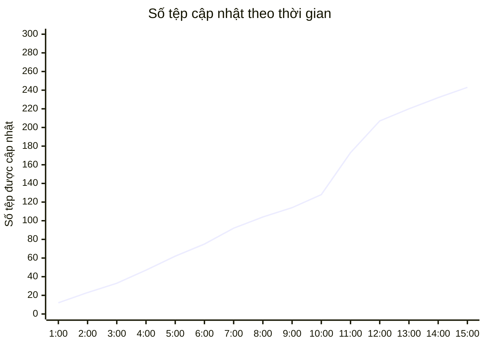

# Phát hiện Tấn công Mạng (Detect Attacks)

## Giới thiệu

Nếu hệ thống phòng thủ không thể ngăn chặn thành công một cuộc tấn công mạng, ưu tiên tiếp theo của tổ chức là **phát hiện** cuộc tấn công đó càng sớm càng tốt — lý tưởng nhất là trong khi cuộc tấn công đang diễn ra, hoặc thậm chí trước khi vi phạm thực sự xảy ra.

Module này giới thiệu các phương pháp phổ biến mà tổ chức sử dụng để phát hiện tấn công mạng.


---

## Phần mềm chống mã độc (Antimalware Software)

Phương thức tấn công tiêu chuẩn là phần mềm độc hại (malware), và biện pháp phát hiện tiêu chuẩn tương ứng là **phần mềm chống mã độc (antimalware)**. Đây là phần mềm chuyên dụng có chức năng phát hiện, cách ly, và loại bỏ phần mềm độc hại trên thiết bị hoặc mạng.

> **Lưu ý thuật ngữ:**  Về mặt kỹ thuật, hai khái niệm này có phạm vi khác nhau: **antivirus** truyền thống tập trung chủ yếu vào virus và worm dựa trên signature; **antimalware** là khái niệm rộng hơn, bao gồm bảo vệ trước nhiều loại mối đe dọa hơn — ransomware, spyware, adware, rootkit — và thường tích hợp thêm các kỹ thuật phát hiện hành vi (behavioral detection), không chỉ dựa vào signature. Trong thực tế, ranh giới giữa hai thuật ngữ ngày càng mờ vì hầu hết sản phẩm hiện đại đều tích hợp cả hai. 

Một số phần mềm antimalware phổ biến: Malwarebytes, McAfee Antivirus, Windows Defender Antivirus. Có thể triển khai theo hai mô hình:

- **Cài đặt cục bộ (local):** Chạy trực tiếp trên từng thiết bị.
- **Quản lý tập trung (centralized management):** Điều phối từ máy chủ trung tâm — phổ biến trong môi trường doanh nghiệp, cho phép giám sát và cập nhật đồng loạt trên nhiều endpoint.


### Cơ chế phát hiện: Malware Signature

Phần mềm antimalware phát hiện mối đe dọa bằng cách quét tệp để tìm **chữ ký phần mềm độc hại (malware signature)** — một mẫu thuộc tính (thường là chuỗi byte đặc trưng hoặc hash) tương ứng với phần mềm độc hại đã biết. Khi chữ ký khớp, phần mềm sẽ thực hiện một trong ba hành động: xóa tệp, cách ly tệp (quarantine), hoặc cảnh báo người dùng.

> **Hạn chế quan trọng cần biết:** Phát hiện dựa trên signature **chỉ hiệu quả với mối đe dọa đã biết** — có nghĩa mẫu chữ ký đó đã được ghi nhận trong cơ sở dữ liệu của nhà cung cấp antimalware. Đây là lý do phương pháp này **không hiệu quả với zero-day malware** hoặc các biến thể **polymorphic** (tự thay đổi mã sau mỗi lần lây nhiễm để né tránh signature cố định). Antimalware hiện đại bổ sung thêm **heuristic analysis** (phân tích dựa trên hành vi khả nghi thay vì chữ ký cố định) và **behavioral detection** (giám sát hành vi runtime bất thường) để bù đắp hạn chế này.

---

## Ghi nhật ký (Logging)

Ghi nhật ký (logging) là một trong những phương pháp quan trọng nhất để phát hiện tấn công — quá trình ghi lại chính xác các hành động xảy ra trong hệ thống tại một vị trí an toàn.

**Yêu cầu về tính toàn vẹn của log:** Bản ghi log phải **không thể bị giả mạo (tamper-proof)** để đóng vai trò như hồ sơ đáng tin cậy về những gì đã xảy ra. Trong thực tế, điều này thường đạt được bằng cách:

- Ghi log ra hệ thống tập trung riêng biệt (centralized log server), tách khỏi hệ thống nguồn — nếu kẻ tấn công xâm nhập hệ thống nguồn, chúng không thể dễ dàng xóa log đã được gửi đi.
- Sử dụng cơ chế **write-once** hoặc **immutable storage** cho log lưu trữ dài hạn.
- Áp dụng chữ ký số hoặc hash chain để phát hiện log đã bị chỉnh sửa.

**Các hành động thường được ghi log:**

- Đăng nhập/đăng xuất người dùng, bao gồm cả lần đăng nhập thất bại.
- Thay đổi cấu hình hệ thống.
- Lưu lượng gói dữ liệu (network traffic).
- Khởi tạo tiến trình hoặc dịch vụ.
- Thay đổi tệp hoặc cơ sở dữ liệu.

**Giá trị của việc tổng hợp log:** Một mục log đơn lẻ thường không mang nhiều giá trị phân tích. Nhưng khi tổng hợp một khối lượng lớn theo thời gian, log trở thành **audit trail (dấu vết kiểm toán)** — công cụ thiết yếu để chẩn đoán sự cố, tái hiện lại chuỗi sự kiện, và xác định hoạt động độc hại hoặc vi phạm bảo mật.

> **Ví dụ — Định dạng log Apache (Common Log Format):**
> 
> ```
> 9.12.156.2 - bob [11/01/2020:14:16:34 -0700] "GET /index.html HTTP/1.0" 200 4066
> ```
> 
> Giải thích từng thành phần:
> 
> - `9.12.156.2` — địa chỉ IP nguồn của client
> - `bob` — tên người dùng đã xác thực (nếu có)
> - `[11/01/2020:14:16:34 -0700]` — thời gian request, kèm múi giờ
> - `"GET /index.html HTTP/1.0"` — request line: phương thức HTTP, đường dẫn, phiên bản giao thức
> - `200` — mã trạng thái HTTP phản hồi (thành công)
> - `4066` — kích thước phản hồi (byte)

---

## Giám sát mạng (Network Monitoring)

Bên cạnh việc ghi log các sự kiện xảy ra trên từng máy chủ, tổ chức có thể giám sát toàn bộ **giao tiếp trên mạng** — phương pháp này gọi là **phân tích lưu lượng (traffic analysis)**.

**Các chỉ số (metrics) được theo dõi:**

- Nguồn và đích của lưu lượng (source/destination IP).
- Giao thức mạng sử dụng (TCP, UDP, HTTP...).
- Băng thông tiêu thụ.
- Kích thước gói tin (packet size).

**Phân tích nâng cao** có thể xác định thêm: ứng dụng/dịch vụ cụ thể đang chạy, dấu hiệu mã độc, và hành vi bất thường (anomaly) — kể cả trong lưu lượng đã được mã hóa, thông qua kỹ thuật phân tích metadata (không cần giải mã nội dung).

>  Thực tế, các công cụ này phân tích **metadata** của traffic mã hóa (kích thước gói, thời gian, tần suất, TLS handshake fingerprint — kỹ thuật gọi là **JA3/JA3S fingerprinting**) để suy luận về loại ứng dụng hoặc hành vi bất thường, **không giải mã nội dung thực tế**. Đây là điểm khác biệt quan trọng cần làm rõ để tránh hiểu sai về khả năng của network monitoring.

> **Ví dụ:** Nếu một thiết bị đang phát trực tuyến video, công cụ giám sát sẽ ghi nhận mức tiêu thụ băng thông cao và **ổn định** trong thời gian dài. Ngược lại, khi tải xuống một tệp lớn, công cụ sẽ ghi nhận **đỉnh** tiêu thụ băng thông ngắn, sau đó giảm nhanh về mức bình thường. Sự khác biệt về mẫu hình (pattern) này giúp phân biệt hành vi hợp pháp với hành vi đáng ngờ — ví dụ, một số loại malware truyền dữ liệu ra ngoài (data exfiltration) theo mẫu hình bất thường mà công cụ giám sát mạng tốt có thể phát hiện.

---

## Công cụ SIEM (Security Information and Event Management)

Việc diễn giải khối lượng lớn dữ liệu thu thập từ network monitoring có thể rất phức tạp nếu làm thủ công. Công cụ **SIEM** giải quyết vấn đề này bằng cách thu thập dữ liệu từ **toàn bộ hạ tầng công nghệ** của tổ chức, tổng hợp và tương quan (correlate) chúng để nhóm bảo mật có thể xác định mô hình tấn công tiềm tàng.


**Hai chức năng cốt lõi của SIEM:**

- **Security Information Management (SIM):** Thu thập, lưu trữ, và phân tích log dài hạn.
- **Security Event Management (SEM):** Giám sát và cảnh báo thời gian thực (real-time).

**Ví dụ ứng dụng — Phát hiện Brute Force Attack:**

Nhóm bảo mật nghi ngờ kẻ tấn công đang thực hiện tấn công brute force nhằm chiếm đoạt tài khoản người dùng. Họ thiết lập một **rule cảnh báo** trong SIEM: kích hoạt cảnh báo nếu phát hiện **5 lần đăng nhập thất bại trở lên trong 1 phút** cho cùng một tài khoản.

Khi kẻ tấn công thử hàng triệu tổ hợp username/password, số lần thất bại sẽ nhanh chóng vượt ngưỡng — SIEM tự động kích hoạt cảnh báo và thông báo cho nhóm bảo mật để can thiệp kịp thời.

**Các công cụ SIEM phổ biến trong thực tế:** Splunk, IBM QRadar, Microsoft Sentinel, Elastic Security (ELK Stack), Wazuh (mã nguồn mở).

---

## Trung tâm Điều hành An ninh (Security Operations Center — SOC)

**SOC** là nhóm chuyên gia an ninh mạng sử dụng phần mềm chuyên dụng để **chủ động giám sát, phát hiện, điều tra và phản hồi** các mối đe dọa và sự cố an ninh trong thời gian thực. SIEM thường là công cụ trung tâm mà nhóm SOC sử dụng hàng ngày.


**Vai trò của nhà phân tích an ninh (Security Analyst):** Đánh giá liên tục tình trạng bảo mật của tổ chức. Khi phát hiện dấu hiệu tấn công hoặc rủi ro, họ quyết định cách phản hồi theo **quy trình ứng phó sự cố (incident response procedure)** đã được tổ chức thiết lập từ trước.

### Thách thức: Cảnh báo sai (False Positive)

Một trong những thách thức lớn nhất trong vận hành SOC là xác định **ngưỡng cảnh báo (alert threshold)** phù hợp. Mục tiêu là giảm thiểu **false positive** — các sự kiện hợp pháp bị nhận diện nhầm là hoạt động độc hại.

Việc xác nhận một cảnh báo có phải false positive hay không thuộc trách nhiệm của security analyst. Nếu một loại sự kiện hợp pháp cụ thể liên tục tạo ra quá nhiều cảnh báo sai, analyst nên xem xét điều chỉnh ngưỡng cảnh báo cao hơn — đánh đổi giữa độ nhạy (sensitivity) và số lượng cảnh báo cần xử lý.

> **Ví dụ:** Một nhân viên quay lại làm việc sau kỳ nghỉ dài, quên mật khẩu, và nhập sai nhiều lần. Số lần thử vượt ngưỡng đã thiết lập, kích hoạt cảnh báo — nhưng đây là **false positive**, không phải tấn công thực sự.

> **Khái niệm liên quan cần biết — False Negative:** Ngược lại với false positive là **false negative** — khi hệ thống **không** phát hiện được một cuộc tấn công thực sự đang xảy ra. Đây là loại lỗi nguy hiểm hơn nhiều so với false positive, vì tổ chức hoàn toàn không nhận biết được mối đe dọa. Cân bằng giữa false positive (gây phiền toái, tốn nguồn lực điều tra) và false negative (bỏ lọt tấn công thực sự) là bài toán cốt lõi trong thiết kế hệ thống phát hiện. 

---

## Trí tuệ Nhân tạo (AI) trong Phát hiện Tấn công

AI đang nâng cao đáng kể khả năng phát hiện và phòng thủ của tổ chức trên nhiều lĩnh vực.

### Ghi nhật ký

AI tự động hóa việc ghi log và phân tích khối lượng dữ liệu lớn từ nhiều nguồn — công việc vốn tốn nhiều thời gian nếu thực hiện thủ công. Nhờ đó, việc phát hiện và ngăn chặn mối đe dọa có thể diễn ra gần thời gian thực.

### Giám sát mạng

AI phân tích mẫu lưu lượng mạng và xác định bất thường có thể là dấu hiệu tấn công. Ví dụ: sự tăng đột biến lưu lượng bất thường có thể chỉ ra một cuộc tấn công **DDoS (Distributed Denial of Service)** đang diễn ra. AI cho phép phát hiện các bất thường này gần như tức thì và kích hoạt biện pháp đối phó tương ứng.

### Công cụ SIEM

Các nền tảng SIEM hiện đại tích hợp AI để xác định mẫu và mối tương quan phức tạp trong dữ liệu, hỗ trợ xác định mối đe dọa tiềm ẩn. Ví dụ: **IBM QRadar** sử dụng AI (thông qua module QRadar Advisor with Watson) để thiết lập ngưỡng cảnh báo động cho các hoạt động bất thường như chuỗi đăng nhập thất bại.

### Trung tâm Điều hành An ninh (SOC)

AI giúp nhà phân tích SOC làm việc hiệu quả hơn đáng kể — thay vì phải tự sàng lọc khối lượng dữ liệu khổng lồ, họ có thể tập trung vào phản hồi các cảnh báo đã được AI xác nhận có khả năng cao là mối đe dọa thực sự. Điều này tiết kiệm thời gian và tăng tốc độ giảm thiểu mối đe dọa.

### Học máy (Machine Learning)

Tổ chức có thể huấn luyện mô hình ML để phân biệt hành vi bình thường và bất thường, dựa trên dữ liệu lịch sử bao gồm cả mối đe dọa thực sự lẫn các trường hợp false positive đã biết.

**Ví dụ:** Hệ thống học được rằng các lần đăng nhập thất bại từ một địa chỉ IP nội bộ đáng tin cậy, trong giờ làm việc, thường tương ứng với hành vi quên mật khẩu thông thường — không phải tấn công. Theo thời gian, mô hình tự động điều chỉnh ngưỡng và độ nhạy cảnh báo, giảm số lượng false positive cần con người xác minh thủ công.

> **Lưu ý về rủi ro của AI trong bảo mật:** Mặc dù AI cải thiện đáng kể khả năng phát hiện, cần lưu ý mô hình ML cũng có thể bị **tấn công đối kháng (adversarial attack)** — kẻ tấn công cố tình tạo ra traffic hoặc hành vi được thiết kế để "lách" qua mô hình phát hiện đã huấn luyện. Đây là lĩnh vực nghiên cứu đang phát triển gọi là **Adversarial Machine Learning**, và là lý do AI nên được xem là một lớp bổ sung trong chiến lược defense in depth, không phải giải pháp thay thế hoàn toàn cho giám sát của con người.

---

## Hoạt động thực hành: Phân tích nhật ký

Bảng dưới đây ghi lại số lượng tệp bị thay đổi trong một tổ chức theo từng giờ. Theo kinh nghiệm, hoạt động thay đổi tệp thường có mức độ tự động hóa cao và có thể dự đoán được — do đó, số lượng thay đổi bất thường có thể là dấu hiệu của hoạt động trái phép.

| Thời gian | Số tệp được cập nhật |
| --------- | -------------------- |
| 01:00     | 12                   |
| 02:00     | 23                   |
| 03:00     | 33                   |
| 04:00     | 47                   |
| 05:00     | 62                   |
| 06:00     | 75                   |
| 07:00     | 92                   |
| 08:00     | 104                  |
| 09:00     | 114                  |
| 10:00     | 128                  |
| 11:00     | 173                  |
| 12:00     | 207                  |
| 13:00     | 220                  |
| 14:00     | 232                  |
| 15:00     | 243                  |

**Phân tích:** Từ 01:00 đến 10:00, số lượng tệp thay đổi tăng đều đặn (khoảng 10-15 tệp/giờ) — phù hợp với mẫu hình hoạt động tự động hóa bình thường. Tuy nhiên, từ **10:00 đến 12:00**, mức tăng đột biến lên 45 và 34 tệp/giờ — gần gấp 3 lần tốc độ tăng trưởng trung bình trước đó. Đây là **anomaly (bất thường)** đáng để điều tra thêm — có thể là dấu hiệu của hoạt động không xác định hoặc trái phép, ví dụ: mã hóa hàng loạt do ransomware, hoặc quá trình exfiltration dữ liệu.



---

## Bổ sung kiến thức

### 1. Phân biệt SIEM, SOAR và XDR — Ba khái niệm dễ nhầm lẫn

Tài liệu tập trung vào SIEM, nhưng hệ sinh thái công cụ phát hiện và phản hồi hiện đại còn có hai khái niệm liên quan quan trọng:

| Công cụ                                                    | Chức năng chính                                                               | Điểm khác biệt với SIEM                                                                                                                       |
| ---------------------------------------------------------- | ----------------------------------------------------------------------------- | --------------------------------------------------------------------------------------------------------------------------------------------- |
| **SIEM**                                                   | Thu thập, tổng hợp, tương quan log và sự kiện                                 | Tập trung vào phát hiện (detection)                                                                                                           |
| **SOAR** (Security Orchestration, Automation and Response) | Tự động hóa quy trình phản hồi sự cố                                          | Tập trung vào phản hồi (response) — có thể tự động cô lập thiết bị, chặn IP, thu hồi quyền truy cập mà không cần con người can thiệp thủ công |
| **XDR** (Extended Detection and Response)                  | Hợp nhất dữ liệu từ endpoint, network, cloud, email vào một nền tảng duy nhất | Phạm vi rộng hơn SIEM truyền thống, tích hợp sẵn khả năng phản hồi                                                                            |

Trong thực tế, SIEM và SOAR thường được triển khai cùng nhau: SIEM phát hiện → SOAR tự động phản hồi theo playbook đã định nghĩa trước, giảm thời gian phản ứng (Mean Time To Respond — MTTR) từ hàng giờ xuống còn vài phút.

### 2. Chỉ số quan trọng để đánh giá hiệu quả phát hiện: MTTD và MTTR

Hai chỉ số (metrics) quan trọng để đánh giá năng lực phát hiện và phản hồi của một tổ chức:

- **MTTD (Mean Time To Detect):** Thời gian trung bình từ khi tấn công bắt đầu đến khi được phát hiện. Theo báo cáo IBM Cost of a Data Breach, MTTD trung bình toàn cầu là hơn 200 ngày cho các vụ vi phạm nghiêm trọng nếu không có công cụ phát hiện phù hợp.
- **MTTR (Mean Time To Respond):** Thời gian trung bình từ khi phát hiện đến khi ngăn chặn/khắc phục hoàn toàn.

Đầu tư vào logging, SIEM, và AI (như tài liệu này trình bày) trực tiếp nhằm mục tiêu giảm cả hai chỉ số này — vì thời gian tồn tại của kẻ tấn công trong hệ thống (dwell time) tỷ lệ thuận với mức độ thiệt hại gây ra.

### 3. Góc nhìn Backend Engineer: Thiết kế logging hỗ trợ phát hiện tấn công

Với vai trò backend developer, việc thiết kế logging đúng cách ngay từ đầu giúp SOC/SIEM hoạt động hiệu quả hơn nhiều:

- **Structured logging:** Ghi log dưới dạng JSON có cấu trúc thay vì plain text tự do — giúp SIEM parse và tương quan dễ dàng hơn nhiều.
- **Correlation ID:** Gắn một ID duy nhất xuyên suốt một request/transaction qua nhiều service — cực kỳ quan trọng trong kiến trúc microservices để truy vết một request đầy đủ qua nhiều log riêng lẻ.
- **Không log thông tin nhạy cảm:** Tránh ghi log mật khẩu, token, hoặc dữ liệu cá nhân dưới dạng plaintext — vi phạm cả bảo mật lẫn quy định bảo vệ dữ liệu.
- **Log đủ ngữ cảnh nhưng không quá tải:** Ghi đủ thông tin để điều tra (user ID, IP, action, timestamp, kết quả) nhưng tránh log quá chi tiết gây quá tải hệ thống lưu trữ và khó phân tích.

Ví dụ log có cấu trúc trong Go (sử dụng package `log/slog` từ Go 1.21+):

```go
slog.Info("user login attempt",
    "user_id", userID,
    "ip_address", clientIP,
    "success", loginSuccess,
    "correlation_id", correlationID,
    "timestamp", time.Now(),
)
```

Log dạng structured này có thể được SIEM parse trực tiếp thành các trường (field) riêng biệt để thiết lập rule cảnh báo — ví dụ: dễ dàng tạo rule "cảnh báo nếu `success=false` xuất hiện ≥5 lần trong 1 phút cho cùng `user_id`" — chính là kịch bản brute force detection được mô tả trong tài liệu.
