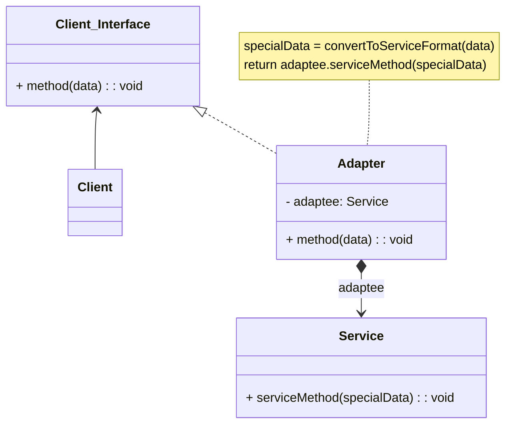
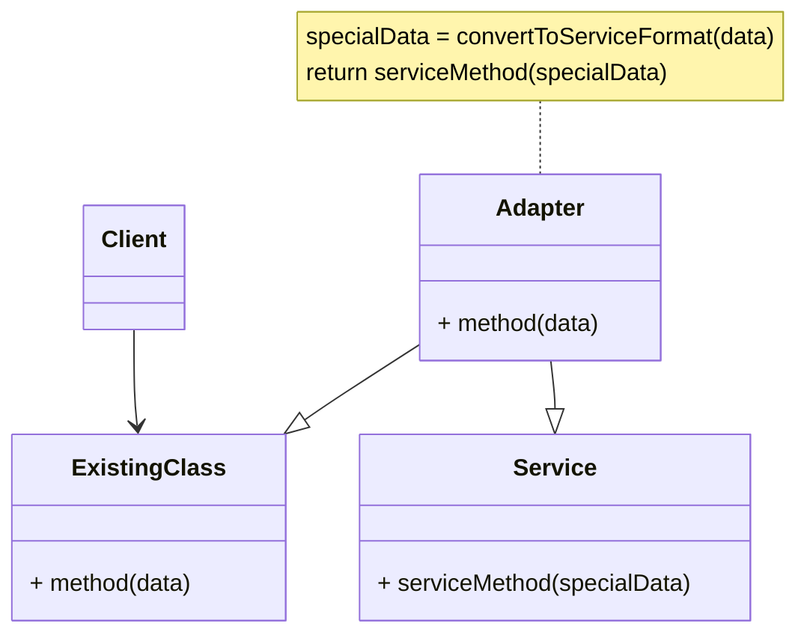

# Adapter Pattern

> Tài liệu này giải thích mẫu thiết kế **Adapter** — thuộc nhóm **Structural Pattern** (nhóm mẫu cấu trúc) — dành cho lập trình viên mới học, có liên hệ thực tế với **Golang/Backend**.

## Mục lục

1. [Giới thiệu](https://claude.ai/chat/de82c3b1-20af-49cd-a508-785244f774d4#1-gi%E1%BB%9Bi-thi%E1%BB%87u)
2. [Vấn đề cần giải quyết](https://claude.ai/chat/de82c3b1-20af-49cd-a508-785244f774d4#2-v%E1%BA%A5n-%C4%91%E1%BB%81-c%E1%BA%A7n-gi%E1%BA%A3i-quy%E1%BA%BFt)
3. [Giải pháp](https://claude.ai/chat/de82c3b1-20af-49cd-a508-785244f774d4#3-gi%E1%BA%A3i-ph%C3%A1p)
4. [Ví dụ đời thực](https://claude.ai/chat/de82c3b1-20af-49cd-a508-785244f774d4#4-v%C3%AD-d%E1%BB%A5-%C4%91%E1%BB%9Di-th%E1%BB%B1c)
5. [Các thành phần chính](https://claude.ai/chat/de82c3b1-20af-49cd-a508-785244f774d4#5-c%C3%A1c-th%C3%A0nh-ph%E1%BA%A7n-ch%C3%ADnh)
6. [Kiến trúc: Object Adapter và Class Adapter](https://claude.ai/chat/de82c3b1-20af-49cd-a508-785244f774d4#6-ki%E1%BA%BFn-tr%C3%BAc-object-adapter-v%C3%A0-class-adapter)
7. [Khi nào nên sử dụng](https://claude.ai/chat/de82c3b1-20af-49cd-a508-785244f774d4#7-khi-n%C3%A0o-n%C3%AAn-s%E1%BB%AD-d%E1%BB%A5ng)
8. [Cách triển khai](https://claude.ai/chat/de82c3b1-20af-49cd-a508-785244f774d4#8-c%C3%A1ch-tri%E1%BB%83n-khai)
9. [Ví dụ minh họa bằng Go](https://claude.ai/chat/de82c3b1-20af-49cd-a508-785244f774d4#9-v%C3%AD-d%E1%BB%A5-minh-h%E1%BB%8Da-b%E1%BA%B1ng-go)
10. [Ưu & nhược điểm](https://claude.ai/chat/de82c3b1-20af-49cd-a508-785244f774d4#10-%C6%B0u--nh%C6%B0%E1%BB%A3c-%C4%91i%E1%BB%83m)
11. [Tóm tắt](https://claude.ai/chat/de82c3b1-20af-49cd-a508-785244f774d4#11-t%C3%B3m-t%E1%BA%AFt)
12. [Tài liệu tham khảo](https://claude.ai/chat/de82c3b1-20af-49cd-a508-785244f774d4#12-t%C3%A0i-li%E1%BB%87u-tham-kh%E1%BA%A3o)

---

## 1. Giới thiệu


**Adapter** (còn gọi là **Wrapper**) là một mẫu thiết kế thuộc nhóm **Structural Pattern**, giúp kết nối các giao diện (**interface**) không tương thích với nhau. Nó cho phép các lớp có giao diện khác nhau làm việc cùng nhau **mà không cần sửa đổi mã nguồn** của những lớp đó.

Adapter hoạt động như một "cầu nối" giữa hai giao diện không tương thích: nó chuyển đổi giao diện của một lớp thành giao diện mà client mong đợi. Cái tên "Wrapper" xuất phát từ cách nó hoạt động — Adapter cung cấp một interface "bọc ngoài" (wrap) tương thích cho một hệ thống có sẵn, hệ thống này vẫn có đầy đủ dữ liệu và hành vi cần thiết, chỉ là interface không khớp với những gì mã nguồn hiện tại đang mong đợi.


---

## 2. Vấn đề cần giải quyết

Hãy tưởng tượng bạn đang phát triển một ứng dụng theo dõi thị trường chứng khoán. Ứng dụng tải dữ liệu chứng khoán từ nhiều nguồn dưới định dạng XML, sau đó hiển thị biểu đồ và sơ đồ cho người dùng.

Đến một lúc, bạn quyết định tích hợp một thư viện phân tích thông minh của bên thứ ba để cải tiến ứng dụng. Vấn đề nảy sinh: thư viện phân tích này chỉ hoạt động với dữ liệu định dạng **JSON**, trong khi ứng dụng của bạn đang dùng **XML**.


Bạn có thể sửa thư viện để nó hỗ trợ XML, nhưng cách này có thể làm hỏng những đoạn mã hiện có đang phụ thuộc vào thư viện đó. Tệ hơn, có thể ngay từ đầu bạn không có quyền truy cập vào mã nguồn của thư viện (ví dụ: thư viện đóng gói dạng binary/package bên thứ ba), khiến phương án sửa trực tiếp trở nên bất khả thi.

---

## 3. Giải pháp

Giải pháp là tạo một **bộ chuyển đổi (adapter)** — một đối tượng đặc biệt có nhiệm vụ chuyển đổi giao diện của một đối tượng để đối tượng khác có thể hiểu được.

Adapter bao bọc (wrap) một trong các đối tượng, che giấu sự phức tạp của quá trình chuyển đổi diễn ra "ở hậu trường". Đối tượng được bao bọc thậm chí **không hề biết** đến sự tồn tại của adapter. Ví dụ: bạn có thể bao bọc một đối tượng hoạt động theo mét và ki-lô-mét bằng một adapter chuyển đổi tất cả dữ liệu sang đơn vị hệ đo lường Anh như feet và dặm.

Adapter hoạt động theo cơ chế sau:

1. Adapter có một giao diện **tương thích** với đối tượng hiện có (client).
2. Nhờ giao diện này, đối tượng hiện có có thể gọi các phương thức của adapter một cách an toàn.
3. Khi nhận được lời gọi, adapter sẽ chuyển yêu cầu đó đến đối tượng thứ hai (đối tượng cần điều chỉnh), nhưng theo đúng định dạng và thứ tự mà đối tượng thứ hai mong đợi.

Trong một số trường hợp, có thể tạo adapter **hai chiều**, chuyển đổi cuộc gọi theo cả hai hướng.


Quay lại ví dụ ứng dụng chứng khoán: để giải quyết vấn đề không tương thích định dạng, bạn tạo các adapter chuyển đổi XML sang JSON cho từng lớp của thư viện phân tích mà mã nguồn của bạn tương tác trực tiếp. Sau đó, điều chỉnh mã nguồn để giao tiếp với thư viện thông qua các adapter này. Khi nhận một lời gọi, adapter sẽ chuyển đổi dữ liệu XML đầu vào thành cấu trúc JSON, rồi chuyển tiếp lời gọi đến phương thức tương ứng của đối tượng phân tích được bao bọc bên trong.

---

## 4. Ví dụ đời thực


Khi lần đầu du lịch từ Mỹ sang châu Âu, bạn có thể bất ngờ khi muốn sạc pin máy tính xách tay: tiêu chuẩn phích cắm và ổ cắm điện ở mỗi quốc gia khác nhau, nên phích cắm kiểu Mỹ sẽ không vừa với ổ cắm ở Đức. Vấn đề này được giải quyết bằng một bộ chuyển đổi phích cắm — có ổ cắm kiểu Mỹ ở một đầu và đầu cắm kiểu châu Âu ở đầu còn lại. Chính bộ chuyển đổi phích cắm này là hình ảnh trực quan nhất cho Adapter Pattern: nó không thay đổi thiết bị hay ổ điện, chỉ đóng vai trò trung gian chuyển đổi giữa hai chuẩn không tương thích.

---

## 5. Các thành phần chính

- **Target (mục tiêu):** giao diện mà client mong đợi sử dụng. Ví dụ: một interface hoặc lớp trừu tượng mà client đang thao tác.
- **Adaptee (đối tượng cần điều chỉnh):** lớp có giao diện **không tương thích** với Target. Ví dụ: một lớp hoặc thư viện bên ngoài mà bạn muốn tái sử dụng.
- **Adapter (bộ điều hợp):** lớp chuyển đổi giao diện của Adaptee thành giao diện của Target. Ví dụ: một lớp triển khai (implement) Target và bên trong sử dụng Adaptee để thực hiện yêu cầu thực tế.

---

## 6. Kiến trúc: Object Adapter và Class Adapter

Có hai cách triển khai Adapter Pattern, phân biệt theo cách adapter kết nối với Adaptee:

### Object Adapter — dùng Composition (kết hợp đối tượng)

Cách này dùng nguyên lý **object composition**: adapter triển khai (implement) giao diện Target, đồng thời **giữ một tham chiếu** (composition) tới đối tượng Adaptee bên trong. Cách này có thể triển khai được ở hầu hết ngôn ngữ lập trình phổ biến, bao gồm cả Go.

Trong mô hình này, lớp Adapter mới tham chiếu đến một (hoặc nhiều) đối tượng thuộc lớp có sẵn với interface không tương thích (**Adaptee/Service**), đồng thời cài đặt interface mà client mong muốn (**Target**). Khi cài đặt các phương thức của Target, Adapter sẽ gọi phương thức tương ứng thông qua đối tượng Adaptee đang được nó giữ tham chiếu.



Các thành phần chính trong mô hình:

1. **Client:** lớp chứa business logic của chương trình.
2. **Client Interface (Target):** mô tả giao thức mà các lớp khác phải tuân theo để có thể làm việc cùng client code.
3. **Service (Adaptee):** một lớp hữu ích (thường đến từ bên thứ ba, hoặc mã nguồn cũ/legacy) mà client không thể dùng trực tiếp vì interface không tương thích.
4. **Adapter:** lớp làm việc được với cả client lẫn service — nó implement Client Interface, đồng thời đóng gói (wrap) đối tượng service bên trong. Khi được client gọi qua Client Interface, Adapter sẽ chuyển các lời gọi đó thành lời gọi đến service theo đúng định dạng mà service hiểu được.
5. Mã nguồn phía client không phụ thuộc chặt vào lớp adapter cụ thể nào, miễn là nó tương tác với adapter thông qua Client Interface. Nhờ vậy, bạn có thể thêm các loại adapter mới vào chương trình mà không ảnh hưởng đến mã nguồn client hiện có — đặc biệt hữu ích khi interface của service class thay đổi hoặc bị thay thế: bạn chỉ cần tạo một adapter mới, không cần sửa mã nguồn client.

### Class Adapter — dùng Inheritance (kế thừa)

Trong mô hình này, lớp Adapter **kế thừa** cả lớp có sẵn interface không tương thích (Adaptee/Service) **lẫn** interface mà client mong muốn (Target), thay vì giữ tham chiếu như Object Adapter.



> **Ghi chú làm rõ:** `ExistingClass` trong sơ đồ này đóng vai trò tương đương với `Client_Interface` (Target) ở sơ đồ Object Adapter phía trên — chỉ là được thể hiện dưới dạng một lớp cụ thể thay vì một interface, vì cách tiếp cận Class Adapter yêu cầu Adapter phải **kế thừa cùng lúc** cả Target lẫn Service.

**Class Adapter** không cần bọc bất kỳ đối tượng nào, vì nó kế thừa trực tiếp hành vi từ cả hai phía (Target và Service). Việc "thích nghi" (adaptation) diễn ra ngay trong các phương thức bị ghi đè (override). Kết quả là đối tượng Adapter có thể được dùng thay thế cho một đối tượng client hiện có.

> **Lưu ý kỹ thuật quan trọng cho Go:** cách tiếp cận Class Adapter đòi hỏi ngôn ngữ hỗ trợ **đa kế thừa** (multiple inheritance) — kế thừa cùng lúc từ hai "lớp cha". Đây là điều mà C++ hỗ trợ, nhưng **C#, Java, và đặc biệt là Go đều không hỗ trợ**. Go không có khái niệm `class`/kế thừa (inheritance) theo nghĩa OOP truyền thống, chỉ có `struct` + `interface` + composition. Vì vậy, trong Go (và cả C#, Java), **Object Adapter là cách tiếp cận duy nhất khả thi** để triển khai Adapter Pattern trong thực tế — mục "Class Adapter" ở trên chủ yếu mang tính tham khảo lý thuyết.

### So sánh Object Adapter và Class Adapter

- Khác biệt chính: **Class Adapter** dùng **Inheritance** (kế thừa) để kết nối Adapter và Adaptee, còn **Object Adapter** dùng **Composition** (kết hợp đối tượng — Adapter giữ một tham chiếu đến Adaptee).
- Với Class Adapter, nếu Adaptee là một lớp cụ thể (không phải interface), Adapter sẽ trở thành một lớp con riêng của đúng Adaptee đó — nên nó không tự động phục vụ được các lớp con khác của Adaptee theo cùng một cách.
- Object Adapter thường linh hoạt hơn: vì dùng composition để giữ tham chiếu đến Adaptee (thay vì kế thừa cố định), một Adapter có thể được viết để làm việc với nhiều loại Adaptee khác nhau nếu cần.

---

## 7. Khi nào nên sử dụng

- Khi bạn muốn tạo một lớp trung gian đóng vai trò "phiên dịch" giữa mã nguồn của bạn và một lớp cũ (legacy class), lớp của bên thứ ba, hoặc bất kỳ lớp nào khác có giao diện khác biệt hoặc bất thường.
- **Tích hợp thư viện bên ngoài:** khi dùng thư viện/API có giao diện không tương thích với hệ thống hiện tại.
- **Tái sử dụng mã nguồn:** khi muốn dùng lại các lớp cũ mà không cần sửa đổi mã nguồn của chúng.
- **Hỗ trợ đa nền tảng:** khi cần làm việc với nhiều hệ thống hoặc nền tảng khác nhau, mỗi nơi có giao diện riêng.
- Khi bạn muốn tái sử dụng một số lớp con hiện có, nhưng chúng lại thiếu một chức năng chung nào đó mà không thể bổ sung trực tiếp vào lớp cha.

Một cách khác để giải quyết vấn đề thiếu chức năng chung là mở rộng từng lớp con và tự thêm chức năng còn thiếu vào từng lớp con mới. Tuy nhiên, cách này buộc bạn phải sao chép cùng một đoạn mã sang tất cả các lớp mới đó — đây là dấu hiệu của một thiết kế có vấn đề (**code smell**: dấu hiệu cho thấy mã nguồn có thể đang tiềm ẩn vấn đề về thiết kế, dù chưa hẳn là lỗi). Adapter Pattern giúp tránh tình trạng trùng lặp này.

---

## 8. Cách triển khai

1. Đảm bảo bạn có ít nhất hai lớp với giao diện không tương thích:
    - Một lớp dịch vụ hữu ích mà bạn không thể thay đổi (thường là của bên thứ ba, mã nguồn cũ/legacy, hoặc có quá nhiều phần khác đang phụ thuộc vào nó).
    - Một hoặc nhiều lớp client sẽ hưởng lợi từ việc sử dụng lớp dịch vụ đó.
2. Khai báo giao diện dành cho client, mô tả cách client giao tiếp với dịch vụ.
3. Tạo lớp adapter và thiết lập để nó tuân theo giao diện dành cho client. Tạm thời để trống phần thân các phương thức.
4. Thêm một trường (field) vào lớp adapter để lưu tham chiếu đến đối tượng dịch vụ (Adaptee). Trường này thường được khởi tạo qua constructor, nhưng đôi khi truyền vào khi gọi phương thức sẽ thuận tiện hơn.
5. Lần lượt triển khai tất cả phương thức của giao diện client trong lớp adapter. Adapter nên **ủy quyền phần lớn công việc thực tế** cho đối tượng dịch vụ, và chỉ đảm nhận việc chuyển đổi giao diện hoặc định dạng dữ liệu.
6. Các lớp client nên sử dụng adapter thông qua giao diện dành cho client. Điều này cho phép bạn thay đổi hoặc mở rộng adapter mà không ảnh hưởng đến mã nguồn client.

> **Ghi chú riêng cho Go:** trong C#/Java, một lớp phải khai báo tường minh `class X : IInterface` (implements) để "cam kết" tuân theo một interface. Go dùng **structural typing** (kiểu cấu trúc): một `struct` tự động thỏa mãn một `interface` miễn là nó có đủ các phương thức yêu cầu, **không cần khai báo `implements` tường minh**. Điều này khiến việc viết Adapter trong Go thường gọn hơn — bạn chỉ cần định nghĩa đúng các phương thức của Target interface trên struct Adapter, không cần cú pháp kế thừa/khai báo đặc biệt nào khác.

---

## 9. Ví dụ minh họa bằng Go

> Các ví dụ gốc dùng C#. Dưới đây là bản chuyển sang Go, dùng cách tiếp cận **Object Adapter** (composition) — cách duy nhất khả thi trong Go, như đã giải thích ở [Mục 6](https://claude.ai/chat/de82c3b1-20af-49cd-a508-785244f774d4#6-ki%E1%BA%BFn-tr%C3%BAc-object-adapter-v%C3%A0-class-adapter).

### Ví dụ 1: Hệ thống thanh toán

```go
package main

import "fmt"

// Target: giao diện mà client mong muốn sử dụng
type PaymentProcessor interface {
	ProcessPayment(amount float64)
}

// Adaptee: hệ thống thanh toán cũ, interface không tương thích với Target
type LegacyCashPayment struct{}

func (LegacyCashPayment) PayWithCash(amount float64) {
	fmt.Printf("Paid %.2f using cash (legacy system).\n", amount)
}

// Adapter: chuyển đổi từ PaymentProcessor (Target) sang LegacyCashPayment (Adaptee)
type PaymentAdapter struct {
	legacyPayment LegacyCashPayment
}

func NewPaymentAdapter(legacy LegacyCashPayment) *PaymentAdapter {
	return &PaymentAdapter{legacyPayment: legacy}
}

// ProcessPayment khiến *PaymentAdapter tự động thỏa mãn interface PaymentProcessor
// — không cần khai báo "implements" như trong C#.
func (a *PaymentAdapter) ProcessPayment(amount float64) {
	a.legacyPayment.PayWithCash(amount)
}

func main() {
	legacySystem := LegacyCashPayment{}
	var processor PaymentProcessor = NewPaymentAdapter(legacySystem)
	processor.ProcessPayment(100.50) // Client gọi qua giao diện Target
}
```

> **Ghi chú thực tế:** ví dụ trên dùng `float64` cho số tiền để giữ đơn giản, tương tự kiểu `decimal` trong bản C# gốc. Trong hệ thống thanh toán thật, `float64` có thể gây sai số làm tròn — nên cân nhắc dùng số nguyên (đơn vị nhỏ nhất, ví dụ "cent") hoặc một thư viện số thập phân chuyên dụng (ví dụ `shopspring/decimal`) khi làm việc với tiền tệ trong Go.

### Ví dụ 2: Vẽ hình (Rectangle & Line)

```go
package main

import "fmt"

// Target: giao diện mà client (đoạn code vẽ hình) mong muốn sử dụng
type Shape interface {
	Draw(x1, y1, x2, y2 int)
}

// ---- Adaptee: các hàm vẽ hình cũ (legacy), interface không tương thích với Shape ----

type LegacyRectangle struct{}

func (LegacyRectangle) Draw(x, y, w, h int) {
	fmt.Printf("Drawing rectangle %d %d %d %d\n", x, y, w, h)
}

type LegacyLine struct{}

func (LegacyLine) Draw(x1, y1, x2, y2 int) {
	fmt.Printf("Drawing line %d %d %d %d\n", x1, y1, x2, y2)
}

// ---- Adapter ----

type RectangleAdapter struct {
	legacyRectangle LegacyRectangle
}

func (a RectangleAdapter) Draw(x1, y1, x2, y2 int) {
	x := minInt(x1, x2)
	y := minInt(y1, y2)
	w := absInt(x2 - x1)
	h := absInt(y2 - y1)
	a.legacyRectangle.Draw(x, y, w, h)
}

type LineAdapter struct {
	legacyLine LegacyLine
}

func (a LineAdapter) Draw(x1, y1, x2, y2 int) {
	a.legacyLine.Draw(x1, y1, x2, y2)
}

func minInt(a, b int) int {
	if a < b {
		return a
	}
	return b
}

func absInt(n int) int {
	if n < 0 {
		return -n
	}
	return n
}

func main() {
	shapes := []Shape{
		LineAdapter{legacyLine: LegacyLine{}},
		RectangleAdapter{legacyRectangle: LegacyRectangle{}},
	}

	x1, y1, x2, y2 := 5, 10, -3, 2
	for _, shape := range shapes {
		shape.Draw(x1, y1, x2, y2)
	}
}
```

**Kết quả:**

```text
Drawing line 5 10 -3 2
Drawing rectangle -3 2 8 8
```

Cả hai ví dụ đều thể hiện đúng cấu trúc Object Adapter: `LegacyCashPayment`/`LegacyRectangle`/`LegacyLine` (Adaptee) hoàn toàn không biết đến sự tồn tại của adapter; `PaymentAdapter`/`RectangleAdapter`/`LineAdapter` là lớp trung gian duy nhất "biết" cả hai phía và thực hiện việc chuyển đổi.

---

## 10. Ưu & nhược điểm

**Ưu điểm:**

- Cho phép các lớp có giao diện khác nhau làm việc cùng nhau.
- Tăng tính tái sử dụng mã nguồn.
- Linh hoạt và dễ dàng mở rộng: có thể thêm adapter mới mà không ảnh hưởng đến client hiện có.

**Nhược điểm:**

- Có thể làm tăng độ phức tạp của mã nguồn nếu sử dụng quá nhiều adapter.
- Cần thêm một lớp trung gian (adapter), có thể ảnh hưởng nhẹ đến hiệu suất do có thêm một bước chuyển đổi/gọi hàm gián tiếp.

---

## 11. Tóm tắt

- **Adapter Pattern** giúp kết nối các giao diện không tương thích với nhau.
- Có hai cách tiếp cận: **Object Adapter** (composition) và **Class Adapter** (inheritance) — nhưng trong Go, chỉ Object Adapter khả thi.
- Adapter tăng tính linh hoạt và khả năng tái sử dụng mã nguồn, nhưng có thể làm tăng độ phức tạp nếu lạm dụng.

---

## 12. Tài liệu tham khảo

[1] Design Patterns for Dummies, Steve Holzner, PhD [2] Head First Design Patterns, Eric Freeman [3] Design Patterns: Elements of Reusable Object-Oriented Software, Gang of Four

---

### Đề xuất mở rộng

Sau khi nắm vững Adapter, có thể tìm hiểu thêm:

- **Facade Pattern:** dễ nhầm với Adapter vì cả hai đều "bọc" một hệ thống khác — Adapter tập trung vào việc chuyển đổi một interface không tương thích thành interface mong muốn, còn Facade tập trung vào việc đơn giản hóa một interface phức tạp có sẵn (không nhất thiết không tương thích).
- **Decorator Pattern:** một Structural Pattern khác cũng "bọc" đối tượng, nhưng với mục đích thêm hành vi mới, chứ không phải chuyển đổi interface.
- **Bridge Pattern:** cũng tách interface khỏi phần cài đặt, nhưng được thiết kế ngay từ đầu (up-front), khác với Adapter thường được áp dụng sau, để "vá" một hệ thống có sẵn.
- **Go interfaces và structural typing:** tìm hiểu sâu hơn cách Go xác định một struct có thỏa mãn interface hay không, giúp hiểu rõ vì sao viết Adapter trong Go lại đơn giản hơn so với C#/Java.
- **Xử lý số tiền (money) trong Go:** tìm hiểu về sai số của `float64` và các thư viện số thập phân (decimal) chuyên dụng cho các hệ thống thanh toán/tài chính.