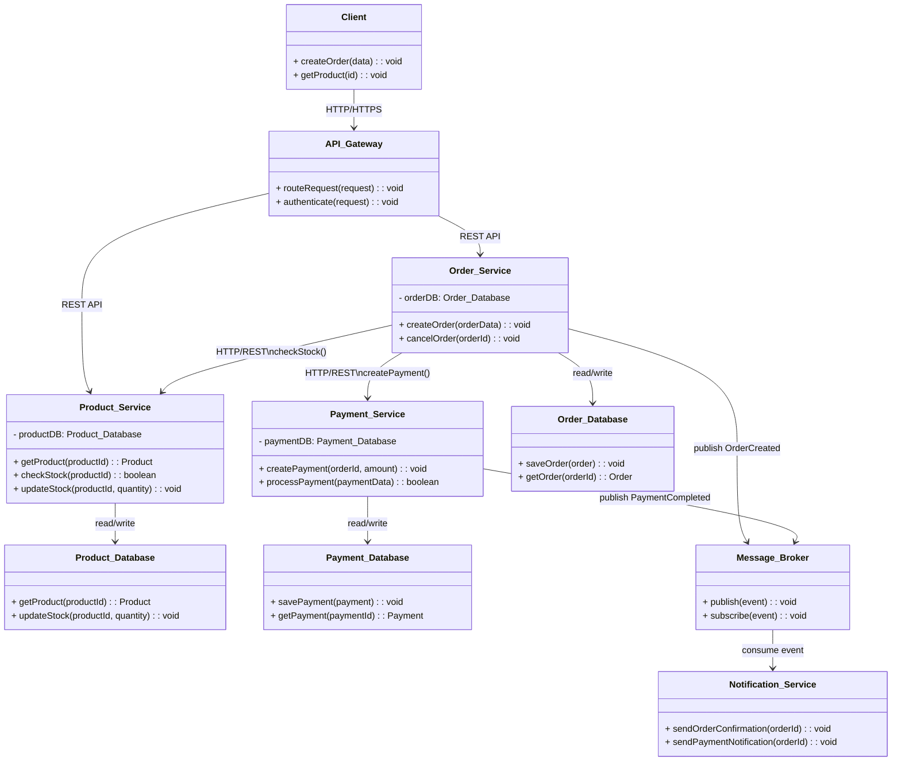
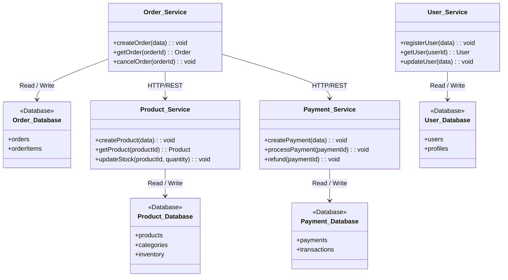

# API Gateway, Service Discovery Và Database Per Service

## Mục lục

- [API Gateway](https://claude.ai/chat/87dfe022-a3fc-4f6e-8d79-792e8630af80#api-gateway)
- [Service Discovery](https://claude.ai/chat/87dfe022-a3fc-4f6e-8d79-792e8630af80#service-discovery)
- [Database per Service](https://claude.ai/chat/87dfe022-a3fc-4f6e-8d79-792e8630af80#database-per-service)
- [Mở rộng](https://claude.ai/chat/87dfe022-a3fc-4f6e-8d79-792e8630af80#m%E1%BB%9F-r%E1%BB%99ng)

---

## API Gateway

**API Gateway** là một service đóng vai trò **điểm vào duy nhất** (single entry point) cho mọi request từ client (web, mobile) tới hệ thống microservices phía sau. Thay vì client phải biết địa chỉ của từng service (Order Service, Product Service, Payment Service...), client chỉ cần gọi tới API Gateway, và Gateway sẽ:

- **Định tuyến (routing)** request tới đúng service — ví dụ `/orders` đi tới Order Service, `/products` đi tới Product Service.
- **Xác thực (authentication/authorization)** request trước khi chuyển tiếp, để từng service không phải tự implement lại logic xác thực.
- Thường đảm nhiệm thêm các việc như **rate limiting** (giới hạn số request), **logging**, và **gộp nhiều lời gọi** (request aggregation) thành một response duy nhất cho client.

Trong sơ đồ ở phần Service Discovery bên dưới, class `API_Gateway` với hai method `routeRequest()` và `authenticate()` chính là minh họa cho hai trách nhiệm chính này.

Xem chi tiết [tại đây](https://github.com/GiaBao0510/ExperienceLearnedAndGathered/tree/main/Software%20Design%20%26%20Architecture/System-wide%20Patterns/Microservice/Api-gateway) 

---

## Service Discovery

### Vấn đề cần giải quyết

Trong môi trường cloud và container, các service instance (một bản chạy cụ thể của một service) có thể được tạo ra, xóa đi, hoặc đổi địa chỉ IP bất kỳ lúc nào — ví dụ khi hệ thống tự động scale thêm instance lúc tải cao. Điều này khiến việc **hard-code** (gán cứng) địa chỉ IP/port để các service gọi nhau trở nên không khả thi: địa chỉ vừa cấu hình xong có thể đã đổi.

### Mô tả

**Service Discovery** cho phép các microservice **tự động tìm thấy** và giao tiếp với nhau mà không cần hard-code địa chỉ IP/port. Một thành phần gọi là **Service Registry** (ví dụ: Consul, Eureka) đóng vai trò "danh bạ" — lưu trữ thông tin về tất cả các service instance đang hoạt động (địa chỉ, port, trạng thái sống/chết).

Sơ đồ dưới đây minh họa một hệ thống thương mại điện tử đơn giản: client gọi qua API Gateway, Gateway định tuyến tới Order Service và Product Service, các service gọi lẫn nhau qua REST, mỗi service có database riêng, và dùng Message Broker để gửi sự kiện bất đồng bộ (ví dụ báo đơn hàng đã tạo) tới Notification Service.



### Ví dụ thực tế

Consul hoặc Eureka lưu danh sách các instance đang sống của Order Service. Khi hệ thống tự động scale từ 2 lên 10 instance (do tải tăng), các service khác gọi tới Order Service sẽ tự động thấy đủ 10 instance mới mà không cần ai sửa lại cấu hình bằng tay.

### Ví dụ cấu hình bằng Go

Dưới đây là ví dụ tối giản: một client Go tự hỏi Consul xem Order Service hiện có những instance nào đang sống, rồi chọn ngẫu nhiên một instance để gọi (một dạng load balancing đơn giản phía client).

```go
package discovery

import (
	"encoding/json"
	"fmt"
	"math/rand"
	"net/http"
)

// ServiceInstance mô tả một instance đang sống, lấy từ Consul.
type ServiceInstance struct {
	Address string `json:"Address"`
	Port    int    `json:"ServicePort"`
}

// DiscoverInstances hỏi Consul: "order-service hiện có những instance nào?"
// thay vì hard-code địa chỉ IP trong code.
func DiscoverInstances(consulAddr, serviceName string) ([]ServiceInstance, error) {
	url := fmt.Sprintf("http://%s/v1/health/service/%s?passing=true", consulAddr, serviceName)

	resp, err := http.Get(url)
	if err != nil {
		return nil, err
	}
	defer resp.Body.Close()

	var raw []struct {
		Service ServiceInstance `json:"Service"`
	}
	if err := json.NewDecoder(resp.Body).Decode(&raw); err != nil {
		return nil, err
	}

	instances := make([]ServiceInstance, 0, len(raw))
	for _, r := range raw {
		instances = append(instances, r.Service)
	}
	return instances, nil
}

// PickInstance chọn ngẫu nhiên một instance đang sống — cách load balancing
// đơn giản nhất phía client, không cần một load balancer riêng.
func PickInstance(instances []ServiceInstance) ServiceInstance {
	return instances[rand.Intn(len(instances))]
}
```

Điểm mấu chốt: code gọi Order Service **không bao giờ chứa địa chỉ IP cố định**. Mỗi lần cần gọi, nó hỏi Consul để lấy danh sách instance mới nhất — nếu một instance vừa bị xóa do scale down, nó sẽ không còn xuất hiện trong danh sách trả về (nhờ tham số `passing=true`, chỉ lấy các instance đã qua health check).

### Ưu điểm

- Tự động cập nhật khi service scale up/down, không cần sửa cấu hình bằng tay.
- Không cần cấu hình cứng địa chỉ IP/port.
- Là nền tảng cho load balancing động giữa các instance đang sống.

### Nhược điểm

- Thêm một thành phần (Service Registry) vào hệ thống, tức thêm một điểm cần vận hành và giám sát.
- Service Registry có thể trở thành **single point of failure** (điểm lỗi duy nhất — nếu nó sập, các service không tìm được nhau nữa) nếu không được thiết kế high availability.
- Cần cơ chế **health check** (kiểm tra định kỳ xem instance còn sống không) để loại bỏ instance đã chết khỏi danh sách.
- Registry chứa thông tin sai lệch (trỏ tới instance đã chết nhưng chưa bị gỡ) còn tệ hơn việc dùng địa chỉ cứng, vì lỗi khó phát hiện hơn.

### Khi nào nên dùng

- Service instance được tạo/xóa động, ví dụ do auto-scaling hoặc chạy trong container.
- Địa chỉ IP/port thay đổi thường xuyên, không thể cấu hình cứng.

### Khi nào KHÔNG nên dùng

- Số lượng service cố định, địa chỉ ổn định, ít thay đổi.
- Đã dùng platform như Kubernetes — Kubernetes có DNS nội bộ lo việc discovery sẵn, không cần thêm Consul/Eureka.

---

## Database per Service

### Vấn đề cần giải quyết

Khi nhiều microservice chia sẻ chung một database, sự thay đổi schema (cấu trúc bảng) của một service có thể ảnh hưởng tới các service khác đang dùng chung database đó — tạo ra phụ thuộc chặt chẽ, cản trở việc scale hay deploy từng service một cách độc lập.

### Mô tả

Để đảm bảo tính **loose coupling** (ràng buộc lỏng) giữa các service, nguyên tắc **Database per Service** yêu cầu: mỗi microservice sở hữu database (hoặc ít nhất là schema) riêng của mình. **Các service khác không được truy cập trực tiếp vào database của nhau** — muốn lấy dữ liệu, phải gọi qua API do service đó cung cấp.



### Ví dụ thực tế

Trong một hệ thống e-commerce: Order Service dùng PostgreSQL (cần transaction chặt chẽ cho đơn hàng), Catalog Service dùng MongoDB (dữ liệu sản phẩm dạng linh hoạt, nhiều thuộc tính khác nhau theo loại hàng), Cart Service dùng Redis (dữ liệu giỏ hàng tạm thời, cần đọc/ghi cực nhanh). Không service nào truy cập trực tiếp vào database của service khác.

### Ví dụ code bằng Go

Ví dụ dưới đây cho thấy `Order_Service` **không** tự query bảng `products` (dù về mặt kỹ thuật có thể làm được nếu có quyền truy cập database), mà bắt buộc phải gọi qua HTTP API của `Product_Service` để kiểm tra tồn kho:

```go
package order

import (
	"database/sql"
	"encoding/json"
	"fmt"
	"net/http"
)

// OrderRepository chỉ biết tới database của riêng Order Service.
// Không có kết nối nào tới database của Product Service hay Payment Service.
type OrderRepository struct {
	db *sql.DB // kết nối riêng tới Order_Database (PostgreSQL)
}

func (r *OrderRepository) SaveOrder(orderID string, productID string, quantity int) error {
	_, err := r.db.Exec(
		`INSERT INTO orders (id, product_id, quantity) VALUES ($1, $2, $3)`,
		orderID, productID, quantity,
	)
	return err
}

// ProductServiceClient là cách DUY NHẤT Order Service được phép
// lấy thông tin sản phẩm — qua API, không qua database trực tiếp.
type ProductServiceClient struct {
	baseURL string
}

func (c *ProductServiceClient) CheckStock(productID string) (bool, error) {
	url := fmt.Sprintf("%s/products/%s/stock", c.baseURL, productID)

	resp, err := http.Get(url)
	if err != nil {
		return false, err
	}
	defer resp.Body.Close()

	var result struct {
		InStock bool `json:"in_stock"`
	}
	if err := json.NewDecoder(resp.Body).Decode(&result); err != nil {
		return false, err
	}
	return result.InStock, nil
}
```

Nếu `Order_Service` được phép kết nối thẳng vào `Product_Database`, chỉ cần Product Service đổi tên cột `stock` thành `stock_quantity` là code của Order Service sẽ lỗi ngay lập tức, dù không ai trong team Order Service biết chuyện đó vừa xảy ra. Gọi qua API giúp Product Service tự do thay đổi schema database nội bộ, miễn là API trả về vẫn đúng hợp đồng (contract) đã thống nhất.

### Ưu điểm

- Mỗi service độc lập về schema — đổi schema của service này không ảnh hưởng service khác.
- Dễ scale từng database riêng theo đúng nhu cầu của service đó.
- Không bị khóa vào một loại database công nghệ duy nhất (có thể chọn SQL, NoSQL, cache tùy nhu cầu).
- Giới hạn phạm vi sự cố: một database hỏng chỉ ảnh hưởng tới đúng một service.

### Nhược điểm

- Khó truy vấn dữ liệu tổng hợp xuyên nhiều service (không thể `JOIN` trực tiếp giữa hai database khác nhau).
- Quản lý **transaction phân tán** (giao dịch trải dài qua nhiều service/database) phức tạp hơn nhiều so với transaction trong một database duy nhất.
- Dễ phát sinh dữ liệu trùng lặp giữa các service (ví dụ, Order Service có thể phải lưu lại tên sản phẩm tại thời điểm đặt hàng).
- Chi phí vận hành nhân lên: nhiều database đồng nghĩa nhiều hệ thống backup, giám sát, và nâng cấp cần quản lý riêng.

### Khi nào nên dùng

- Muốn các service deploy và scale hoàn toàn độc lập với nhau.
- Mỗi service có mô hình dữ liệu khác nhau, phù hợp với loại database khác nhau.

### Khi nào KHÔNG nên dùng

- Ứng dụng còn nhỏ, chưa cần tách biệt — dùng chung một database vẫn quản lý tốt.
- Nghiệp vụ đòi hỏi nhiều `JOIN` phức tạp xuyên service theo thời gian thực, khó thay thế bằng gọi API.

---

## Mở Rộng

Sau khi nắm API Gateway, Service Discovery và Database per Service, bạn có thể tìm hiểu thêm:

- **Load Balancing**: Các chiến lược phân phối request tới nhiều instance (round-robin, least connections...), và sự khác biệt giữa client-side vs server-side load balancing.
- **Circuit Breaker & Retry**: Kỹ thuật xử lý khi một service gọi tới service khác nhưng service đó đang lỗi hoặc chậm.
- **Saga Pattern**: Cách quản lý transaction trải dài qua nhiều service khi mỗi service có database riêng (giải quyết đúng nhược điểm "transaction phân tán" nêu ở trên).
- **CQRS (Command Query Responsibility Segregation)**: Kỹ thuật tách riêng mô hình ghi và đọc dữ liệu, thường dùng kèm Database per Service để giải quyết bài toán truy vấn tổng hợp xuyên service.
- **Service Mesh** (ví dụ: Istio, Linkerd): Lớp hạ tầng xử lý giao tiếp giữa các service (bao gồm cả service discovery, load balancing, retry) mà không cần viết code riêng trong từng service.
- **Kubernetes Service & DNS**: Cách Kubernetes cung cấp service discovery "miễn phí" thông qua DNS nội bộ, khác với việc tự triển khai Consul/Eureka.