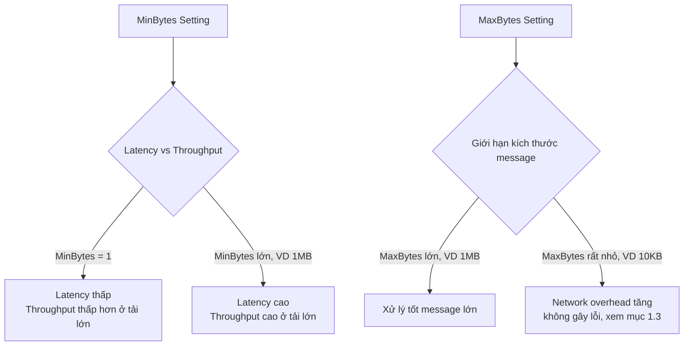

# Cấu hình Consumer & Producer trong Kafka (kafka-go)

## Mục lục
1. [Consumer Fetch Behavior: MinBytes, MaxBytes, MaxWait](#1-consumer-fetch-behavior-cách-consumer-lấy-dữ-liệu-từ-broker)
2. [Partition và vai trò của Key](#2-partition-và-vai-trò-của-key)
3. [Balancer trong kafka-go](#3-balancer-trong-kafka-go)
4. [Bảng cấu hình khuyến nghị](#4-bảng-cấu-hình-khuyến-nghị-cho-hệ-thống-cần-real-time)
5. [Mở rộng](#mở-rộng)

---

## 1. Consumer Fetch Behavior (Cách Consumer lấy dữ liệu từ Broker)

**Khái niệm nền:** Kafka hoạt động theo mô hình **pull** — Broker không tự đẩy (push) dữ liệu cho Consumer. Consumer phải chủ động gửi **fetch request** để "hỏi xin" dữ liệu. Ba tham số dưới đây quyết định cách fetch request này hoạt động.

### 1.1. Ba tham số cốt lõi

| Tham số | Ý nghĩa | Ảnh hưởng |
|---|---|---|
| **`fetch.min.bytes`** (`MinBytes`) | Ngưỡng byte **tối thiểu** mà Consumer yêu cầu Broker phải gom đủ trước khi trả lời. Broker sẽ "giữ" (park) request lại, chưa trả ngay, cho đến khi tích lũy đủ dữ liệu từ các partition được assign. | Giá trị càng cao → độ trễ (latency) càng lớn, nhưng throughput tăng vì ít round-trip network hơn (gom nhiều message nhỏ thành 1 batch). |
| **`fetch.max.bytes`** (`MaxBytes`) | Trần dung lượng **tối đa** mà Broker trả về trong 1 lần fetch response. | Bảo vệ RAM/network buffer phía Consumer khỏi response quá lớn. Giá trị càng cao → throughput mỗi round-trip càng cao, nhưng tốn RAM hơn. |
| **`fetch.max.wait.ms`** (`MaxWait` trong kafka-go) | "Van an toàn" cho `MinBytes`: thời gian tối đa Broker chờ để gom đủ `MinBytes`. Hết thời gian mà vẫn chưa đủ, Broker buộc phải trả về những gì đang có. | Ngăn Consumer bị "treo" chờ vô thời hạn khi hệ thống có ít traffic. |

**Tại sao Kafka cần 3 tham số này?** Để cho phép người dùng chủ động đánh đổi giữa **Latency** (độ trễ) và **Throughput** (thông lượng) tùy theo đặc thù hệ thống:

- **Cần phản hồi nhanh** (order processing, chat, notification): đặt `MinBytes = 1` — trả lời ngay khi có dữ liệu, dù chỉ 1 byte.
- **Batch/analytics pipeline, không cần real-time**: đặt `MinBytes` cao hơn (VD vài trăm KB) — chấp nhận chờ lâu hơn để đổi lấy throughput cao.

```go
r := kafka.NewReader(kafka.ReaderConfig{
    Brokers:  []string{"localhost:9092"},
    Topic:    "orders",
    GroupID:  "order-processor",
    MinBytes: 1,                 // trả lời ngay khi có dữ liệu — ưu tiên latency thấp
    MaxBytes: 1e6,               // 1MB — đủ lớn cho message JSON đơn hàng thông thường
    MaxWait:  200 * time.Millisecond, // không chờ quá 200ms nếu chưa đủ MinBytes
})
```

### 1.2. Sơ đồ đánh đổi Latency vs Throughput



### 1.3. Trường hợp `MaxBytes` quá nhỏ — điều gì thực sự xảy ra?

**Tình huống:** `MaxBytes` được set bằng `MinBytes` và quá nhỏ (VD chỉ 10KB), trong khi Producer gửi một message JSON đơn hàng nặng 15KB.

> Theo [KIP-74](https://cwiki.apache.org/confluence/display/KAFKA/KIP-74:+Add+Fetch+Response+Size+Limit+in+Bytes) — thay đổi chính thức trong giao thức fetch của Kafka — `fetch.max.bytes` (và `max.partition.fetch.bytes`) là một **giới hạn mềm (soft limit)**, không phải giới hạn tuyệt đối: *"nếu message/batch đầu tiên trong partition đầu tiên của fetch request lớn hơn giới hạn này, Broker vẫn sẽ trả về message đó để đảm bảo Consumer luôn có thể tiến triển (make progress)"*. Điều này áp dụng ở tầng giao thức Kafka mà kafka-go tuân theo.
>
> Nói cách khác: với ví dụ trên, Broker **vẫn sẽ trả về message 15KB** dù `MaxBytes = 10KB`, chứ không từ chối hay khiến Consumer treo vô hạn. Lỗi thật sự dạng `MessageTooLarge`/`RecordTooLarge` xảy ra ở **phía Producer**, khi message vượt quá `message.max.bytes` (cấu hình ở Broker/topic) hoặc `max.request.size` (cấu hình ở Producer) — đây là hai tham số hoàn toàn khác với `fetch.max.bytes` phía Consumer.
>
> **Hậu quả thực sự (vẫn nghiêm trọng, chỉ khác về bản chất)** khi đặt `MaxBytes` quá nhỏ: mỗi lần fetch chỉ nhận được rất ít dữ liệu (hoặc chỉ đúng 1 message lớn duy nhất), khiến Consumer phải gửi **nhiều fetch request hơn hẳn mức cần thiết** — network overhead tăng cao, và lợi thế batch processing của Kafka gần như bị triệt tiêu. Đây vẫn là một cấu hình sai cần tránh, chỉ khác là **nguyên nhân đúng** là giảm hiệu năng chứ không phải gây lỗi cứng hay treo hệ thống.

**Sai lầm phổ biến cần tránh:**
- Đặt `MaxBytes` bằng `MinBytes` — làm mất "khoảng linh hoạt" cần thiết giữa hai ngưỡng.
- Đặt `MinBytes` quá lớn (VD 10MB) cho hệ thống cần độ trễ thấp (real-time).
- Đặt `MaxBytes` nhỏ hơn kích thước message thực tế trong hệ thống — tuy không gây lỗi cứng như mô tả sai ở trên, nhưng vẫn làm giảm hiệu năng đáng kể do tăng số lượng round-trip.

---

## 2. Partition và vai trò của Key

### 2.1. Partition là gì?

**Partition** là đơn vị lưu trữ logic bên trong một topic — mỗi partition về bản chất là một **log tuần tự, có thứ tự (ordered log)**. Một topic có thể được chia thành nhiều partition để scale theo chiều ngang (horizontal scaling): nhiều Consumer trong cùng một consumer group có thể xử lý song song các partition khác nhau.

### 2.2. Key & cơ chế chọn Partition

Khi Producer gửi một message, nó có thể đính kèm một **Key** (một chuỗi byte bất kỳ). Nếu Balancer đang dùng là loại dựa trên hash (xem mục 3), Kafka sẽ:

1. Băm (hash) giá trị Key đó — kafka-go mặc định dùng thuật toán **FNV-1a** cho `Hash` Balancer (các thuật toán khác như Murmur2, CRC32 cũng có sẵn — xem mục 3).
2. Lấy phần dư (modulo) cho số lượng partition để chọn ra partition đích:

```
Partition = Hash(Key) % Number_of_Partitions
```

Vì phép hash này là **deterministic** (cùng Key luôn cho cùng kết quả hash), nên cùng một Key sẽ **luôn luôn** được gửi vào cùng một partition.

### 2.3. Nguyên lý vàng: Kafka chỉ đảm bảo thứ tự TRONG CÙNG MỘT PARTITION

Đây là nguyên lý quan trọng nhất cần khắc cốt ghi tâm khi thiết kế hệ thống dùng Kafka: **Kafka chỉ đảm bảo thứ tự (ordering) của các message bên trong cùng một partition.** Giữa các partition khác nhau, hoàn toàn không có gì đảm bảo thứ tự.

**Hệ quả trực tiếp:** nếu nghiệp vụ của bạn cần giữ đúng thứ tự các sự kiện của cùng một entity (VD: các sự kiện thay đổi trạng thái của cùng một đơn hàng, hoặc các hành động của cùng một khách hàng), bạn **bắt buộc** phải đảm bảo toàn bộ message của entity đó luôn đi vào cùng một partition — cách duy nhất để làm điều này là gán cùng một Key (VD: `order_id`, `customer_id`) cho toàn bộ các message liên quan.

**Ví dụ minh họa:**

```go
// Đảm bảo mọi sự kiện của cùng 1 đơn hàng luôn vào cùng 1 partition,
// nhờ đó consumer luôn xử lý các sự kiện của đơn hàng này đúng thứ tự.
msg := kafka.Message{
    Key:   []byte(orderID),          // VD: "order-8f3a21"
    Value: eventPayloadJSON,
}
writer.WriteMessages(ctx, msg)
```

**Cảnh báo — hai sai lầm phổ biến:**

- **Gán Key nhưng lại dùng Balancer không đọc Key** (VD: `RoundRobin` hoặc `LeastBytes`) — Key sẽ hoàn toàn bị bỏ qua, không có tác dụng đảm bảo thứ tự nào cả. Phải dùng balancer dựa-hash (`Hash`, `CRC32Balancer`, `Murmur2Balancer` — xem mục 3).
- **Key có cardinality (số lượng giá trị khác nhau) quá thấp** — VD chỉ dùng Key là `"VN"`/`"US"` cho hàng triệu đơn hàng — khiến gần như toàn bộ traffic dồn vào 1-2 partition, tạo ra **hot partition** (partition quá tải trong khi các partition khác gần như rảnh rỗi), làm mất lợi thế scale ngang của Kafka.

---

## 3. Balancer trong kafka-go

**Balancer** là thành phần quyết định một message sẽ được gửi vào partition nào. kafka-go cung cấp sẵn nhiều loại Balancer:

### 3.1. RoundRobin — Balancer mặc định của kafka-go

Cách hoạt động: gửi message lần lượt theo vòng tròn P0 → P1 → P2 → ... → quay lại P0. Dùng khi message không có Key, hoặc nghiệp vụ không quan tâm đến thứ tự.

### 3.2. Hash Balancer (FNV-1a) — cần khai báo tường minh

```go
w := &kafka.Writer{
    Addr:     kafka.TCP("localhost:9092"),
    Topic:    "orders",
    Balancer: &kafka.Hash{}, // PHẢI khai báo tường minh — không phải mặc định
}
```

Đây chính là Balancer phù hợp cho use case cần giữ thứ tự theo Key (như order processing) — cùng Key luôn cùng partition (mục 2.3). Mặc định dùng thuật toán FNV-1a, tương thích cùng thuật toán mà **Sarama Producer** (client Kafka phổ biến khác cho Go) sử dụng.

**Lưu ý quan trọng khi scale:** nếu sau này bạn **tăng số lượng partition** của topic, phép modulo trong công thức `Hash(Key) % Number_of_Partitions` sẽ thay đổi kết quả → toàn bộ mapping Key → partition cũ bị "vỡ". Đây là một trong những sai lầm phổ biến nhất khi mở rộng hệ thống — cần cân nhắc kỹ số lượng partition ngay từ đầu, hoặc chấp nhận một số message cùng Key sẽ tạm thời "lệch" partition trong giai đoạn chuyển tiếp.

### 3.3. LeastBytes

```go
Balancer: &kafka.LeastBytes{}
```

Giữ một mảng đếm (`counters[]`) theo dõi số byte đã được đưa vào hàng đợi (queue) cho mỗi partition, rồi chọn partition đang có ít dữ liệu nhất. Dùng để cân bằng tải đều theo **dung lượng** (disk/network) giữa các partition — nhưng **không đọc Key**, nên sẽ phá vỡ đảm bảo thứ tự nếu bạn đang cần ordering theo entity.

### 3.4. CRC32Balancer và Murmur2Balancer — tương thích với client khác ngôn ngữ

> - **`CRC32Balancer`**: tương thích với chiến lược phân vùng mặc định (`consistent_random`) của **librdkafka** (client C/C++, và cả `confluent-kafka-python` vì thư viện này wrap librdkafka).
> - **`Murmur2Balancer`**: mới là balancer tương thích với **partitioner mặc định của Java client** — đây là balancer bị thiếu trong tài liệu gốc.

```go
Balancer: kafka.CRC32Balancer{}   // tương thích librdkafka / confluent-kafka-python
Balancer: kafka.Murmur2Balancer{} // tương thích Java client (canonical Kafka producer)
```

**Khi nào cần dùng hai balancer này?** Chỉ khi hệ thống của bạn có **nhiều service dùng nhiều ngôn ngữ/client khác nhau cùng ghi vào một topic**, và bạn cần đảm bảo message có cùng Key (dù được gửi từ Go, Java hay Python) đều rơi vào cùng một partition. Với một hệ thống thuần Go (kafka-go ở cả Producer lẫn Consumer), `Hash` (FNV-1a) là đủ dùng và đơn giản hơn.

### 3.5. Bảng tổng hợp Balancer

| Balancer | Có đọc Key không? | Tương thích với | Phù hợp khi |
|---|---|---|---|
| `RoundRobin` (mặc định) | Không | — | Message không có Key, không cần giữ thứ tự |
| `Hash` (FNV-1a) | Có | Sarama (Go) | Hệ thống thuần Go, cần giữ thứ tự theo Key |
| `LeastBytes` | Không | — | Cần cân bằng tải theo dung lượng, không cần giữ thứ tự |
| `CRC32Balancer` | Có | librdkafka, confluent-kafka-python | Hệ thống đa ngôn ngữ có client C/C++/Python |
| `Murmur2Balancer` | Có | Java client (canonical) | Hệ thống đa ngôn ngữ có producer Java |

---

## 4. Bảng cấu hình khuyến nghị cho hệ thống cần real-time

Dựa trên toàn bộ phân tích ở trên, với hệ thống dạng order processing / chat / notification (ưu tiên latency thấp, cần giữ đúng thứ tự sự kiện theo entity):

| Cấu hình | Giá trị khuyến nghị | Lý do |
|---|---|---|
| `MinBytes` | `1` | Trả lời ngay khi có dữ liệu, không chờ gom batch — ưu tiên độ trễ thấp |
| `MaxBytes` | Đủ lớn hơn kích thước message thực tế (VD `1MB`) | Tránh network overhead không cần thiết; không cần quá lo lỗi cứng vì có cơ chế soft limit (mục 1.3), nhưng vẫn nên đặt hợp lý để tối ưu hiệu năng |
| `MaxWait` | 100–300ms | Đủ ngắn để không làm tăng latency đáng kể, nhưng vẫn cho Broker một khoảng thời gian nhỏ để gom dữ liệu nếu có |
| `Balancer` | `&kafka.Hash{}` (khai báo tường minh) | Đảm bảo message cùng Key (VD: `order_id`) luôn vào cùng partition → giữ đúng thứ tự xử lý |
| `Message Key` | `order_id` / `customer_id` (tùy entity cần giữ thứ tự) | Là điều kiện bắt buộc để Balancer dựa-hash phát huy tác dụng |

---

### Mở rộng

- **Consumer Group & Rebalance**: khi có nhiều Consumer cùng đọc một topic trong cùng một Group ID, Kafka cần cơ chế phân chia partition giữa các Consumer (rebalance) — đáng tìm hiểu thêm về `GroupBalancers` (Range, RoundRobin, Sticky, CooperativeSticky) vì đây là chủ đề khác với `Balancer` phía Producer đã học ở tài liệu này (dễ nhầm lẫn tên gọi).
- **Idempotent Producer & `enable.idempotence`**: cơ chế đảm bảo Producer không vô tình ghi trùng message khi retry — đây là nội dung tiếp theo trong lộ trình học Kafka của bạn (theo roadmap delivery semantics đã đặt ra).
- **Compression (`compression.codec`)**: gzip/snappy/lz4/zstd — ảnh hưởng trực tiếp đến việc `MinBytes`/`MaxBytes` nên đặt bao nhiêu, vì kích thước message sau nén sẽ nhỏ hơn nhiều so với JSON gốc.
- **`max.partition.fetch.bytes` vs `fetch.max.bytes`**: tài liệu này tập trung vào `fetch.max.bytes` (giới hạn tổng cho cả fetch response), nhưng Kafka còn có `max.partition.fetch.bytes` (giới hạn cho từng partition riêng lẻ) — cùng tuân theo cơ chế soft-limit đã nêu ở mục 1.3, đáng tìm hiểu sâu hơn khi hệ thống fetch từ nhiều partition cùng lúc.
- **Dead Letter Queue (DLQ) & Retry Topic**: bước tiếp theo tự nhiên sau khi nắm vững fetch/partition/balancer — xử lý message lỗi mà không làm nghẽn partition, đúng như roadmap học tập bạn đã đặt ra.
